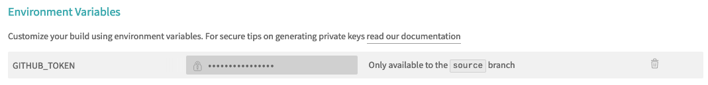

這篇文章將會簡單介紹一下Jekyll，以及我如何使用Jekyll將網站建置在GitHub Page上的經歷。
<!--more-->

## Jekyll是什麼？
[Jekyll](https://jekyllrb.com/)是一個基於Ruby的靜態網頁產生器，常用在個人、project或是公司、組織的網頁上，由GitHub的co-founder [Tom Preston-Wemer](https://en.wikipedia.org/wiki/Tom_Preston-Werner)製作的。

只要給Jekyll一些Liquid模板以及用Markdown寫的文章內容，它就可以幫你生成出一整個靜態網站。
[Liquid](https://github.com/Shopify/liquid)是一個模板引擎，可以在html裡面安插一些程式語言，讓html可以根據你的需求被產生出來，可以參考[Liquid GitHub當中的例子](https://github.com/Shopify/liquid#what-does-it-look-like)，會比較理解它想要實現的事情。

```html
<ul id="products">
    
    
        <li>
            <h2>{{ product.name  }}</h2>
            Only {{ product.price | price  }}

            {{ product.description | prettyprint | paragraph  }}
        </li>
    
    
</ul>
```

至於[Markdown](https://zh.wikipedia.org/zh-tw/Markdown)，是一個輕量級標記式語言，相信有使用過GitHub的人應該對它並不陌生。

或許是因為Jekyll是由GitHub co-founder所製作的，所以目前GitHub Page支援Jekyll，使你可以在你的repo當中放入Jekyll的原始碼，GitHub就會自動幫你編譯並部署成網站。
底下將會從零開始，紀錄我如何建立一個部落格網站。

## 準備環境
### 直接套用現成Repo
如果說不想要這麼麻煩的準備環境，想要直接開始寫作的話，可以去網路上找別人已經弄好的GitHub Repo，像是[personal-website](https://github.com/github/personal-website)，Fork到自己的帳號底下，改一下repo的名字，變成**[username].github.io**，就可以開始在**_post**這個資料夾底下創立Markdown檔案，開始自由的創作，GitHub理應會將你新創立的文章自動變成網頁部署上去。

倘若你想要客製化網站的話，可能就必須自己準備一個環境，得要繼續往下閱讀了。

### 建立GitHub Page Repo
網路上有很多教學來教大家如何建立自己的GitHub Page，可以參考[GitHub官方教學](https://pages.github.com/)。
其實主要需要做的事情就是建立一個新的repository，命名為**[username].github.io**，並將之設為public repo。
之後只要將html檔案上傳上去，GitHub就會自動將檔案部署到**https://[username].github.io**這個網站上，相當的方便而且還免費！

### 安裝Ruby、Jekyll
前面有提到Jekyll是基於Ruby所建立的，所以必須要在自己的電腦上先安裝Ruby，安裝Ruby的方法可以參考[Jekyll官方教學](https://jekyllrb.com/docs/installation/)，根據不同的作業系統會需要不一樣的步驟，但倘若你所使用的是macOS Catalina以上的作業系統，其內建就有Ruby了，可以直接安裝Jekyll。

在安裝好Ruby以後，直接下底下的指令應該就能安裝好Jekyll。
```bash
gem install bundler jekyll --user-install
```

## 使用樣板建立第一個網站
在準備好環境以後，應該就迫不及待的想要產生一個好棒棒的網站，最快的方式應當是去複製別人的樣板，這邊我所使用的樣板是[jekyll-TeXt-theme](https://github.com/kitian616/jekyll-TeXt-theme)，你也可以去找尋自己心中所屬的那個樣板，像是蠻像Medium的樣板[Poole](https://github.com/poole/poole)等等。

想好樣板選哪一個以後，接著便是在你的GitHub Page Repo上套用它，套用的流程可以參考底下。

### Clone你的GitHub Page Repo到電腦上

```bash
git clone https://github.com/[username]/[username].github.io.git
```

### 在repo根目錄創建Gemfile和\_conf.yaml

通常樣板都是用gem的形式來讓大家使用，為此我們需要建立**Gemfile**和**\_conf.yaml**這兩個檔案，來讓Ruby知道我們這個repo需要哪些相關的gem。

```ruby
# Put the followings into your Gemfile

source "https://rubygems.org"

gem "jekyll"
gem "jekyll-text-theme"
```
```yaml
# Put the following into your _conf.yaml

theme: jekyll-text-theme
```

### 安裝套件
```bash
bundle install --path vendor/bundle
```
上面的指令會把需要的套件都安裝在**vendor/bundle**這個資料夾內。

### 把樣板所定義的CSS、設定檔放到repo根目錄
```bash
cp -r vendor/bundle/ruby/2.6.0/gems/jekyll-text-theme-2.2.6/_* ./
cp -r vendor/bundle/ruby/2.6.0/gems/jekyll-text-theme-2.2.6/assets ./
```

### 把網頁模版複製進repo根目錄
[jekyll-TeXt-theme](https://github.com/kitian616/jekyll-TeXt-theme)所需要的網頁模版可以參考其[repo底下的test資料夾](https://github.com/kitian616/jekyll-TeXt-theme/tree/master/test)，我印象中那時是複製了底下這些檔案。
```
404.html
_config.yml
archive.html
index.html
```

### 確認樣板是否順利套用
利用底下的指令讓Jekyll產生靜態網站。
```bash
bundle exec jekyll serve --trace
```
產生出來的html檔案們會在**_site/**這個資料夾內，你也可以到[http://localhost:4000](http://localhost:4000)上觀看自己的網頁。

如果成功看到網頁跑出來，就代表套用算是成功了，接下來就可以開始進行客製化，像是去**\_conf.yaml**做一些設定、調整**\_include**裡面的html模板等等，把網頁刻成你的樣子。

## 部署到GitHub Page上
在把網頁變成了你的樣子以後，接著就會想讓世人看看，想把網頁丟到GitHub Page上。
因為Github會自動幫你編譯Jekyll，所以並不需要將整個**_site/**資料夾上傳，記得把不需要的東西放入**.gitignore**當中。
```
.bundle/
.jekyll-cache/
Gemfile.lock
vendor/
.sass-cache/
.site/
```
值得一提的是，因為GitHub在編譯的時候會在safe mode底下執行，所支援的套件有限，可以參考[GitHub Dependency Versions](https://pages.github.com/versions/)，如果有用到超出支援的套件的話會編譯不過。

在push到GitHub以後，可以去repo settings中GitHub Page相關的段落看有沒有錯誤訊息，如果成功部署上去可以看到相關的訊息，如果過程中發生了錯誤，在[troubleshooting github page builds](https://help.github.com/en/enterprise/2.14/user/articles/troubleshooting-github-pages-builds)能夠看到更多有關錯誤訊息的資訊。

### 如果我想用超出支援的套件怎麼辦？
其實Github Page也支援一般的靜態網頁存放方式，所以可以先在本機把網頁編譯好以後，將**_site/**裡面所有的東西都push到master branch，並放一個**.nojekyll**的文件在裡面，如此一來就能使用超出支援的套件了，只是是在本機端。

可以參考[Custom Jekyll plugins with GitHub Pages](https://www.drewsilcock.co.uk/custom-jekyll-plugins)，把Jekyll相關的原始碼放進source branch，把產生出來的靜態網頁放進master branch，讓整個東西都還是位在同一個repo底下。

具體來說那篇文章想做的事情類似底下的指令，但上面文章會把master branch的根目錄設在source branch中的**_site/**裡面，讓使用者可以編譯完，就進去**_site/**資料夾內將新產生的html推上master branch。
```bash
# Push source to origin and copy site to temp folder
git checkout -b source
git push origin source
cp -r _site/ /tmp/

# Remove all files in master
git checkout master
rm -rf ./*

# Copy site to master
cp -r /tmp/_site/* ./
touch .nojekyll

# Push master to origin
git add .
git commit -m "Upload site"
git push origin master
```

### 如果我想要線上編輯怎麼辦？
上面所介紹的方式雖然可以使用沒有支援的套件，但是仍需要在本機編譯，所以每次發佈一篇新的文章時，會需要將新文章的原始碼push到source branch，編譯完成後再進入其中的**_site/**資料夾把東西push到master branch，這樣才算成功把網頁更新。

倘若我今天心血來潮在GitHub網頁版上面直接寫起了文章，想要發佈出去的話，還得要打開終端機pull source branch的資料、編譯一下、把東西推到master branch，相當的不方便，所以在此提供一個解法讓你可以在網頁版GitHub的source branch寫完文章以後，commit完可以直接發佈至master branch，於此同時還可以保有使用GitHub Page沒有支援的套件的好處。

簡述一下解法便是利用Travis CI的虛擬機，幫我們把網頁編譯好，再請它幫我們把編譯好的網站push回master branch。

#### Travis CI 簡介
[Travis CI](https://travis-ci.org/)是一個用來作持續整合(CI)的平台，只要在Travis CI連結GitHub，並在repo根目錄當中製作一個**.travis.yml**檔案，告訴它想要在CI的時候執行什麼樣的指令，它就會建立一個虛擬機並執行你設定的指令。

#### 連結Travis CI和GitHub
到[Travis CI](https://travis-ci.org/)的網站中，點選*Sign in with GitHub*，並給予它觀看repo的權限，它就可以知道你有哪些repo，接著選擇**[username].github.io**的repo並勾選右邊的啟動按鈕，如此一來Travis CI就會開始監測你的repo有沒有新的commit。


#### 給予Travis CI push的權限
為了要讓Travis CI可以幫忙把網頁push到master branch當中，我們需要給予它GitHub token，讓它能夠有權利push，可以到[GitHub settings](https://github.com/settings/tokens)創建一個token給Travis CI使用，並勾選給予的權限。


拿到token以後，可以把token儲存在Travis CI的環境變數當中，若把token放repo裡面怕會被別人看到，儲存成變數的方法可以參照[Travis官方文件](https://docs.travis-ci.com/user/environment-variables#defining-variables-in-repository-settings)，點選repo的設定以後，就可以找到相關的區塊了，我自己是設定成底下的樣子。



#### 設定Travis CI
至此我們讓Travis CI實時監控我們的commit，也讓它有權力可以push到master branch，接著就是告訴它該怎麼樣編譯我們的網站以及要把哪些東西push到master branch。

我是參照[別人的gist](https://gist.github.com/willprice/e07efd73fb7f13f917ea#file-travis-yml)稍作修改以後來設定的，可以參考我的[.travis.yml](https://github.com/wjohn1483/wjohn1483.github.io/blob/source/.travis.yml)和[.travis/push.sh](https://github.com/wjohn1483/wjohn1483.github.io/blob/source/.travis/push.sh)。

```yaml
# .travis.yml

language: ruby
rvm:
    - 2.1
script:
  - bundle exec jekyll build
after_success:
  - 'if [ "$TRAVIS_PULL_REQUEST" = "false" ]; then bash -x .travis/push.sh; fi'
```

```bash
# .travis/push.sh

#!/bin/bash

setup_git_folder() {
    git init
    git config --global user.email "wjohn1483@yahoo.com.tw"
    git config --global user.name "wjohn1483"
    git remote add origin https://${GITHUB_TOKEN}@github.com/wjohn1483/wjohn1483.github.io.git
    git pull origin master
}

commit_website_files() {
    git checkout master
    rsync -a -v -q --delete-after ../_site/* ./
    git status
    git add .
    git commit -m "Travis build: $TRAVIS_BUILD_NUMBER"
}

upload_files() {
    git push origin master
}

mkdir folder_to_push
cd folder_to_push

setup_git_folder
commit_website_files
upload_files
```

至此就完成了線上編輯的所有步驟了，以後就能夠在GitHub網頁版上撰寫文章，commit完就直接部署到GitHub Page上。
