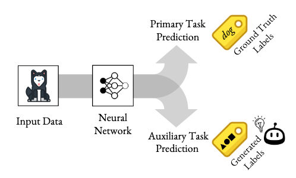
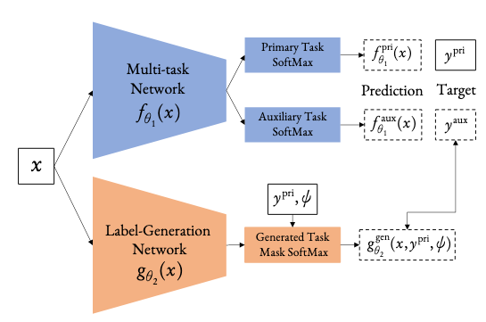

通常在訓練的時候，如果能有一些輔助的任務(task)，通常會對主要的任務在效能上有所提升，然而這些輔助任務的答案通常會需要人類來標注，並不能隨意的想加輔助任務就加輔助任務，而這篇文章要介紹的NeurIPS 2019的[Self-Supervised Generalisation with Meta Auxiliary Learning](https://papers.nips.cc/paper/8445-self-supervised-generalisation-with-meta-auxiliary-learning.pdf)，將輔助任務的答案都用機器來產生，免去了準備輔助任務答案的麻煩。
<!--more-->

## 簡介
在先前的研究當中，大多表示如果可以讓model能夠同時有多個任務可以學習，並且共用部分參數的話，對於整體學習的成果會有所提升。

舉個例子來說，如果今天想要做一個影像辨識的模型，輸入是一張動物的圖片，輸出是該動物的種類，像是貓、狗、鳥等等，我們可以直接疊一些CNN，把圖片丟進去，輸出就直接是動物的種類，gradient descent硬做一波，然而如果我們有更多的資訊，像是知道貓是屬於貓科、狗是屬於犬科，我們可以在model的中間或是在最後額外拉出一條flow來去判別這個動物的科別，通常後者在判斷動物種類的效果應該會比較好，因為在前面CNN的部分更可以知道哪些資訊是需要被保留的。

不過這樣子的方式其實是很需要人類幫助的，我們需要知道判斷動物種類可以參考科別，而且我們也需要對每一張圖片除了標注種類，還要額外標注科別，答案的獲取相當的昂貴，為此，這篇paper希望能夠讓機器來取代人類，自動產生出一些有意義的輔助答案來幫助主要的任務能學得更好，而上方的圖是這篇paper的示意圖。

## 方法
### Model架構圖

這篇paper將他們所創造出來的model稱之為Meta AuXiliary Learning (MAXL)，由兩個model所組成，分別是在圖片上半部的*Multi-task Network*和下半部的*Label-Generation Network*。

### Multi-task Network

Multi-task Network就是我們主要的neural network，其參數為$\theta_1$，輸入$x$，輸出primary task和auxiliary task的答案$f_{\theta_1}^{pri}(x)$和$f_{\theta_1}^{aux}(x)$，其中auxiliary task的答案$y^{aux}$是由底下的Label-Generation Network所預測出來的。

而這個network的目標是希望能夠分對primary task以及auxiliary task，所以它的objective function為

$\arg\limits_{\theta_1}\min\left( \mathcal{L}\left( f_{\theta_1}^{pri}(x_{(i)}), y_{(i)}^{pri} \right) + \mathcal{L} \left( f_{\theta_1}^{aux}(x_{(i)}), y_{(i)}^{aux} \right) \right)$

$Focal\ loss : \mathcal{L}(\hat y, y)=-y(1-\hat y)^\gamma\log(\hat y)$

 其中所使用的loss function為focal loss，在paper裡說可以幫助model更專注在錯誤的predict上。

### Label-Generation Network

Label-Generation Network的目的是希望能夠產生出讓Multi-task Network可以學得更好的label，所以它的objective function被設定為

$\arg\limits_{\theta_2}\min\mathcal{L}\left( f_{\theta_1^+}^{pri}(x_{(i)}),y_{(i)}^{pri} \right)$

其中的$\theta_1^+$為

$\theta_1^+=\theta_1-\alpha\bigtriangledown_{\theta_1}\left( \mathcal{L} \left( f_{\theta_1}^{pri}(x_{(i)}), y_{(i)}^{pri} \right) + \mathcal{L} \left( f_{\theta_1}^{aux}(x_{(i)}), y_{(i)}^{aux} \right) \right)$

此objective function的含義是，在Multi-task Network經過一次更新以後，希望它在primary task上的loss可以最小，這個概念有點類似[Model-Agnostic Meta-Learning for Fast Adaptation of Deep Networks (MAML)](https://arxiv.org/pdf/1703.03400.pdf)中，希望找到一個初始參數，讓model在更新過後可以在各個task上的綜合表現最佳。

## 實驗

## 結論
