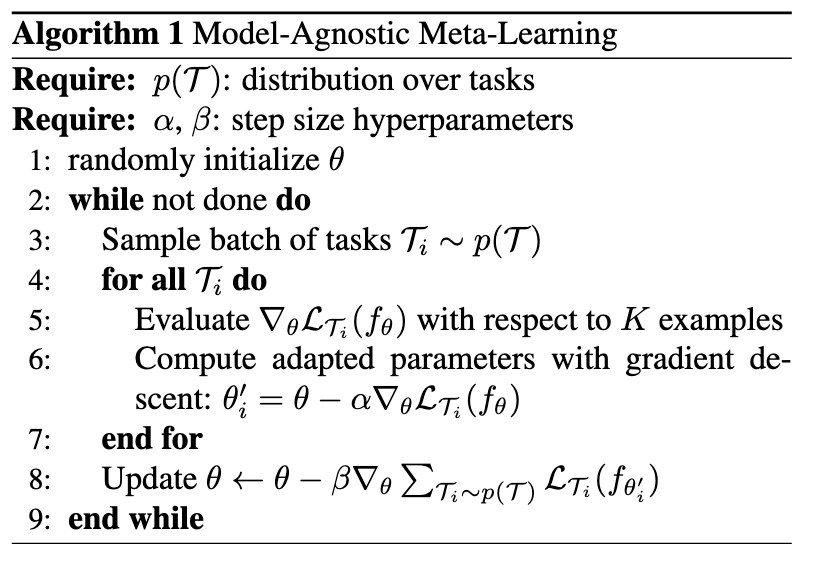
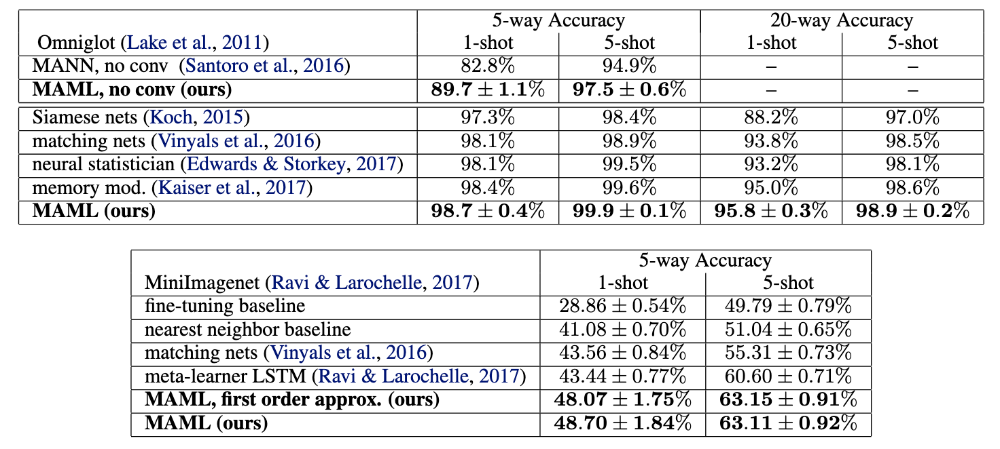

這篇paper想要去尋找一個最佳的初始化參數，讓model可以在各個task上都可以得到不錯的表現。

<!--more-->

## 簡介

Meta learning可以說是一個讓model學習如何學習的方式，希望讓model知道如何學習是比較有效率的，如此一來便可以使model在比較少的資料仍可以得到不錯的效果。而這篇paper提出一個叫做MAML的方法，想要嘗試找到一個很好的初始化參數，讓model用少量資料在其他task上訓練的時候，不需要太多epoch就能獲得很好的效果。

## 方法

### Task定義

先定義一下要被學習的task。

$$\mathcal{T}= \{ \mathcal{L}(x_1, a_1, ..., x_H, a_H), q(x_1), q(x_{t+1}|x_t, a_t), H\}$$

其中$$\mathcal{L}$$是loss function，$$q(x_1)$$是初始的observation，$$q(x_{t+1}\vert x_t, a_t)$$是transition distribution，而$$H$$是episode length。

因為這篇paper並不只有做在classification的task上，也有做在reinforcement learning上，所以需要有episode的概念，而如果是classification task的話，就會令$$H=1$$。

### MAML

作者提出的概念很直觀，我想要找到一個model初始值，讓這個初始值在各個task上面經過訓練以後都能達到不錯的效果，而我猜想是由於速度上的考量，這邊的*經過訓練*指的是經過一次的update，所以可以將objective function寫成以下的樣子

$$\theta_i'=\theta-\alpha\bigtriangledown_\theta \mathcal{L}_{\mathcal{T}_i}(f_\theta)$$

$$\min\limits_{\theta}\sum\limits_{\mathcal{T}_i \sim p(\mathcal{T})}\mathcal{L}_{\mathcal{T}_i}(f_{\theta_i'})=\sum\limits_{\mathcal{T}_i\sim p(\mathcal{T})}\mathcal{L}_{\mathcal{T}_i}(f_{\theta-\alpha\bigtriangledown_\theta\mathcal{L}_{\mathcal{T}_i}(f_\theta)})$$

式(2)是初始參數在task $$\mathcal{T}_i$$上經過一次update所得到的參數，式(3)是把在各個task上更新過一次的參數在各個task上的loss加總起來，來當作objective function，而實際更新初始參數的式子如下

$$\theta\leftarrow\theta-\beta\bigtriangledown_\theta\sum\limits_{\mathcal{T}_i\sim p(\mathcal{T})}\mathcal{L}_{\mathcal{T}_i}(f_{\theta_i'})$$

如果把其中的$$\theta_i'$$用式(2)替換掉的話，可以發現式(4)其實有經過兩次微分，不過tensorflow也有支援兩次微分，所以在實作上可以直接照著paper的公式做出來就行。

### 演算法

## 實驗

如果想對實驗了解更多的話，可以直接去[arXiv](https://arxiv.org/pdf/1703.03400.pdf)上面看原始的paper，這邊只貼上MAML做在classification上的結果，paper還有做在reinforcement learning上的實驗。

可以看到MAML比起其他meta learning的方法都還要來得好一些。

## 結論

作者們提出了簡單卻有效的方式找到好的初始化參數來解meta learning，而且目前deep learning的tool像是tensorflow等都有支援二次微分的計算，所以在實作上應該也不會到非常困難，在paper當中也有附上用tensorflow實作的程式碼。