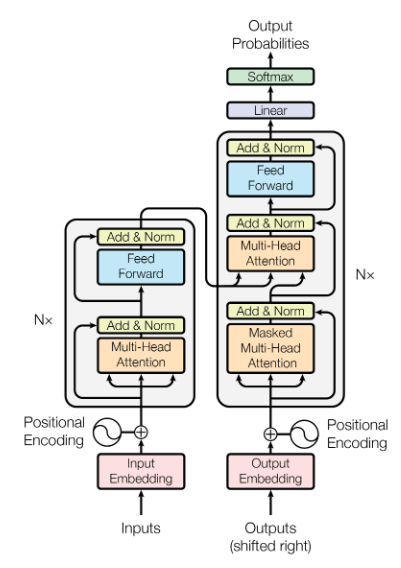
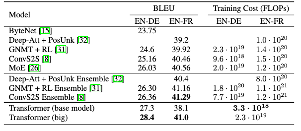

這篇文章想要簡介一下被廣泛使用的Transformer是什麼。

<!--more-->

## 簡介

在以前處理有關sequence的問題，像是文字、語音和影像等，所使用的model不是CNN就是RNN，然而它們各自有一些缺點，像是CNN必須要疊的很深才可以看到比較長範圍的資訊，RNN比較不能應付較長的序列，並且必須sequential的做訓練，不能夠被平行化，而這篇paper提出了另一個一樣能套用在sequence上的model，稱之為Transformer。

## 方法

底下的圖是paper當中所提出的Transformer的架構，跟一般做language translation的架構蠻像的，由encoder和decoder組成，但可以看到其中有一個比較特別的layer：Multi-Head Attention。

### Scaled Dot-Product Attention

在講Multi-Head Attention Layer之前，得先要講一下Scaled Dot-Product Attention，因為Multi-Head Attention Layer其實是由Scaled Dot-Product Attention所組成的，而下圖為Scaled Dot-Product Attention的架構。

假設我們現在有一個sequence input $$\boldsymbol{x}$$，其長度為$$n$$，而每一個元$$x_i$$是一個$$d$$維度的向量，可以想像成是我們已經把一個輸入進來的句子轉換成了$$d$$維的word embeddings

$$\boldsymbol{x}=[x_1, x_2, ..., x_n],\ x_i\in\mathbb{R}^d$$

而圖中的$$\boldsymbol{Q}$$、$$\boldsymbol{K}$$、$$\boldsymbol{V}$$，分別代表的是Query、Key、Value，是由不同的weight各自乘上輸入$$\boldsymbol{x}$$所得到的

$$\boldsymbol{Q}=[Q_1, Q_2, ..., Q_n],\ Q_i=W_Qx_i\in\mathbb{R}^{d_k}$$

$$\boldsymbol{K}=[K_1, K_2, ..., K_n],\ K_i=W_Kx_i\in\mathbb{R}^{d_k}$$

$$\boldsymbol{V}=[V_1, V_2, ..., V_n],\ V_i=W_Vx_i\in\mathbb{R}^{d_v}$$

Scaled Dot-Product Attention做的事情就是，對每個時間點$$t$$，用其Query對所有時間點的Key做內積，scale以後過$$\mathrm{softmax}$$得到attention weight，再與Value做weighted sum。假設我們想要得到$$t=1$$的輸出，其流程大概會是底下這樣

1. 取出$$t=1$$的query $$Q_1$$

2. 對所有時間點的key做內積，得到原始的attention weight $$\boldsymbol{a}=[Q_1K_1, Q_1K_2, ..., Q_1K_n], Q_iK_j \in \mathbb{R}$$

3. 對原始的attention weight除上維度開根號，以避免原始值太大，亦即$$\boldsymbol{a}=\frac{\boldsymbol{a}}{\sqrt{d_k}}$$

4. 將$$\boldsymbol{a}$$通過$$\mathrm{softmax}$$，得到最終的attention weight $$\boldsymbol{\hat a}=[\hat a_1, \hat a_2, ..., \hat a_n], \hat a_i\in\mathbb{R}$$

5. 利用attention weight對value做weighted sum，得到時間點$$t=1$$的輸出$$z_1$$

    $$z_1=V_1*\hat a_1+V_2*\hat a_2+...+V_n*\hat a_n\in\mathbb{R}^{d_v}$$

其他時間點的輸出$$z_2, ..., z_n$$都是利用相同的方式得到的，我們也可以從中發現到，其實產生某個特定時間點的輸出$$z_t$$並沒有與其他時間點有關聯，我們可以簡單地用矩陣相乘的方式一次算出所有的輸出

$$\boldsymbol{z}=[z_1, z_2, ..., z_n]=\mathrm{Attention}(\boldsymbol{Q}, \boldsymbol{K}, \boldsymbol{V})=\boldsymbol{V}\left(\mathrm{softmax}(\frac{\boldsymbol{Q}^T\boldsymbol{K}}{\sqrt{d_k}})\right)^T$$

至此我們有了可以輸入一個序列$$\boldsymbol{x}$$，得到與$$\boldsymbol{x}$$相同長度輸出$$\boldsymbol{z}$$的Scaled Dot-Product Attention layer。

### Multi-Head Attention Layer

而在Transformer架構中的Multi-Head Attention其實就是把輸入的$$\boldsymbol{Q}$$、$$\boldsymbol{K}$$、$$\boldsymbol{V}$$過linear transform、把多個Scaled Dot-Product Attention平行的疊在一起、將每個輸出都接起來後再過一個linear transform

$$\mathrm{MultiHead}(\boldsymbol{Q}, \boldsymbol{K}, \boldsymbol{V})=\mathrm{Concat}(\mathrm{head_1}, ..., \mathrm{head_h})W^O$$

$$\mathrm{head_i}=\mathrm{Attention}(\boldsymbol{Q}W_i^Q, \boldsymbol{K}W_i^K, \boldsymbol{V}W_i^V)\\W_i^Q\in\mathbb{R}^{d_{model}\times d_{k}}, W_i^K\in\mathbb{R}^{d_{model}\times d_k}, W_i^V\in\mathbb{R}^{d_{model}\times d_v}$$

在paper裡面，將$$\mathrm{head}$$的個數設為$$h=8$$、$$d_k=d_v=d_{model}/h=64$$，其中的$$d_{model}$$是Multi-Head Attention輸出的維度。

### Add & Norm

這一層做的事情是加一個residual connection，並做[Layer Normalization](https://arxiv.org/pdf/1607.06450.pdf)。

### Positional Encoding

在上面的方法中，在產生特定時間點輸出的時候，並不會對比較近或比較遠的輸入而有不一樣的操作，使得在產生$$z_3$$的時候，model並不知道$$x_1$$是比較近而$$x_{10}$$是比較遠的，因此在paper裡對輸入都加入了positional encoding，好讓model可以看輸入就知道這個輸入是哪一個時間點的輸入。

$$PE(pos, 2i)=\sin(pos/10000^{2i/d_{model}})\\PE(pos, 2i+1)=\cos(pos/10000^{2i/d_{model}})$$

### Encoding / Decoding 動畫

底下是從[Google AI Blog](https://ai.googleblog.com/2017/08/transformer-novel-neural-network.html)中擷取下來的動畫，解釋了Transformer在encoding和decoding時的流程。

## 實驗

Paper將Transformer應用在翻譯上，可以看到Transformer的表現超群。

## 結論

這篇paper提出了Transformer的架構，底層使用了Multi-Head Attention，是一個與CNN、RNN一樣，可以輸入輸出都是序列的layer，當你也有要處理序列的問題時，不妨試試看，或許可以有不錯的表現。
