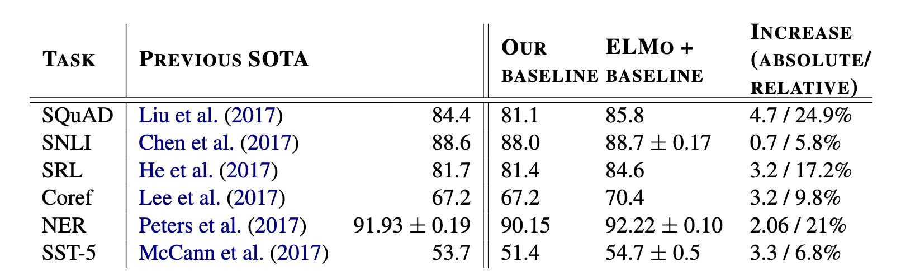

這篇簡單介紹一下赫赫有名的ELMo，其源自於[Deep contextualized word representation](https://www.aclweb.org/anthology/N18-1202.pdf)這篇paper。
<!--more-->

## 簡介

在做許許多多NLP任務的時候，我們通常都會將輸入進來的字轉換成word embedding，而一個好的embedding可以使整個任務的成效更好，而這篇paper的目的就是想要去尋找好的embedding。

## 方法

### Bidirectional Language Model

其主要的模型架構還蠻簡單的，就是多層的bidirectional language model。

假定我們輸入一個序列

$$N=(t_1, t_2, ..., t_N)$$

一個forward laguage model做的事情就是在給定序列的前半部$$(t_1, t_2, ..., t_{k-1})$$，去讓$$t_k$$被產生出來的機率可以最大，其主要的objective function如下

$$p(t_1, t_2, ..., t_N)=\prod \limits_{k=1}\limits^{N}p(t_k\vert t_1, t_2, ..., t_{k-1})$$

而backward language model做的事情跟forward language model差不多，就只是將序列反著輸入進去

$$p(t_1, t_2, ..., t_N)=\prod \limits_{k=1}\limits^{N}p(t+k\vert t_{k+1}, t_{k+2}, ..., t_N)$$

Birirectional language model就是將forward language model和backward language model合在一起做訓練

$$\sum\limits_{k=1}\limits^{N}\left( \log p(t_k\vert t_1, ..., t_{k-1};\overrightarrow{\theta_{LSTM}}) + \log p(t_k\vert t_{k+1}, ..., t_N;\overleftarrow{\theta_{LSTM}}) \right)$$

### ELMo

前面我們訓練多層的bidirectional language model，在每個輸入進來的token $$t_k$$得到了很多embedding，那我們應該要用怎麼樣的方式來使用呢？這篇paper建議將這些embedding做weighted sum，而其中的weight是根據後面要解決的NLP任務來決定的。

假如果們訓練了$$L$$層bidirectional language model，我們對於每一個token $$t_k$$可以得到$$2L+1$$個embedding

$$R_k=\left\{ x_k^{LM}, \overrightarrow{h_{k,j}^{LM}}, \overleftarrow{h_{k,j}^{LM}}\vert j=1, ..., L \right\}\\=\left\{ h_{k,j}^{LM}\vert j=0, ..., L \right\}$$

這$$2L+1$$個embedding包含了token一開始進來經過linear transform的embedding $$x^{LM}_k$$，以及$$L$$層forward/backward language model的hidden state$$\{ \overrightarrow{h_{k,j}^{LM}}, \overleftarrow{h_{k,j}^{LM}} \}$$，而ELMo會將這$$2L+1$$個embedding融合成一個

$$\mathrm{ELMo}^{task}_k=E(R_k;\theta^{task})=\gamma^{task}\sum\limits_{j=0}\limits^{L}s_j^{task}h_{k,j}^{LM}$$

其中$$s^{task}_j$$是經過$$\mathrm{softmax}$$標準化的weight，而$$\gamma^{task}$$的目的是讓後面NLP的任務可以自行決定要如何去scale這整個向量。

## 實驗

可以從上表中看到，使用了ELMo的embedding以後，成效就起飛了。

## 結論

ELMo是個我覺得架構還蠻算簡單的，製作word embedding的方式，也可以根據你後面想要解決的NLP task做fine-tuned。
