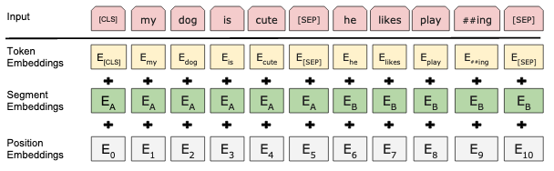

這篇介紹一下常常聽到的[BERT](https://arxiv.org/pdf/1810.04805.pdf)是怎麼樣運作的。

<!--more-->

## 簡介

在很多NLP的任務上常常可以聽到某個團隊用了BERT以後達到了state-of-the-art，而聽說現在在做NLP的時候都會使用BERT產生出來的embedding，再拿去給後面想要解決的NLP任務使用，得到的效果通常都還不錯，BERT成為了做各種NLP任務的起手式。

## 方法

BERT的架構是前一篇[Attention Is All You Need](https://wjohn1483.github.io/2020/03/21/attention-is-all-you-need/)當中所提到的Transformer的encoder，只是訓練的方式和參數的設定比較不一樣，在BERT這篇paper裡面使用了兩種參數

$$\mathrm{BERT}_{BASE}:L=12,H=768,A=12, total\ parameters=110\mathrm{M}\\\mathrm{BERT}_{LARGE}:L=24,H=1024,A=16, total\ parameters=340\mathrm{M}$$

其中$$L$$代表層數、$$H$$代表hidden size、$$A$$代表self-attention的head數。

### 訓練方式

#### Input Representation

由於BERT後面所接的NLP任務可能會需要sentence embedding，或同時考慮多個sentence，所以BERT在這個地方有設計兩個特別的token，分別是`[CLS]`和`[SEP]`，`[SEP]`是用來分開兩個句子的，而`[CLS]`是用來做classification的embedding，因為BERT是用self-attention layer為基礎，所以即便放在第一個，其輸出的embedding仍然包含整個句子的資訊。

而上圖中的Segment Embeddings是為了能夠更分開兩個句子之間的差異，可以想像成$$\mathrm{E_A}$$是一個純量等於$$0$$，$$\mathrm{E_B}$$也是一個純量等於$$1$$，更詳細的解說可以參考[這裡](https://www.cnblogs.com/d0main/p/10447853.html)。

#### Masked LM

BERT在做pre-training的時候，會同時訓練兩種任務，分別是masked LM以及next sentence prediction，而masked LM做的事情有點像是克漏字，在輸入一段文字進來的時候，在每個token會有15%的機率會被替換成`[MASK]`這個token，而最終希望透過一個classifier，輸入`[MASK]`經過BERT得到的embedding，輸出原本被替換掉的token。

#### Next Sentence Prediction (NSP)

Next sentence prediction做的事情就是去判斷輸入進來的這兩個句子，是不是在順序上是連續的，像是`人之初`和`性本善`就是連續的句子，但`人之初`和`你好嗎`就不是連續的句子，而訓練的方式是會拿`[CLS]`經過BERT得出來的embedding，來當作classifier的輸入，希望這個classifier輸出$$\mathrm{IsNext}$$或是$$\mathrm{NotNext}$$。

底下是整體的架構圖，其實在fine-tuning的時候，會根據不一樣的任務而拿不同位置輸出的結果，細節可以參考[原本的paper](https://arxiv.org/pdf/1810.04805.pdf)。

## 實驗

上圖為BERT部分的實驗結果，可以看到它技壓群雄。

## 結論

BERT是一個基於Transformer架構的模型，需要大量的資料來做訓練，好在作者們有提供已經訓練好的模型參數，可以直接下載下來做使用，期望使用BERT以後，能夠讓想要解決的NLP任務結果一飛沖天。

## 參考資料

1. [【译】为什么BERT有3个嵌入层，它们都是如何实现的](https://www.cnblogs.com/d0main/p/10447853.html)