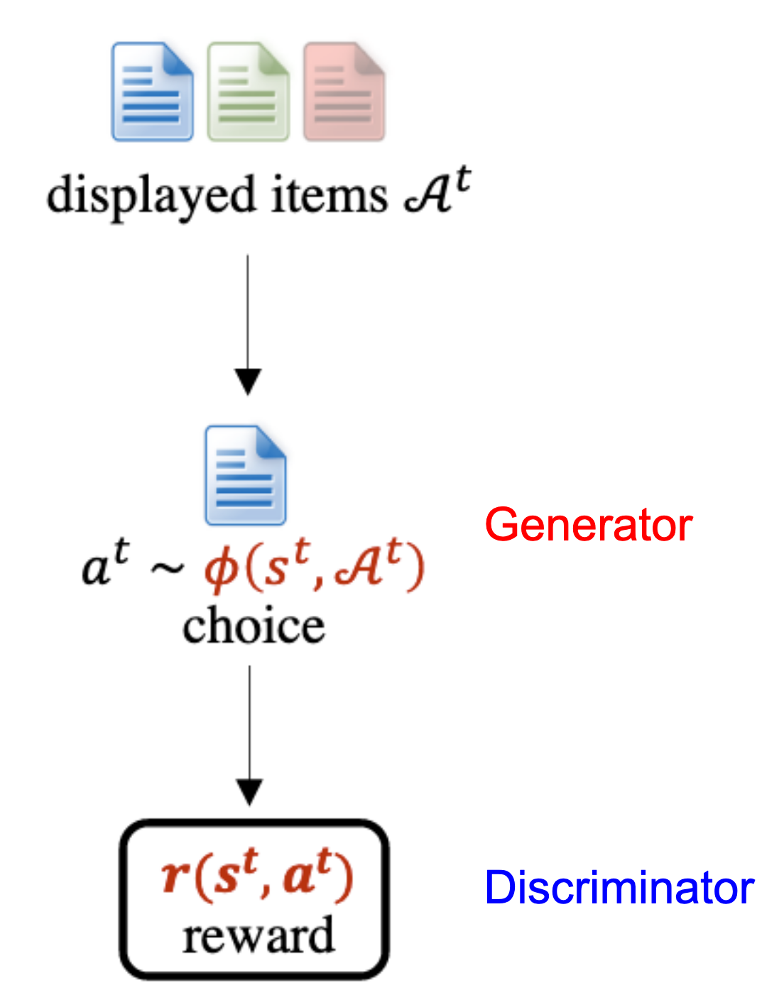
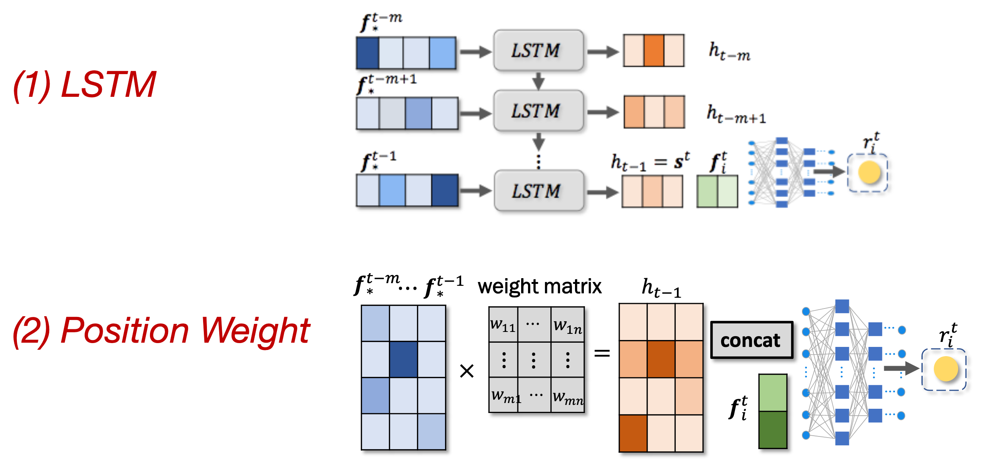
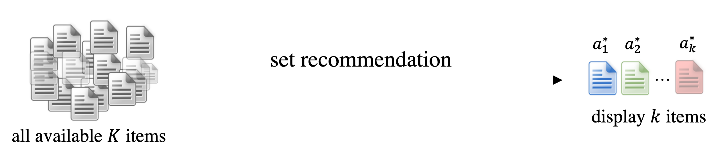
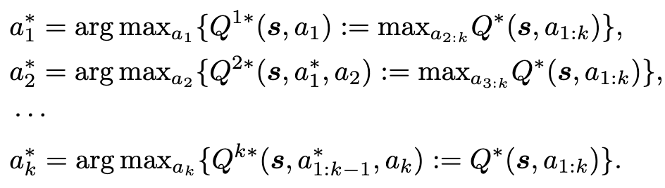

Reinforcement Learning很適合用在推薦系統上，然而要訓練RL需要很多跟使用者互動的經驗，這篇paper使用類似GAN的方法來去創造user model，以跟推薦系統互動。

<!--more-->

## 簡介

[這篇paper](https://arxiv.org/pdf/1812.10613.pdf)是ICML 2019的oral，主要是在講述，如何在推薦系統上套用Reinforcement Learning的框架，為此需要建立一個user model當作是環境，好讓推薦系統與之互動，作者還提出了Cascading Q-Network來做組合的推薦。

如果想對這篇paper瞭解更多的話，可以參考[作者在Oral的投影片](https://icml.cc/media/Slides/icml/2019/201(11-14-00)-11-14-25-4831-generative_adve.pdf)和[演講錄影](https://slideslive.com/38917397/time-series)(從25:50開始)。

## 方法

### 推薦系統與環境的互動方式

一開始作者先簡單介紹了一下推薦系統跟環境(user)互動的方式

1. 我們可以先從過去的資料蒐集該使用者過去點選過的東西，也就是上圖左下角的`state at t`
2. 推薦系統會根據state推薦出一些使用者可能有興趣的東西
3. 使用者從中選擇出他有興趣的物品，或是選擇以上皆沒有興趣
4. 將使用者新的選擇放入歷史資料中
5. 算出新的state以後回到步驟2

兩者互動的方式便是推薦系統不斷推薦物品，而使用者不斷從中選擇他有興趣的東西，如此反覆來創造訓練資料。

### Generative Adversarial User Model

在前面有提到，訓練RL需要與環境互動很多次才能訓練得好，然而這在推薦系統上是一件難以做到的事情，因為推薦系統的環境便是真實的使用者，而真實的使用者並沒有那麼的有耐心，願意陪你訓練推薦系統。另一個用RL訓練推薦系統的難處是，我們沒辦法去量化使用者的reward，我們只能從使用者的行為判斷出他可能比較喜歡哪一個物品，卻沒有辦法知道他有多喜歡，舉例來說，我們推出了十個物品給使用者，使用者點選了其中一個，接著又推出另外十個物品給使用者，使用者又點選了其中一個，雖然使用者在兩次的推薦當中都有點選物品，但我們無法知道使用者是不是喜歡第一次推薦的物品大過第二次推薦的物品。

為此，作者訓練了一個使用者模型來去模擬真實使用者的選擇，並產生出量化的reward，方便推薦系統做訓練。

#### Framework

身為一個使用者，他會看到推薦系統所推薦的物品清單$$A^t$$，generator會根據過去的選擇(使用者的喜好)，選擇出他有興趣的物品$$a^t\sim \phi(s^t, A^t)$$，而discriminator想要做的便是對generator給出的物品打個reward分數$$r(s^t,a^t)$$。

$$\phi(s^t, A^t)=\arg\max\limits_{\phi}\mathbb{E}_\phi[r(s^t,a^t)]-R(\phi)/\eta$$

$$r_\theta(s^t,a^t)=\mathbf{v}\sigma(\mathbf{V}(s^t,f_{a^t})+b)$$

式(1)中的$$R(\phi)/\eta$$是一個regularisation term，generator希望能獲取最大的reward，而reward其實就是將使用者過去的選擇和商品的feature餵入一層NN而得到一個純量，兩者想要最佳化的式子如下

$$\min\limits_{\theta}\max\limits_{\phi}\left( \mathbb{E}_\phi[\sum^T_{t=1}r_\theta(s^t_{true}, a^t)]-R(\theta)/\eta\right) - \sum^T_{t=1}r_\theta(s^t_{true},a^t_{true})$$

擁有下標$$true$$的代表是使用者真實的選擇，而generator想要最佳化的是第一項，discriminator想要最佳化的是第二項，也就是說generator想要讓自己產生出的選擇跟使用者真正的選擇越貼近越好，而discriminator想要讓使用者真正的選擇所得到的reward越大越好。

#### User State

在generator和discriminator都有用同使用到的$$s^t$$代表的是使用者過去的選擇，也就是使用者的喜好，其被實作的方式其實就是把過去所選擇的那些物品的feature(文字敘述、圖片等等做成embedding)，通過LSTM或者是直接乘上一個大矩陣並concatenate在一起，就完成了。

### Cascading Q-Networks

在前面使用類似GAN的方法得到了user model以後，接下來就是做一個推薦系統來從廣大的物品池裡面找出使用者會喜歡的商品，倘若想要使用$$Q-function$$來去對每一個可能的組合去做評估的話(式(4))，可以想像得到我們應該是算不完的，因為組合數實在是太多了，假如$$K=3000$$、$$k=10$$，我們就得要計算$$3000\choose10$$這麼多個可能，是故作者推出了Cascading Q-Networks來解決這個問題。

$$a^*_1, a^*_2, ..., a^*_k=\arg\max Q(s^t, a_1, a_2, ..., a_k)$$

其想法很簡單，如果組合數太多的話，那我就一個一個求出該被放進去的物品，直至$$k$$個物品都被選擇好。

而這個Cascading Q-Networks的訓練方式可以想成是訓練$$k$$個DQN，而每個DQN的reward都是一樣的，是user model給予整個組合的分數。

## 實驗

首先作者想要知道用GAN所訓練出來的user model的表現如何，便將這個user model去跟其他推薦系統相比較，可以看到用GAN訓練出來的user model表現蠻好的。

再來是對Cascading Q-Networks的實驗，想要知道以DQN作為推薦系統的表現怎麼樣，也可以看到CDQN的表現也相當亮眼。

## 結論

在這篇paper裡面作者使用GAN的技術來模擬真實的使用者，讓用RL來訓練推薦系統變得沒有那麼遙不可及。
