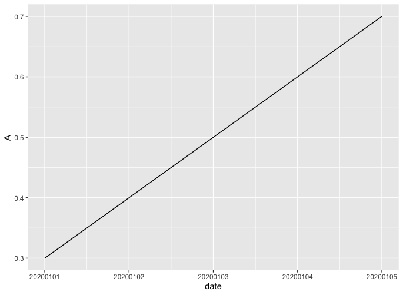
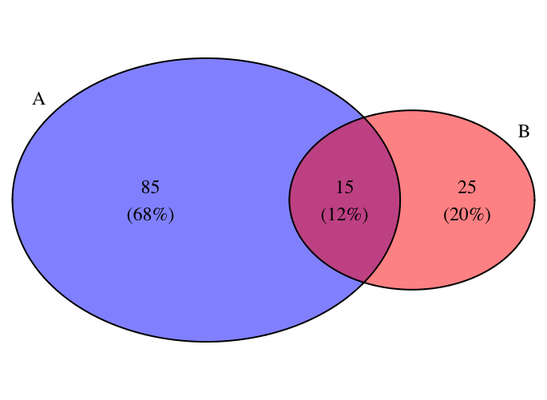
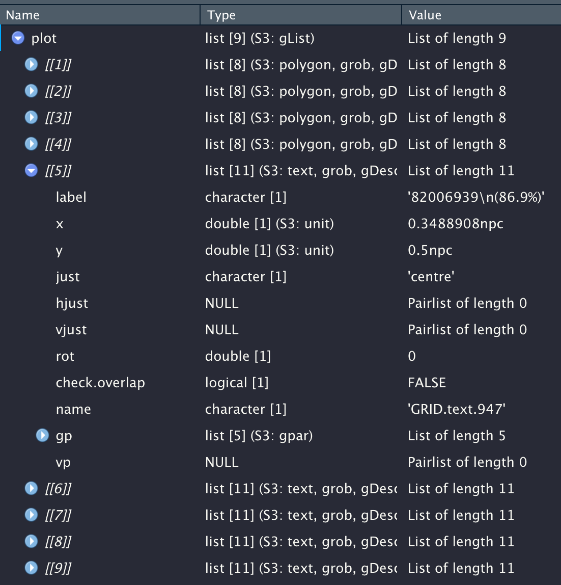
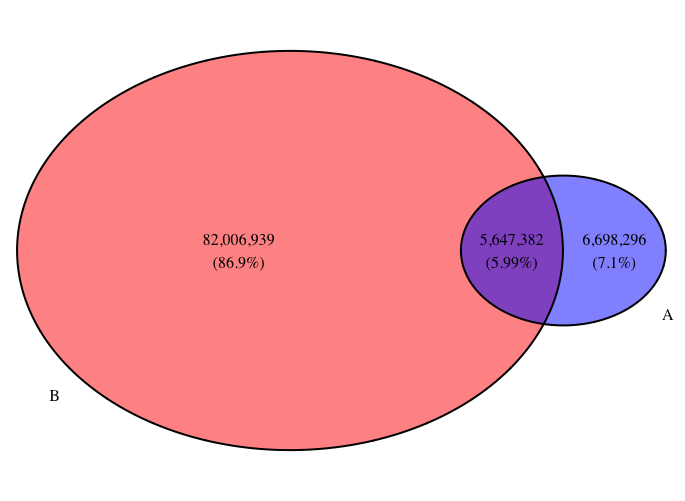

在以前有聽聞說R語言很適合用來畫圖，方便人們來觀察資料的特性，這篇粗淺的紀錄一下我用過的一些作圖function。

<!--more-->

## 安裝R和RStudio

可以在[CMU的網站上](http://lib.stat.cmu.edu/R/CRAN/)下載R的安裝檔，並在[RStudio](https://rstudio.com/products/rstudio/download/)的官網上下載RStudio，在完成這兩件事情以後，應該就能順利的在電腦上使用RStudio撰寫R的script了。

## 資料的讀寫

在準備好環境以後，接下來就是去將資料讀取進來，而在讀取的部分只需要打上`read.csv()`就能輕鬆的把csv檔讀進來了。

```R
data = read.csv("[path to your csv file]")
summary(data)
View(data)
```

而且R還有提供一些貼心的function，像是`summary()`：可以幫你簡單的總結一下這分檔案的基本資料、`View()`：可以在RStudio裡面以表格的方式打開這個csv檔，方便人們閱覽。

## 折線圖

若今天的資料形式適合畫折線圖來觀察趨勢的話，可以使用`ggplot()`來幫助你畫折線圖。

### 橫軸是其中一個欄位

假設今天的資料`test.csv`長得像底下這樣。

| date | A    | B                                                            |
| ---- | ---- | ------------------------------------------------------------ |
|20200101| 0.3|  0.5|
|20200102| 0.4 |  0.8|
|20200103| 0.5|  0.9|
|20200104| 0.6 | 0.2 |
|20200105| 0.7 | 0.7 |

#### 單一變數作圖

如果我們希望以日期為橫軸、A的值作為縱軸畫出來的話，直接打上底下的程式碼就行。

```R
library(ggplot2)
data = read.csv("test.csv")
ggplot(data) + geom_line(aes(x=date, y=A))
```



上面的程式碼中，首先先引入`ggplot2`這個畫圖的library，再來`ggplot(data)`可以想成是我現在想要以`data`這個dataframe作圖，而我想要的形式是線，亦即`geom_line()`，而`aes()`宣告了這條線的x、y軸的資料要從哪一個column中做選取。

#### 多變數作圖

倘若想要以日期作為橫軸、A和B的值作為縱軸畫在同一張圖片上，並以不同的顏色區分開來，可以參考底下的程式碼。

```R
library(ggplot2)
library(reshape2)
data = read.csv("test.csv")
melt_data = melt(data, id.vars="date")
ggplot(melt_data) + geom_line(aes(x=date, y=value, group=variable, color=variable))
```


在這邊我們多引入了一個叫`reshape2`的library幫我們把dataframe melt一下，`melt()`這個function所做的事情是把dataframe的資料以我們所設定好的column打散。

以`melt(data, id.vars="date")`這個例子來說，我們會固定**date**這個column，將**A**、**B**這兩個column的資料打散，想法上是去看說**date**這個column有個值是*20200101*，其對應到的column **A**的值是*0.3*，對應到**B**的值是*0.5*，所以會分別產生`(20200101, A, 0.3)`和`(20200101, B, 0.5)`這兩筆資料，並持續進行下去直到**date**的所有值都看過，也因此經過`melt()`以後，我們可以得到以下的dataframe。

| date     | variable | value |
| -------- | -------- | ----- |
| 20200101 | A        | 0.3   |
| 20200102 | A | 0.4 |
| 20200103 | A | 0.5 |
| 20200104 | A | 0.6 |
| 20200105 | A | 0.7 |
| 20200101 | B | 0.5 |
| 20200102 | B | 0.8 |
| 20200103 | B | 0.9 |
| 20200104 | B | 0.2 |
|20200105|B|0.7|

值得一提的是，`melt()`可以指定新的欄位名稱，使你在作圖時的橫軸、縱軸能用自定義的名稱。舉例來說，我想要將**variable**換成type、**value**換成score的話，可以參考底下程式碼。

```R
melt_data = melt(data, id.vars="date", variable.name="type", value.name="score")
```

有了這樣子的dataframe以後，就可以填入至`aes()`裡面，變成`aes(x=date, y=value, group=variable, color=variable)`，告訴它我們想要以**date**為橫軸**value**為縱軸，其中每個值有它所屬的group，以**variable**為標示，而我希望每個group以不同顏色標示，如此便能畫出我們所想要的圖了。

### 橫軸"不"是其中一個欄位

如果說今天手上的資料長成底下這樣。

| type | date20200101 | date20200102 | date20200103 | date20200104 | date20200105 |
| ---- | ------------ | ------------ | ------------ | ------------ | ------------ |
| A    | 0.3          | 0.4          | 0.5          | 0.6          | 0.7          |
| B    | 0.5          | 0.8          | 0.9          | 0.2          | 0.7          |

可以看到現在每一個日期變成了一個column，沒有辦法輕易的指定橫軸、縱軸就將圖畫出來，不過我們可以稍微調整一下資料，使之變成像"[橫軸是其中一個欄位](#橫軸是其中一個欄位)"那樣好指定的長相，整個程式碼長得像底下這樣。

```R
t_data = setNames(data.frame(t(data[,2:ncol(data)])), data[,1])
t_data["date"] = rownames(t_data)
melt_t_data = melt(t_data, id.vars="date")
ggplot(melt_t_data) + geom_line(aes(x=date, y=value, group=variable, color=variable))
```

首先，我們得要將資料透過`t()`轉置一下，把日期變成row，於此同時把column name設成A、B，也就是程式碼中的第一行，其中`data[,2ncol(data)]`的意思是選取`data`裡面的第二個column至最後一個column(R是1 base的語言)，也就是從**date20200101**選到**date20200105**，同理，`data[,1]`就是選取**type**這個column。

在經過第一行的轉換以後，原先的dataframe會變成底下的樣子。

|              | A    | B    |
| ------------ | ---- | ---- |
| date20200101 | 0.3  | 0.5  |
| date20200102 | 0.4  | 0.8  |
| date20200103 | 0.5  | 0.9  |
| date20200104 | 0.6  | 0.2  |
| date20200105 | 0.7  | 0.7  |

雖然變得比較像可以直接指定了，但目前還沒有辦法直接把所有的日期都選取起來，也就是日期還不是一個column，不過我們可以透過`t_data["date"] = rownames(t_data)`來新增一個column **date**，其中每個row都是日期。

|              | A    | B    | date         |
| ------------ | ---- | ---- | ------------ |
| date20200101 | 0.3  | 0.5  | date20200101 |
| date20200102 | 0.4  | 0.8  | date20200102 |
| date20200103 | 0.5  | 0.9  | date20200103 |
| date20200104 | 0.6  | 0.2  | date20200104 |
| Date20200105 | 0.7  | 0.7  | date20200105 |

至此我們成功讓我們的資料長得像"[橫軸是其中一個欄位](#橫軸是其中一個欄位)"中的資料那樣，接著一樣透過`melt()`和`ggplot()`便能將圖畫出來了。


## 文氏圖

文氏圖很適合用來觀察集合的關係，而R也有套件能夠幫助你很容易地畫出簡單的文氏圖。

### 安裝套件

在R裡面可以幫忙畫文氏圖的套件叫`VennDiagram`，可以使用底下的指令安裝並引入。

```R
install.packages("VennDiagram")
library(VennDiagram)
```

### 使用VennDiagram畫出文氏圖

假如我們今天想要觀察兩個集合**A**、**B**的關係，我們也已經知道兩者的大小和交集如下。

| A    | B    | Intersection |
| ---- | ---- | ------------ |
| 100  | 40   | 15           |

使用的方式很簡單，只要把數字填進去就能夠將圖畫出來了。

```R
grid.newpage()
plot = draw.pairwise.venn(area1=100, area2=40, cross.area=15, category=c("A", "B"), fill=c("blue", "red"))
```


#### 加上百分比和修改字體大小

如果想要在圖裡面加上百分比的話，只需要多加`print.mode=c("raw", "percent")`就行。

至於字體的大小，可以透過`cex`調整數字字體大小、`cat.cex`調整類別的字體大小。

```R
grid.newpage()
plot = draw.pairwise.venn(area1=100, area2=40, cross.area=15, category=c("A", "B"), fill=c("blue", "red"), print.mode=c("raw", "percent"), cex=1.5, cat.cex=1.5)
```



#### 將數字加上逗號

如果今天的數字很大的話，我們通常會希望在數字裡面加上逗號，方便我們去看這個數字是幾百萬還是幾千萬，假如我們的資料是底下這樣。

| A             | B        | Intersection |
| ------------- | -------- | ------------ |
| 12345678 | 87654321 | 5647382      |

這邊的做法比較tricky一些，因為VennDiagram並沒有辦法直接多加一個參數就能將逗號塞進去，我們需要自己手動放入。

```R
plot = draw.pairwise.venn(area1=12345678, area2=87654321, cross.area=5647382, category=c("A", "B"), fill=c("blue", "red"), print.mode=c("raw", "percent"))
```

在上面的指令跑完以後可以透過`View(plot)`看到其``[[5]]``到``[[7]]``的`label`裡面寫的資訊是會顯示在圖裡的字串。



是故我們只需要去修改`label`裡面的值，把逗號塞進去再畫出來就行了。

```R
plot = draw.pairwise.venn(area1=12345678, area2=87654321, cross.area=5647382, category=c("A", "B"), fill=c("blue", "red"), print.mode=c("raw", "percent"))
for(i in 5:7){
  a = strsplit(plot[[i]]$label, "\n")
  x = paste(format(as.numeric(a[[1]][1]), big.mark=",", scientific=FALSE), a[[1]][2], sep="\n")
  plot[[i]]$label = x
}
grid.newpage()
grid.draw(plot)
```

在上面的程式碼中，我們寫了一個for迴圈去改`[[5]]`到`[[7]]`的值，我們將`label`拿出來並以`\n`切成數字部分和百分比的部分，接著把數字部分塞逗號進去以後再與百分比部分接起來，最後再將圖畫出來，就達成我們想要的效果了。


