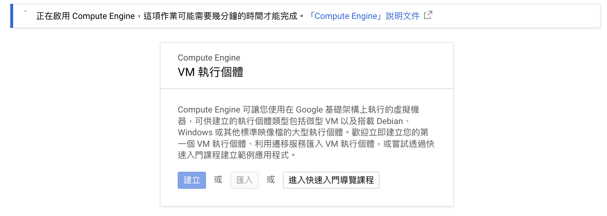
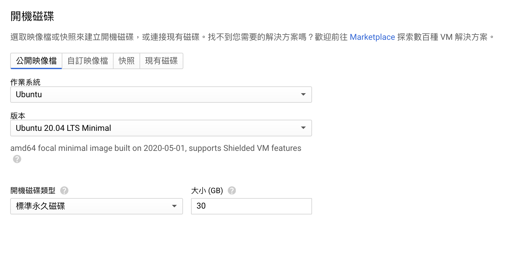
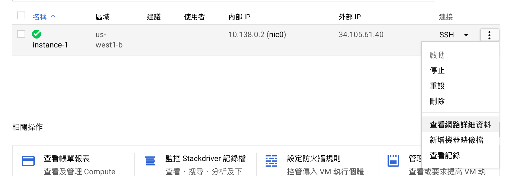
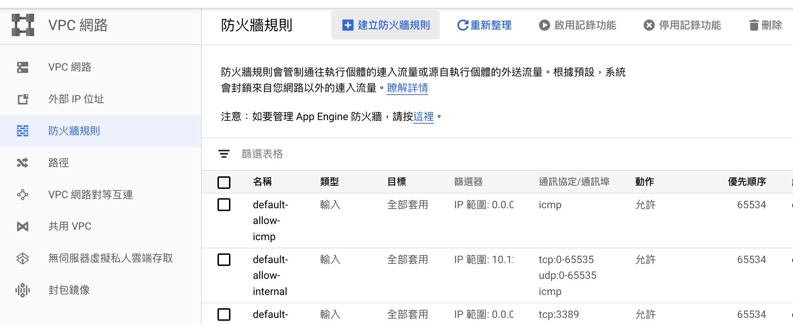
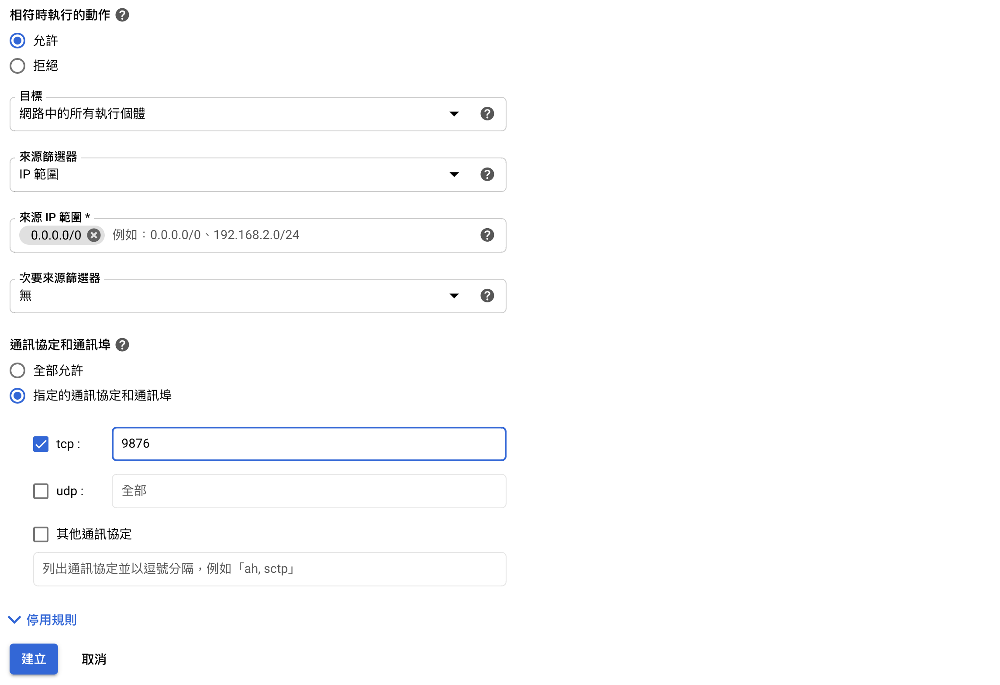
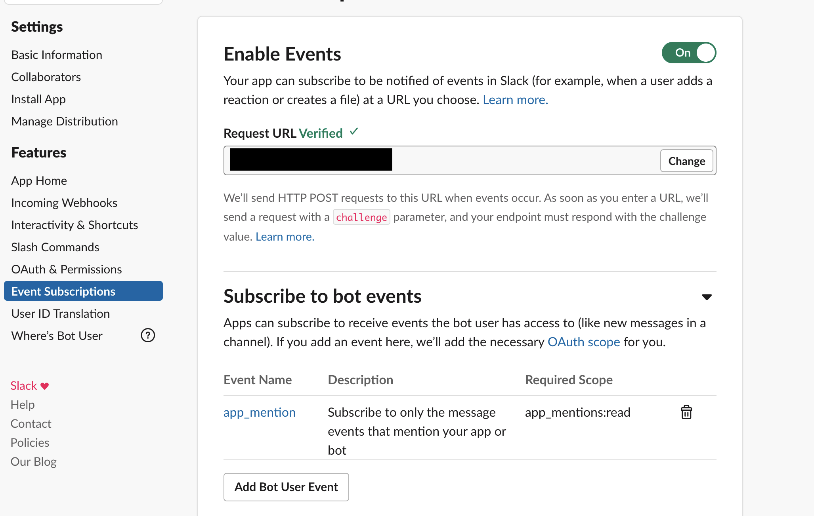

這篇文章紀錄一下如何透過GCP製作一個簡單的slack機器人。

<!--more-->

## 目標

由於一些原因，使我想要製作一個slack機器人，來幫助我將slack上的訊息貼到某個google sheet上，底下將會介紹我如何做到這件事情。

## Google Cloud Platform (GCP)

在開始製作slack機器人之前，我們需要先找到一個24小時不間斷運行的機器來執行我們的機器人程式，而這個機器最好有public IP，來讓slack可以透過這個IP跟機器人互動，最終，我選擇了Google Cloud Platform (GCP)來放我的機器人，因為它現在有[「一律免費」的方案](https://cloud.google.com/free/docs/gcp-free-tier?hl=zh-tw)可以使用，這個方案的額度允許你永久免費使用一個f1-micro的機器，還搭配有一個public IP，詳細的使用資訊可以參考連接中**Compute Engine**的部分。

### 註冊

註冊的部分就照著[官網](https://cloud.google.com/)的指示一步一步填寫資料就完成了，不過這邊會需要填寫信用卡資料，當你使用超過免費的額度的時候會從信用卡扣款。

### 開啟虛擬機

在註冊完成了以後就可以準備來開啟一個虛擬機了，可以直接到[Compute Engine](https://console.cloud.google.com/projectselector/compute/instances)這邊選擇，如果你沒有新增過任何專案的話，這邊會提示你新增一個專案，如果已經有建立好專案了，就可以直接選擇它。



這邊可能會需要一點時間來設定一些東西，當設定完成了以後就可以按下**建立**，來設定虛擬機的規格。


如果要使用f1-micro的機器，也就是一律免費所提供的機型的話，在區域的部分只能選美國，接著就是在機器類型的地方選擇f1-micro，這時在畫面的右上角就應該可以看到一律免費所提供的免費時數。



在下方開機磁碟的部分，可以選擇自己喜歡的作業系統，而一律免費的方案提供你30GB的HDD硬碟可以使用，記得要在這邊把容量改成30GB。

最後按下建立就能成功建立一個虛擬機了。


這邊可以看到虛擬機的內部IP和外部IP，而想要在虛擬機裡面下指令的話，可以點選右邊SSH的按鈕，會在瀏覽器裡面幫你開啟一個terminal，你就能任意的安裝、執行你想要的程式碼了。

### 防火牆

在開好虛擬機以後，接著就是希望slack傳送的資料可以被虛擬機接收到，為此需要開通防火牆，可以點選虛擬機旁邊設定中的**查看網路詳細資料**。



接著點選左邊的**防火牆規則**、右邊的**建立防火牆規則**。



自行設定一下需要的網路設定，按下**建立**就完成了，如此一來就能讓slack透過你所設定的port進行溝通。



## Slack Bot

在有了可以跑slack bot的虛擬機以後，接著便是來創建slack bot。

### 創建Slack app並選擇Bot

首先我們會先需要在[slack API中創建一個application](https://api.slack.com/apps)，並且選擇我們這個application的種類。


接著會需要告訴slack說這個bot需要的權限有哪些，可以點選左邊的**OAuth & Permissions**，在底下的**Scopes**新增想要的權限。


這邊我選擇了兩個權限，分別是讓bot有權可以讀取它被mention的訊息，以及以bot的帳戶傳送訊息到channel中。選擇好權限以後，就能在上圖最上方點選把bot安裝到你的workspace中(由於我已經安裝過了，所以現在顯示**Reinstall App**)。

### Event Subscription

至此，我們應該已經可以在slack中看到我們所創建的bot帳戶，接著就是希望bot可以在事件發生時(在這邊是希望被mention的時候)，可以有適當的反應，而slack這邊的做法其實就是當事件發生的時候，會傳送一個HTTP POST request到你所設定的網址，所以我們只需要在前面創立的虛擬機裡面，架設一個Web server來接受slack的POST request就行。



值得一提的是，在設定slack要傳送的POST位址時，slack為確保網址是活著的，所以在設定的時候就會傳送一個POST request過去，裡面會包含一個`challenge`的參數，我們會需要直接return `challenge`這個參數的內容給slack才可以設定成功。

### 傳送訊息

至於怎麼創立Web server跟slack互動以及傳送訊息至channel裡，可以參考[Slack的python-slackclient](https://github.com/SlackAPI/python-slackclient)裡面的[tutorial](https://github.com/slackapi/python-slackclient/tree/master/tutorial)。

簡單來說，上面的例子就是使用Flask建立一個Web server，不過會需要[使用到這個bot的憑證](https://github.com/slackapi/python-slackclient/blob/master/tutorial/PythOnBoardingBot/app.py#L12-L15)(可以看tutorial裡面的截圖)，接著就是設定一些`slack_events_adapter`來處理不同的event。

不過我個人使用時，不知道為什麼`slack_events_adapter`好像沒有什麼用處，我自己的程式碼是長得像底下這樣的。

```python
from flask import Flask, request
from slack import WebClient
from slackeventsapi import SlackEventAdapter

app = Flask(__name__)
slack_events_adapter = SlackEventAdapter(slack_signing_secret, "/slack/events", app)
slack_web_client = WebClient(token=slack_bot_token)

@app.route("/", methods=['POST'])
def post_handling():
    data = request.get_json()
    logger.info(f"Incoming payload\n{data}")

    # Slack need to check application is valid
    if "challenge" in data.keys():
        logger.info("Check accessibility")
        return data["challenge"]

    # Handle slack events
    else:
        event = data.get("event")
        channel_id = event.get("channel")
        user_id = event.get("user")
        text = event.get("text")
        event_type = event.get("type")
        ts = event.get("ts") if event.get("thread_ts") is None else event.get("thread_ts")
        if event_type == "app_mention":
            # Do what you want to do here
            
        response = slack_web_client.chat_postMessage(channel=channel_id, text=return_message, thread_ts=ts)
```

其中最後一行是把訊息傳送到slack的API，其中的`channel_id`、`ts`是從slack的POST request來的，分別是channel的id和thread的ts，而`return_message`是一個單純的string，在呼叫`chat_postMessage()`以後，就會將訊息回覆在thread中，若想要直接回覆在群組中，只需要把`chat_postMessage()`裡的`thread_ts`部分拿掉就可以了。

## 與Google Sheet互動

當初創立這個Bot的目的是希望把一些東西貼到google sheet上，在這邊介紹一下怎麼用command line來跟google sheet互動，使用的套件是[gspread](https://github.com/burnash/gspread)，這邊的介紹主要是參考[Accessing Google Spreadsheet Data using Python](https://towardsdatascience.com/accessing-google-spreadsheet-data-using-python-90a5bc214fd2)。

### 建立service account

為了要讓Bot可以修改google sheet，我們需要為他建立一個google bot帳號，來在google sheet的設定裡賦予它編輯者的權限，而設定的方法也很簡單，首先先去google clound console選擇**APIs & Services**的**Library**。


並在跳出來的畫面搜尋**Google Sheets API**，點進去並啟用以後，應該會引導到底下的畫面，新增一個新的credential。


**需要記得把上圖中的Which API are you using換成Google Sheets API**，完成了以後我們可以得到一個json檔，裡面包含了一些credential來讓我們使用Google Sheets API。

印象中在建立的途中會提示你建立一個service account，只需要填寫一個代表這個bot的名字就可以獲得一個電子信箱位址。


可以去**APIs & Services**的**Credentials**裡面去看到是否有一個domain name為`iam.gserviceaccount.com`的電子信箱，最後就是將這電子信箱加入google sheet的協作者就可以了。

### gspread

至此，bot已經有權限可以修改google sheet了，最後就是透過gspread來跟google sheet做互動，範例的程式碼如下。

```python
import gspread
from oauth2client.service_account import ServiceAccountCredentials

scope = ['https://spreadsheets.google.com/feeds']
credential = ServiceAccountCredentials.from_json_keyfile_name('/path/to/your/credential.json', scope)
client = gspread.authorize(credential)
sheet = client.open_by_url(sheet_url).sheet1
```

這邊的`/path/to/you/credential.json`是前面所下載的json檔，而`sheet_url`是你google sheet的網址，其他gspread的使用方法可以參考它的[documentation](https://gspread.readthedocs.io/en/latest/)。


