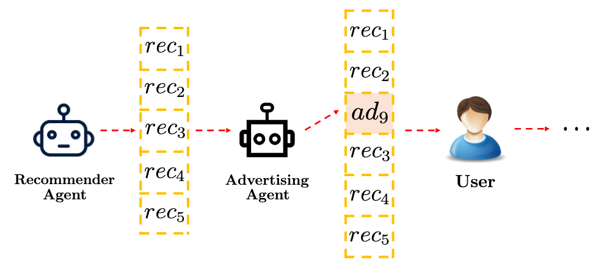
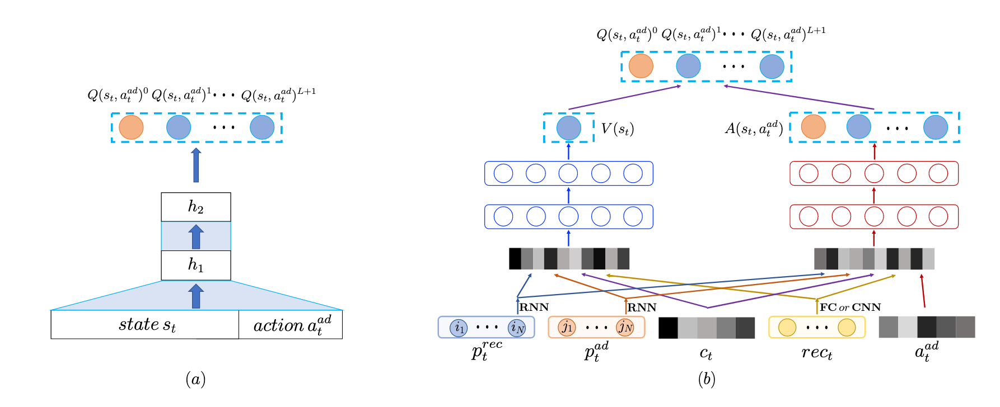
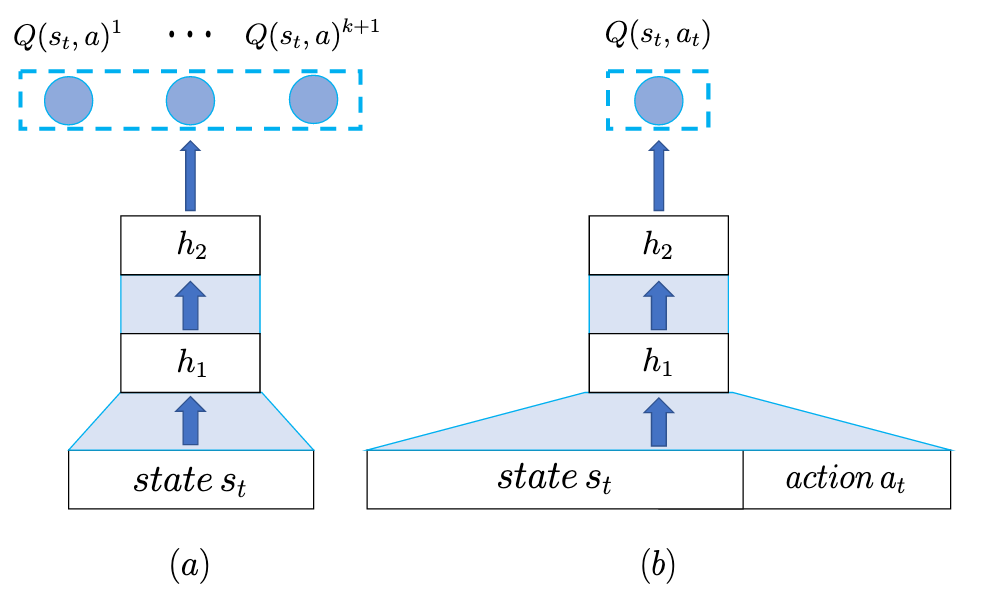
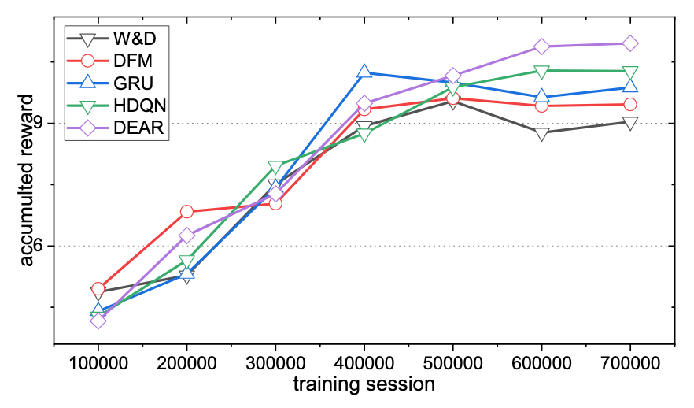

用Reinforcement Learning來訓練廣告系統，決定廣告該要怎麼顯現。

<!--more-->

## 簡介

[這篇paper](https://arxiv.org/pdf/1909.03602.pdf)想要使用Reinforcement Learning來解決廣告系統當中，廣告曝光數以及使用者體驗的平衡，當廣告曝光的越多，使用者體驗就會下降，反之，沒有廣告的曝光，平台本身的獲利就會減少。

在這篇paper當中，假設平台本身已經有一個很好的推薦系統，每當使用者發request進來的時候，便會推薦使用者感興趣的內容，而這篇paper想要研究的就是中間的Advertising Agent，並解決底下息息相關的三個問題

* 要不要在本次的推薦當中安插廣告？
* 如果要放廣告，那要放哪一個廣告？
* 放在推薦的內容中的哪一個位置？

## 方法

作者提出的模型如下圖

模型的輸入總共有五個

* $$p^{rec}_t$$：使用者過去所看過內容的feature，把過去每個時間點看過的內容的feature都丟進GRU裡面取最後一個時間點的hidden state
* $$p^{ad}_t$$：使用者過去所看過廣告的feature，把過去每個時間點看過的廣告的feature都丟進GRU裡面取最後一個時間點的hidden state
* $$c_t$$：使用者的資訊，像是使用的是iOS還是Android等等基本的資訊
* $$rec_t$$：當前推薦內容的feature，把所有的內容的feature接在一塊過一層layer，$$rec_t=\tanh(W_{rec}concat(rec_1, ..., rec_L)+b_{rec})$$
* $$a^{ad}_t$$：廣告的feature

把上面四個合併在一起就是代表使用者狀態的$$s_t$$，$$s_t=concat(p^{rec}_t,p^{ad}_t,c_t,rec_t)$$。

左圖(a)為作者一開始想到的模型架構，藉由把使用者的狀態$$s_t$$和廣告的feature $$a^{ad}_t$$餵進去，讓model去預測把廣告插在不同位置的分數，$$Q(s_t,a^{ad}_t)^1, Q(s_t,a^{ad}_t)^2$$代表的便是插在位置1和2的分數，而紅色圈圈的$$Q(s_t,a^{ad}_t)^0$$是不插廣告的分數，讓一次model的predict就可以一次解決上述的三個問題（要決定插哪一個廣告就把所有候選的廣告都丟進model裡面去predict，取最高分的）。

當今天使用者的體驗不錯的時候，可以適時地加入廣告增加平台收入，而當使用者體驗不好的時候，就不應該插入廣告，作者想要將這樣的概念加入至model當中，所以架構從(a)修改成了(b)，左邊的$$V(s_t)$$的輸入只有使用者的$$s_t$$，代表使用者到現在的體驗如何，而右邊的$$A(s_t,a^{ad}_t)$$多加入了廣告的feature，代表插入廣告以後的分數如何，而最終的分數便是兩者的加總。

作者所提出來的架構跟原本DQN的架構類似，只是又多了一個維度，如果使用上圖的(a)、(b)，和上上圖的(a)架構來玩倉庫番的話，他們的概念是這樣子的

* 上圖(a)：給定遊戲畫面（$$s_t$$），預測往上下左右走的分數（$$Q(s_t,a)^1,...,Q(s_t,a)^{k+1}$$）
* 上圖(b)：給定遊戲畫面（$$s_t$$）和動作（往上$$a_t$$），model會預測出這個組合的分數
* 上上圖(a)：給定遊戲畫面（$$s_t$$）和動作（往上$$a_t$$），model會預測出往上走0步、1步、n步的分數（$$Q(s_t,a)^0,...,Q(s_t,a)^{k+1}$$）

## 實驗

作者首先將這個model（DEAR）與其他RL的model做比較，可以看到這篇paper model的表現是最好的。

再來作者將model去掉一部份，看看各個部件對performance的影響。

* DEAR-1：將Reinforcement Learning改成Supervised Learning
* DEAR-2：把使用者過去所看過內容的feature，從GRU改成Dense
* DEAR-3：在原本DQN架構圖(b)的架構，並多在輸入的地方接一個1-hot vector代表廣告要插在哪一個位置
* DEAR-4：不把$$V(s_t)$$和$$A(s_t,a^{ad}_t)$$分開算，也就是作者所提出的架構圖中的(a)

可以看到最終版本的架構的表現最好。

## 結論

在這篇paper裡面，作者結合了兩個傳統DQN的架構，多衍伸出了一個維度，來一次性解決廣告系統需要決定的三件事情，這樣的架構除了用在廣告系統上，還可以應用在其他的任務當中。