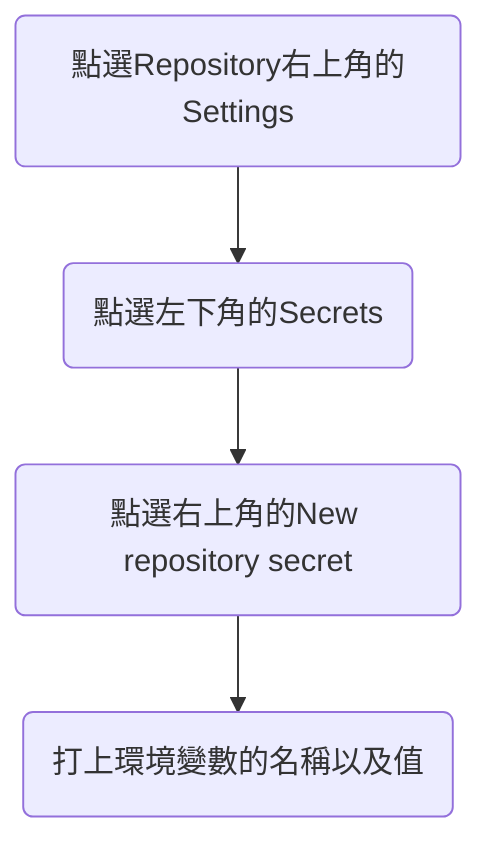

前陣子發現到GitHub Actions可以用來做CI，試著使用看看。

<!--more-->

## GitHub Actions

[GitHub Actions](https://github.com/features/actions)是GitHub自己出的一套CI/CD的工具，可以讓你在推code、看CI/CD都在GitHub上面解決。

GitHub Actions相較於其他CI/CD的工具，我覺得它的優勢在於免費的額度比較多，如果是public repository，actions的使用是免費的，而private repository每個月也有2000分鐘的使用時間，而且如果有其他人fork你的repository，這些CI/CD的設定也會跟著被帶走，別人也可以無痛的使用相同的CI/CD流程。

## 開始使用GitHub Actions

只要在repository裡面創建**.github/workflows/**，並在裡面放好設定檔，就可以觸發GitHub Actions了，你也可以在repository頁面的上方點Actions的頁籤，裡面有一些設定檔的範本可以選擇。

```yaml
name: My first github actions

on:
  push:
    branches: [ master ]

jobs:
  build:
    name: Build
    runs-on: ubuntu-latest

    steps:
      - name: Checkout
        uses: actions/checkout@v2

      - name: Build
        run: |
          echo "hello"

```

設定檔跟其他的工具長相差不多，在steps裡面填寫你想要做的事情，GitHub就會起一個virtual machine來執行。

## 設定環境變數

如果想要在Actions裡面傳入環境變數的話，可以參考底下的步驟。



repository裡面設定好環境變數以後，在設定檔需要宣告使用哪些環境變數，之後在steps裡面就可以直接使用了。

```yaml
name: My first github actions

on:
  push:
    branches: [ master ]
    
jobs:
  build:
    name: Build
    env:
      USER_NAME: ${{secrets.USER_NAME}}
    runs-on: ubuntu-latest

    steps:
      - name: Checkout
        uses: actions/checkout@v2

      - name: Build
        run: |
          echo "${USER_NAME}"

```

## 想要在Actions裡面push程式碼到repository

在Actions裡面有人寫好了[工具](https://github.com/marketplace/actions/webfactory-ssh-agent)可以讓你宣告ssh key，就能像一般利用ssh key push的方式推程式碼到你的repository裡面，產生和設定ssh public/private key的方式請參考[GitHub的官方文件](https://docs.github.com/en/github/authenticating-to-github/connecting-to-github-with-ssh)。

在GitHub設定好public key以後，將private key弄到ssh-agent的方式可以參考底下。

```yaml
name: My first github actions

on:
  push:
    branches: [ master ]
    
jobs:
  build:
    name: Build
    env:
      USER_NAME: ${{secrets.USER_NAME}}
    runs-on: ubuntu-latest

    steps:
      - name: Checkout
        uses: actions/checkout@v2
        
      - name:
        uses: webfactory/ssh-agent@v0.5.0
        with:
          ssh-private-key: ${{secrets.SSH_PRIVATE_KEY}}

      - name: Build
        run: |
          echo "${USER_NAME}"
```

## 參考資料

1. [[淺談]用GitHub Actions 簡易的 CI 來發布GitPages](https://medium.com/@JainKai/%E6%B7%BA%E8%AB%87-%E7%94%A8github-actions-%E7%B0%A1%E6%98%93%E7%9A%84-ci-%E4%BE%86%E7%99%BC%E5%B8%83gitpages-6ae48e52467e)
2. [帶著走的CI/CD：GitHub Actions! (Take the CI/CD with you: GitHub Actions!)](https://medium.com/thinkthenrant/githubactionsintro-94be66a8a9f1)
3. [webfactory/ssh-agent](webfactory/ssh-agent)
