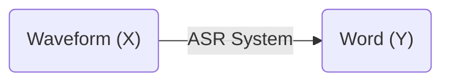

在我們的生活當中，語音辨識已經越來越普及了，不論是語音輸入、語音助手都有使用到語音辨識的技術，底下簡單介紹一下在大量使用neural network之前語音辨識所使用到的一些技術。

<!--more-->

## 基礎介紹

語音辨識（Automatic Speech Recognition, ASR）所做的事情如上圖所示，將輸入的訊號轉換成文字，亦即是去尋找

$$\arg\max\limits_Y P(Y\vert X)$$

### 輸入

關於ASR輸入的部分，在大多數的情況下，我們並不會直接將waveform當作輸入，而是會先對這個waveform做一些處理，最常見的做法是將waveform轉成MFCC sequence後再餵入ASR系統裡面。

**Mel-frequency Cepstrum Coefficients (MFCC)**

在一般的設定當中，語音訊號的採樣頻率是16k，也就是1秒會有16k個數值，而[MFCC](https://en.wikipedia.org/wiki/Mel-frequency_cepstrum)會以25ms為一個window、每10ms為間隔去將25ms的音訊轉成39維的向量。概括來說MFCC做的事情是先將waveform過傅立葉轉換，再通過一群filter bank，最後從頻域轉回來，而這些filter bank是過去人們研究耳朵的構造所訂定出來的，專門為了辨識音訊所設計。

MFCC具體上做的事情還蠻複雜的，好在現在可以直接使用[Kaldi](https://github.com/kaldi-asr/kaldi)幫我們將音訊轉成MFCC，只要將音訊餵進去，它就可以幫忙將音訊轉成MFCC sequence，也就是一堆39維的向量組成的序列，接著就可以開始製作ASR系統了。

值得一提的是，近期有蠻多研究會直接使用過完filter bank以後得到的輸出當作ASR系統的輸入，可以看需求來選擇不同的feature，在Kaldi裡面都有支援。

### 輸出

在ASR系統輸出的部分，我們最終想要輸出的是文字，但在語音辨識裡面，通常ASR系統輸出的並不會直接是文字，而是比文字再更小的單位，因為一個字通常是由很多音來組成的，像是注音符號就是一個比文字再更小的單位，底下介紹一下常用的輸出有什麼。

**Phoneme**

Phoneme是發音的最小單位，可以想像成是類似英文的音標，而這種輸出會需要有該語言的專業人士告訴我們每一個字所對應到的phoneme是什麼，好讓ASR系統在產生出phoneme以後，能藉由查表的方式轉換成文字。

**Graphme**

Graphme是書寫的最小單位，在英文的話會是英文字母，在中文的話會是每一個中文字，雖說中文字有上萬個，但實際上常用的中文字大概在3000-5000的量級。

**Morpheme**

Morpheme是比graphme再大一點的單位，可以說是英文的字根字首。

`unbelievable`→`un`、`believe`、`able`

## Hybrid ASR

接下來稍微講一下ASR系統該怎麼做，不過在做語音辨識之前，我們會要先去蒐集語音及其相對應的文字$$\mathcal{D}_l=\{(X_i, Y_i)\}^{N}_{i=1}$$，其中$$X=[x_1, ..., x_T]\in (\mathbb{R}^m)^*$$，$$x_t$$是一個$$m$$維的向量，可以想成是之前提到的MFCC，而$$Y=[y_1, ..., y_L] \in B^*$$，$$B$$代表的是文字的vocabulary，我們想要製作的ASR系統其實就是$$p_\theta(Y\vert X)$$，將音訊輸入進去以後，告訴我們文字出現的機率。

這個章節想要提的hybrid ASR主要由三個部分組成：Language Model（LM）、Pronunciation Model（PM）、Acoustic Model（AM）。

### Language Model

Language model做的事情是判斷這個文字序列$$Y$$出現的機率有多少，有點像是鍵盤輸入法的校正，隨著輸入的文字越來越長，去找最適當的文字該要是什麼，寫成數學式如下。

$$p_{LM}(Y)=\prod^L_{i=1}p(y_i\vert y_1, ..., y_{i-1})$$

### Pronunciation Model

Pronunciation model其實就是前面所提到的，文字跟phoneme的對應表，又稱為lexicon。每一個$$Y$$，都可以根據這個表對應成phoneme sequence。

$$P=[p_1, ..., p_M]=f_{PM}(Y)\in O^*$$

其中$$f_{PM}(Y)$$代表mapping function，$$O$$表示phoneme inventory，也就是所有的phoneme有哪些。

### Acoustic Model

Acoustic model做的事情是去決定phoneme sequence產生出$$X$$的機率，亦即$$p_{AM}(X\vert P)$$，而phoneme sequence當中的每一個phoneme $$p$$都有可能產生出不定長度的feature $$x$$，我們並不知道$$X=[x_1, ..., x_T]$$當中的哪些$$x_t$$是由哪個$$p_t$$產生的，為此，我們對於每一個phoneme都用一個[Hidden Markov Model（HMM）](https://en.wikipedia.org/wiki/Hidden_Markov_model#Applications)來model。

可以想成是說，我們創造了另一個比phoneme更小的單位，HMM的`state`，來代表一個phoneme，可能一個phoneme 是由3個state組成$$p_1=[a_1, a_2, a_3]$$，當$$X=[a_1, a_1, a_2, a_2, a_2, a_3]$$，我們就有機會可以說$$X$$是由phoneme $$p_1$$產生出來的，因此原先的phoneme sequence $$P$$，可以以HMM state來改寫成$$A=[a_1, ..., a_T]$$，這邊$$A$$的長度與$$X$$的長度一致，所以$$A$$又被稱之為alignment。

$$
\begin{aligned} 
p_{AM}(X,A\vert P) & =p_{emit}(X\vert A)p_{tran}(A\vert P) \\
& =\prod\limits_t p_{emit}(x_t\vert a_t)p_{tran}(a_t\vert a_{t-1}; P)
\end{aligned}
$$

有了alignment以後，我們可以根據這些state來算出joint probability，上面的$$p_{tran}$$表示的是HMM當中的transition probability，而$$p_{emit}$$表示emission probability，亦即這個state產生出這個feature的機率，通常使用[Gaussian Mixture Model（GMM）](https://scikit-learn.org/stable/modules/mixture.html)來model。

而實際上我們想要知道的$$p_{AM}(X\vert P)$$就是將所有有可能的$$A$$都加起來

$$
\begin{aligned}
p_{AM}(X\vert P) & =\sum_A p_{emit}(X\vert A)p_{tran}(A\vert P) \\
& \approx \max_A p_{emit}(X\vert A)p_{train}(A\vert P)
\end{aligned}
$$

雖然在算式裡面有很多的$$\sum$$和$$\prod$$還有窮舉，其實在做計算的時候會使用[forward-backward algorithm](https://en.wikipedia.org/wiki/Forward%E2%80%93backward_algorithm)和[Viterbi algorithm](https://en.wikipedia.org/wiki/Viterbi_algorithm)這些類似dynamic programming的方式來有效率的計算。

### 組合Hybrid ASR

前面介紹了hybrid ASR當中重要的三個部分：LM、PM、AM，而它們三個組合起來的方式如下

$$
\begin{aligned}
p_\theta(X,Y) & = p_{AM}(X\vert f_{PM}(Y))p_{LM}(Y) \\
& = \sum_Ap_{emit}(X\vert A)p_{tran}(A\vert f_{PM}(Y))p_{LM}(Y) \\
& \approx \max_Ap_{emit}(X\vert A) p_{tran}(A\vert f_{PM}(Y))p_{LM}(Y)
\end{aligned}
$$

雖說它們存在於同一個數學式當中，但實際上LM和AM通常是會被分開訓練的，它們有各自的objective function。

$$p^*_{LM}=\arg\max\limits_{p_{LM}}\sum\limits^{N}\limits_{i=1}\log p_{LM}(Y_i)$$

$$p^*_{AM}=\arg\max\limits_{p_{AM}}\sum\limits^N\limits_{i=1}\log p_{AM}(X_i\vert f_{PM}(Y_i))$$

在知道怎麼計算joint probability $$p_\theta(X,Y)$$以後，我們想要求得的$$\arg \max\limits_Y p_\theta(Y\vert X)$$就是去尋找最大的joint probability $$p_\theta(X,Y)$$。

$$
\begin{aligned}
\arg\max\limits_Yp_\theta(Y\vert X) & = \arg\max\limits_Y\frac{p_\theta(X,Y)}{p(X)} \\
& \approx \arg\max\limits_Yp_\theta(X,Y)
\end{aligned}
$$

其中$$p(X)$$是語音$$X$$出現的機率，假設每一段語音出現的機率都均等的話，我們可以忽略不看。

實際上在操作的時候，我們會將HMM emission probability、transition probability、lexicon和language model共同組成[Weighted Finite State Transducers（WFST）](https://en.wikipedia.org/wiki/Finite-state_transducer)，並從中去尋找最佳路徑，與此同時還會引入一個$$\alpha$$來去調配acoustic model和language model的平衡。

$$p_{\theta,\alpha}(X,Y)\propto p_{AM}(X\vert f_{PM}(Y))p_{LM}(Y)^\alpha$$

而這個$$\alpha$$是在development set $$\{(\tilde X_i,\tilde Y_i)\}^{\tilde N}_{i=1}$$最小化edit distance得到的。

$$\alpha=\arg\min\limits_\alpha\sum\limits_{i=1}\limits^{\tilde N}ED\left ( \tilde Y_i,\arg\max\limits_Y \left (\log p_{AM}(\tilde X\vert f_{PM}(Y))+ \alpha*\log p_{LM}(Y)\right ) \right )$$

所以最終語音辨識出來的文字會是

$$Y^*=\arg\max\limits_Yp_{\theta,\alpha}(X,Y)$$

### 在Hybrid ASR裡面使用DNN

隨著neural network的興起，語音辨識也逐漸引入deep learning來幫助辨識，在這個hybrid ASR系統裡面，我們也可以使用DNN來幫助我們提高辨識率。

在acoustic model裡面，我們想要算的是$$p_{AM}(X\vert P)$$，在前面的推導當中，我們得到

$$p_{AM}(X\vert P)\approx \max_A p_{emit}(X\vert A)p_{tran}(A\vert P)$$

其中再去細鑽下去的話

$$
\begin{aligned}
p_{AM}(X\vert P) & \approx \max_A p_{emit}(X\vert A)p_{tran}(A\vert P) \\
& = \max\limits_A\prod\limits^T\limits_{t=1}p_{emit}(x_t\vert a_t)p_{tran}(a_t\vert a_{t-1}; P) \\
& = \max\limits_A\prod\limits^T\limits_{t=1}\frac{p(a_t\vert x_t)p(x_t)}{p(a_t)}p_{tran}(a_t\vert a_{t-1}; P)
\end{aligned}
$$

其中$$p_{tran}(a_t\vert a_{t-1}; P)$$一樣是由HMM來，$$p(a_t)$$可以從HMM裡面統計出來$$p(a_t)=\frac{a_t出現的次數}{所有state出現的次數}$$，而$$p(a_t\vert x_t)$$就可以用DNN來做訓練。

## 參考資料

1. [[DLHLP 2020] Speech Recognition (1/7) - Overview](https://www.youtube.com/watch?v=AIKu43goh-8)
2. [Unsupervised Speech Recognition](https://arxiv.org/abs/2105.11084)
