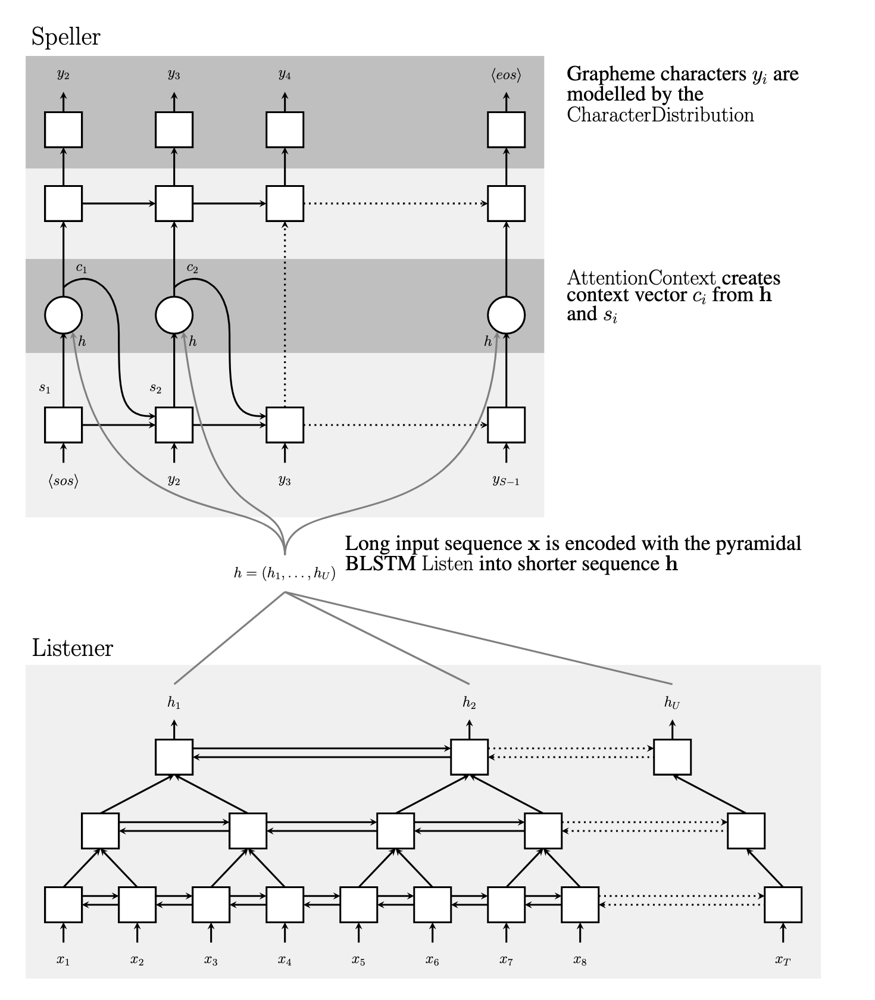
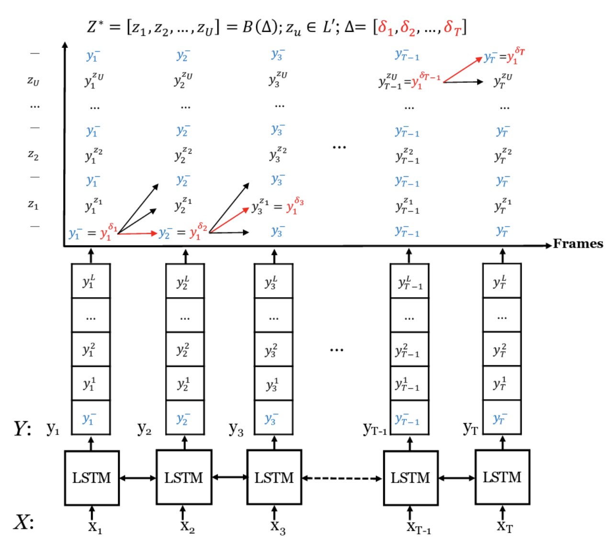
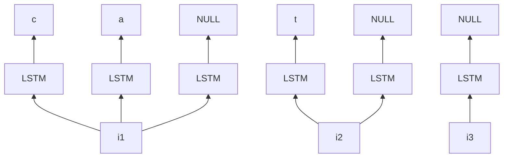
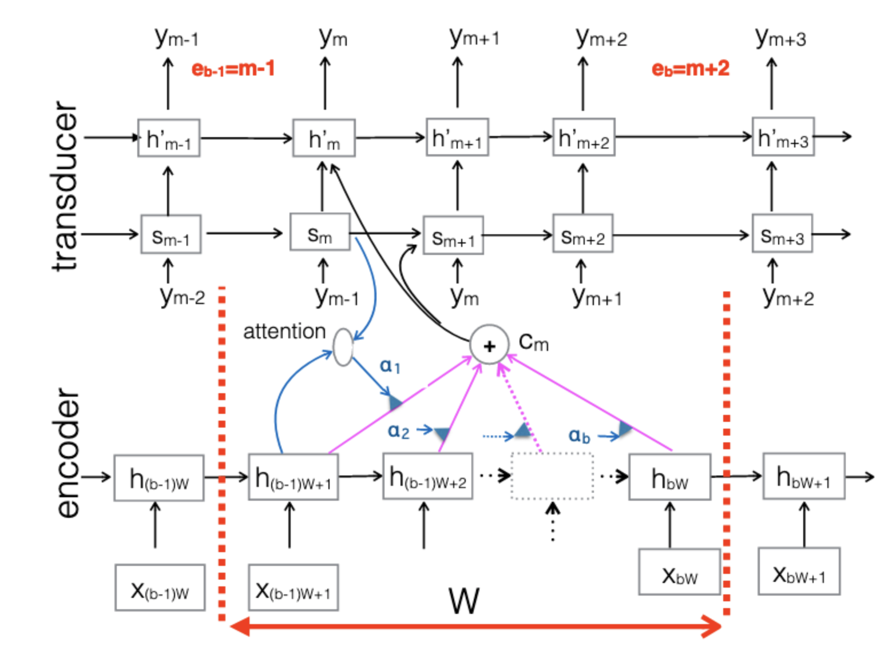

在[先前的文章](https://wjohn1483.github.io/2021/06/14/introduction-to-speech-recognition/)裡頭，介紹了在深度學習蓬勃發展之前，語音辨識大概是如何達成的，而這篇文章會簡單介紹一下，在加入了深度學習以後，語音辨識的技術有了什麼樣的更動。

<!--more-->

過去在做語音辨識的時候，會需要不同的模型互相協作，而隨著深度學習的發展，有些語音辨識的方法已經可以將所有的模型整合成一個模型，大大簡化了語音辨識的複雜度。

## Listen, Attend and Spell（LAS）

第一個要提到的模型是LAS，是一個End-to-end的語音辨識模型，輸入語音訊號，輸出就是character。

上圖為LAS模型的架構，其實就是一個sequence to sequence的model搭配attention，不過比較特別的是，在encoder也就是上圖中的Listener裡頭，使用的是pyramidal bidirectional LSTM，因為輸入的語音訊號的個數通常都遠大於輸出的字數，所以透過pyramidal的方式來減少decoder attend的數量；另一個特別的地方是，在decoder的也就是上圖中的Speller裡面，仍然會將RNN的輸出拉回來放進下一個時間點的輸入。

LAS的model雖然可以幫助我們做語音辨識，但這個模型需要將整個句子都聽完才可以開始辨識，如果輸入進來的語音訊號很長，或是想要對串流語音做語音辨識，就得要使用其他的方式，可以參考底下的方法。

## Connectionist Temporal Classification（CTC）

CTC是一種基於RNN loss function的方法，可以把比較長的輸入$$X$$轉換成比較短的輸出$$Z$$，跟語音辨識所需要的條件相同，而CTC的特點在於輸出的時候會多一個`blank`的符號，每一個時間點RNN的輸出除了可以是vocabulary裡面的字以外，還可以是`blank`，寫作`-`。

假如說我們拿一段語音訊號$$X=[x_1, x_2, ..., x_T]$$輸入到LSTM裡面，每個時間點LSTM都會輸出一個長度為$$L+1$$的向量$$y_t=[y_t^{-}, y_t^1, ..., y_t^L]$$，其中$$L$$表示vocabulary的大小，雖然我們知道這整段語音訊號$$X$$所對應到的文字是$$Z=[z_1, z_2, ..., z_U]$$，但因為LSTM整個輸出的長度跟輸入長度相同，都是$$T$$，而文字的長度是$$U$$，兩者對不起來，沒辦法直接一對一對應做gradient descent，所以CTC在這裡使用了`blank`並將$$Z$$裡面的文字重複來把$$Z$$的長度擴充到跟$$T$$一樣，並搭配一個mapping function $$B()$$來把所有`blank`和相鄰的重複輸出去除掉，保留不相鄰的輸出。

舉例來說，假設今天放進LSTM的$$X$$長度為4，而對應的$$Z$$為$$[讚, 啦]$$，我們可以透過加入`-`或重複$$Z$$裡面的字來讓長度變為4，之後再讓$$B()$$幫我們把修改過的輸出$$Z^*$$的輸出對回$$Z$$，亦即

$$
B([-, 讚, 啦, 啦])=[讚, 啦] \\
B([讚, 讚, 啦, 啦])=[讚, 啦] \\
B([-, 讚, 啦, -])=[讚, 啦]
$$

其中每一個$$B()$$的輸入$$[-, 讚, 啦, 啦]$$、$$[讚, 讚, 啦, 啦]$$等都可以是LSTM用來學習的目標，而我們會透過[Forward-backward Algorithm](https://en.wikipedia.org/wiki/Forward%E2%80%93backward_algorithm)來將所有可能的組合都囊括進來。

我們將LSTM每一個時間點的輸出$$y_t$$攤開來，並取出所有在$$Z$$裡面文字的機率，再在每個label之間都插入`blank`的符號，如上圖中的上半部。在這邊，我們限定每個時間點的轉移只能往右邊或右上角走，不能往右下或左邊走，如此便可以透過Forward Algorithm將最後一個時間點的機率總和來當作觀察到輸出$$Z$$的機率$$P(Z\vert X)$$，其中每一個可能的$$Z^*$$的機率可以被表示為

$$P(Z^*\vert X)=\coprod\limits_{t=1}\limits^{T}y_t^{Z^*_t}$$

而$$P(Z\vert X)$$可以被表示為

$$P(Z\vert X)=\sum\limits_{Z^* \in B^{-1}(Z)}P(Z^*\vert X)$$

最後就可以透過底下的loss function做訓練了

$$\mathcal{L}_{CTC}=-\sum\limits_{\forall(X,Z^*)\in\theta}\ln P(Z^*\vert X)$$

訓練完CTC以後，就可以直接將聲音訊號餵進去，選擇每一個時間點最大的文字搭配$$B()$$當作是語音辨識的輸出，也可以使用beam search來增進performance。

## RNN Transducer（RNN-T）

在上述CTC的部分裡面，我們透過在label裡面加入`blank`來讓串流語音辨識成為可能，然而在CTC裡面，每一個時間點的輸出跟下一個時間點的輸出是互相獨立的，這會使得後面時間的要輸出的時候因為不確定前面輸出過了沒造成結巴的現象，而RNN-T所做的改動便是將上一個時間點的輸出拉回來當作是下一個時間點的輸入，並改變predict文字的方式。

在前面CTC的部分裡，每一個時間點LSTM會吃一個向量進來，輸出一個文字，但在RNN-T裡面，每一個時間點LSTM會重複吃一同個向量，直到predict出`NULL`以後才會吃下一個輸入。

所以當輸入的語音embedding長度為$$T$$時，我們就會在對應的答案裡面加入$$T$$個`NULL`，至於要如何將$$T$$個`NULL`放進去就跟CTC的方式相同。

RNN-T除了predict方式的不同，還有在輸出的最後放一個language model，並把language model的輸出與下一個時間點的輸入一用餵進LSTM當中，可以看[影片中的架構](https://youtu.be/CGuLuBaLIeI?t=1870)來獲得比較清楚的了解。

總的來說，RNN-T的架構如下圖，由三個部分所構成成：

* Encoder：可以想成是acoustic model，也就是上面架構圖中的LSTM，計算語音訊號的特徵。
* Prediction Network：可以想成是language model，在[影片中的架構](https://youtu.be/CGuLuBaLIeI?t=1870)裡面最上層的部分。
* Joint Network：綜合Encoder和Prediction Network的輸出決定最後的文字是什麼，在[影片中的架構](https://youtu.be/CGuLuBaLIeI?t=1870)中是黃色的框框。

## Neural Transducer

Neural Transducer和RNN-T的作法類似，與RNN-T不同的地方在於，輸入從單一個acoustic feature變成多個acoustic feature，並在其中加入attention的機制。

在neural transducer裡，輸入進來的acoustic feature們會用固定大小$$W$$的window切開，分成多個block，每次模型會根據當前輸入的block中的acoustic feature來做predict，直到model predict出`NULL`以後才會輸入下一個block。

## Monotonic Chunkwise Attention（MoChA）

MoChA又對neural transducer做了一些變形，在neural transducer裡使用固定大小的$$W$$來對acoustic feature分塊，而MoChA想讓model來自己決定block要怎麼切。

在上圖(a)是一般的soft attention，在輸出$$y$$的時候會對所有的input算attention。

圖(b)是monotonic attention，由model來決定要attend多少input，$$\otimes$$是有被選中的input，而$$\bullet$$是決定要停止的地方，下一個時間點會從上一個時間點停止的地方開始往後預測該要在哪個input停下來。

圖(c)是MoChA，與圖(b)的作法類似，但在這邊會設定一個window size $$W$$，在停下來的地方往前框$$W$$個feature來當作模型的輸入，在圖中的例子是設定$$W=3$$。

## 總結

在這篇文章裡面介紹了一些End-to-end的方式來訓練語音辨識的模型，它們的辨識錯誤率跟先前的HMM-DNN hybrid模型相近，如果資料量夠大的話，end-to-end的模型還可以把錯誤率再調降，可以根據擁有的資料量來決定要使用哪一種方式來製作你的語音辨識模型。

## 參考資料

1. [[DLHLP 2020] Speech Recognition (3/7) - CTC, RNN-T and more](https://www.youtube.com/watch?v=CGuLuBaLIeI)
2. [Listen, Attend and Spell](https://arxiv.org/pdf/1508.01211.pdf)
3. [Figure 4 - available via license: Creative Commons Attribution 4.0 International](https://www.researchgate.net/figure/Recurrent-neural-network-RNN-transducer-structure-38_fig3_335044103)
4. [A Neural Transducer](https://arxiv.org/pdf/1511.04868.pdf)
5. [Monotonic Chunkwise Attention](https://arxiv.org/pdf/1712.05382.pdf)

