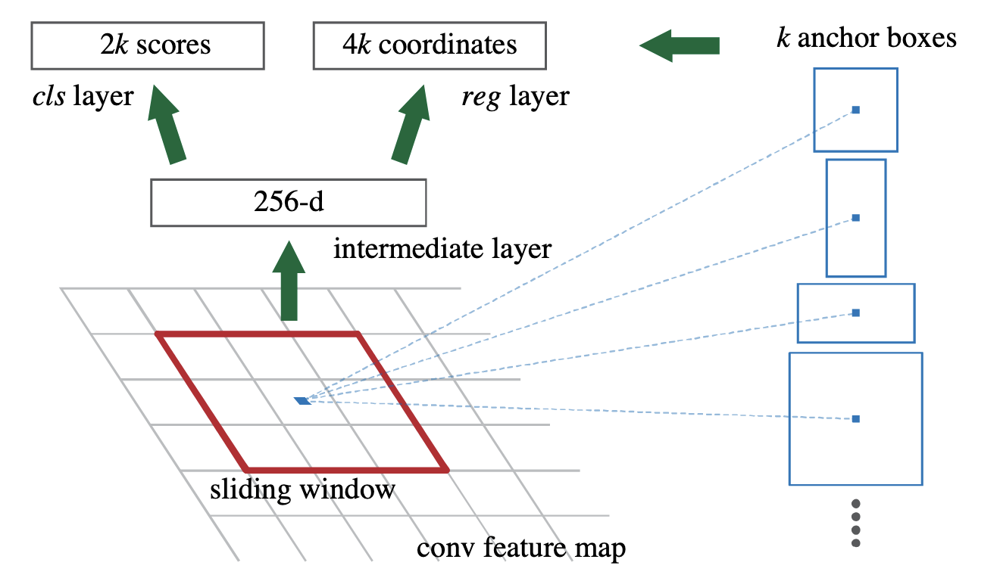
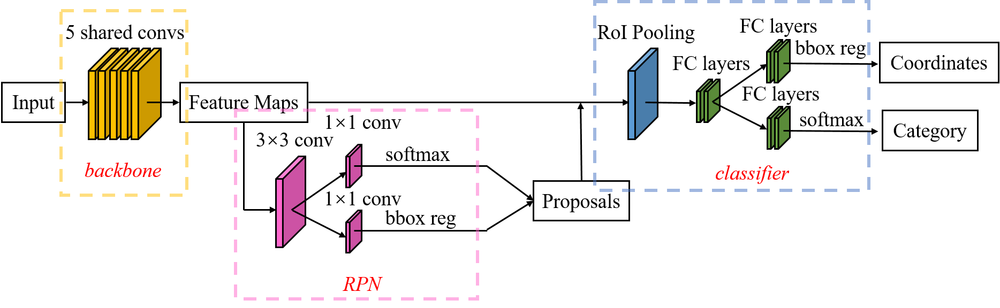
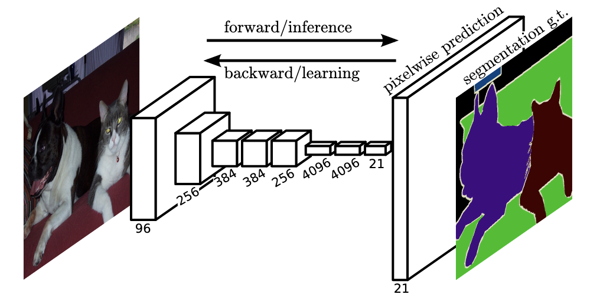

簡單整理一下目前有關object detection的一些研究。

<!--more-->

## 暴力做Object Detection

隨著深度學習的興起，現在已經有各式各樣的model可以幫助我們做image classification，辨識出圖片裡面的是什麼東西。如果想要直接用這些model做物件偵測，一個簡單暴力的方式是，用不同大小的方框掃過整張圖片，把每一個方框的圖片都丟進去model裡面做物件分類來達到物件偵測的效果。

## Region with CNN（R-CNN）

在前面提到我們可以用不同的方框掃過整張圖片來做物件偵測，但這樣的效率明顯不高，而且很吃計算量，這邊要介紹的[R-CNN](https://arxiv.org/pdf/1311.2524.pdf)便是透過Selective Search來選取可能有東西的區域，再拿去model裡面分類，其大致上的流程如下：

1. 產生大約2000個可能有東西的區域（Region Proposals）
2. 透過預先訓練好的模型像是AlexNet、Inception等抽取圖片特徵
3. 將特徵透過SVM來去分辨裡面有沒有含有特定物體

### Selective Search

[Selective search](https://ivi.fnwi.uva.nl/isis/publications/2013/UijlingsIJCV2013/UijlingsIJCV2013.pdf)是以[Graph Based Segmentation](http://cs.brown.edu/people/pfelzens/papers/seg-ijcv.pdf)的結果為基礎，使用階層群聚演算法來得到要輸入進model的region proposal，Graph Based Segmentation在Open CV裡面有支援，使用的方式可以參考[這篇部落格](https://blog.gtwang.org/programming/opencv-graph-based-segmentation-tutorial/)。

階層群聚演算法會從Graph Based Segmentation的結果裡面，每次挑選出兩個最相近的區塊做合併，而相似度的計算包含了顏色、紋理、大小等等的因素，綜合起來來判斷兩個區塊的相似度，詳細的介紹可以參考[這篇部落格](https://blog.gtwang.org/programming/selective-search-for-object-detection/)，具體演算法的流程可以參考下圖。

### Bounding-box Regression

R-CNN除了使用selective search找到有可能的region proposal以外，有另外透過bounding-box regression來調整selective search框出來的bounding box。

對於每一個bounding box，我們可以透過$$(x, y, w, h)$$​來表示，這四個數值分別代表這個bounding box中心點座標和長寬，而bounding-box regression是想要透過一個平移加縮放的mapping function $$f()$$​來把selective search得到的bounding box $$(P_x, P_y, P_w, P_y)$$透過轉換以後可以越接近label好的bounding box $$(G_x, G_y, G_w, G_h)$$​越好。

$$f(P_x, P_y, P_w, P_y)=(\hat{G}_x, \hat{G}_y, \hat{G}_w, \hat{G}_h)\approx(G_x, G_y, G_w, G_h)$$

透過將$$f()$$​弄成regression task，之後便可以透過gradient descent來訓練$$f()$$​，更詳細的說明可以參考[這篇文章](https://blog.csdn.net/zijin0802034/article/details/77685438)。

## Fast R-CNN

在上面的R-CNN裡面，每一個region proposal都會被丟進預先訓練好的模型來抽取圖片特徵，然而很多時候region proposal之間會有重疊的部分，其實並不需要重新再算一遍，因此在[Fast R-CNN](https://arxiv.org/pdf/1504.08083.pdf)裡面想要直接把region proposal對應到feature map中，來避免掉不必要的計算。

Fast R-CNN跟R-CNN一樣，會先需要先選好region proposal，在把圖片經過CNN得到feature map的時候，也會將選好的region proposal也投影到跟feature map一樣的大小，直接對該區塊內的feature map做max pooling後得到固定大小的feature，最後透過fully connected layers來得到region裡面物體的類別，以及對bounding box做回歸，這個方法被稱作Region of Interest Pooling（RoI Pooling）。

*[Region of interest pooling explained](https://deepsense.ai/region-of-interest-pooling-explained/)*

## Faster R-CNN

在Fast R-CNN裡面還是會需要跑selective search來得到region proposal，而[Faster R-CNN](https://arxiv.org/pdf/1506.01497.pdf)的想法是想要直接在CNN的feature map裡面透過Region Proposal Network來直接得到region proposal。

Region Proposal Network是一個CNN，它會先用個sliding window去掃過整張圖片，在每個window的中心點去套用$$k$$​​個預先定義好、不同大小的anchor box，將anchor box框出來的feature map輸入進CNN以後，predict出含有物體的機率，以及實際bounding box的座標。

其整體的架構畫出來大概長底下這樣，中間的區塊是Faster R-CNN提出來的RPN，而右邊的是原本Fast R-CNN既有的部分。

*[实例分割模型Mask R-CNN详解：从R-CNN，Fast R-CNN，Faster R-CNN再到Mask R-CNN](https://blog.csdn.net/jiongnima/article/details/79094159)*

## Mask R-CNN

[Mask R-CNN](https://arxiv.org/pdf/1703.06870.pdf)在Faster R-CNN的基礎上，修改了RoI Pooling，調整成RoI Align，並多加入Mask prediction。

*[实例分割模型Mask R-CNN详解：从R-CNN，Fast R-CNN，Faster R-CNN再到Mask R-CNN](https://blog.csdn.net/jiongnima/article/details/79094159)*

### RoI Align

在原本RoI Pooling的使用情境下，會需要在把region proposal投影到feature map的維度時把座標取整數，在計算max pooling的時候也需要對區塊的範圍取整數，雖然說在feature map上面取整數去除掉的零頭看起來不大，但feature map實際上是圖片經過了很多CNN，濃縮過的feature，去除掉的零頭在原本圖片上的影響其實是比想像中大的。

因此在Mask R-CNN裡面使用bilinear interpolation來避免掉取整數的問題，下圖中的藍色方框是CNN輸出的feature map，而黑色方框是RoI，藉由interpolation的方式來計算出要輸入至後面的feature。

### Mask Prediction

在Mask R-CNN做的另一件事情是引入[Fully Convolutional Networks（FCN）](https://www.cv-foundation.org/openaccess/content_cvpr_2015/papers/Long_Fully_Convolutional_Networks_2015_CVPR_paper.pdf)來做pixel-wise的mask，FCN主要是先使用CNN來對圖片做降維，之後再透過deconvolution CNN來把feature還原到圖片原本的大小，並predict出segmentation。

## YOLO

前面所提的R-CNN們都是region-based的方法，會需要先決定有可能的region proposal再往後進行下去，而[YOLO](https://pjreddie.com/media/files/papers/yolo.pdf)是You Only Look Once的縮寫，一個region-free的方法，希望可以只跑一次CNN就同時產生出bounding box和物體的類別。

首先，YOLO會先把圖片切成$$S \times S$$​個grid，並讓每一個grid都用neural network去預測$$B$$​個可能的bounding box、含有物件的信心程度以及物件的類別。在圖中上半部不同的黑框便是預測出來的bounding box，而不同的粗細表示信心程度的大小，而下半部是物件類別的預測結果。

在選出了有可能的bounding box和類別偵測的結果以後，會先用一個固定的threshold把信心程度太低的bounding box去除掉，然後使用Non-Maximum Supression（NMS）來計算出最後的輸出結果，NMS運作的方式可以參考[這篇文章](https://chih-sheng-huang821.medium.com/%E6%A9%9F%E5%99%A8-%E6%B7%B1%E5%BA%A6%E5%AD%B8%E7%BF%92-%E7%89%A9%E4%BB%B6%E5%81%B5%E6%B8%AC-non-maximum-suppression-nms-aa70c45adffa)，裡頭有詳細的圖解可以參考。

## 參考資料

1. [OpenCV 教學：實作 Graph Based Segmentation 圖形分割演算法](https://blog.gtwang.org/programming/opencv-graph-based-segmentation-tutorial/)
2. [OpenCV 教學：實作 Selective Search 物體偵測候選區域演算法](https://blog.gtwang.org/programming/selective-search-for-object-detection/)
3. [边框回归(Bounding Box Regression)详解](https://blog.csdn.net/zijin0802034/article/details/77685438)
4. [Object Detection : R-CNN, Fast-RCNN, Faster RCNN](https://ccshenyltw.medium.com/object-detection-r-cnn-fast-rcnn-faster-rcnn-mask-rcnn-retinanet-to-be-continued-71b67640445)
5. [關於影像辨識，所有你應該知道的深度學習模型](https://medium.com/cubo-ai/%E7%89%A9%E9%AB%94%E5%81%B5%E6%B8%AC-object-detection-740096ec4540)
6. [实例分割模型Mask R-CNN详解：从R-CNN，Fast R-CNN，Faster R-CNN再到Mask R-CNN](https://blog.csdn.net/jiongnima/article/details/79094159)
7. [Region of interest pooling explained](https://deepsense.ai/region-of-interest-pooling-explained/)
8. [深度學習-物件偵測:You Only Look Once (YOLO)](https://chih-sheng-huang821.medium.com/%E6%B7%B1%E5%BA%A6%E5%AD%B8%E7%BF%92-%E7%89%A9%E4%BB%B6%E5%81%B5%E6%B8%AC-you-only-look-once-yolo-4fb9cf49453c)
9. [機器/深度學習: 物件偵測 Non-Maximum Suppression (NMS)](https://chih-sheng-huang821.medium.com/%E6%A9%9F%E5%99%A8-%E6%B7%B1%E5%BA%A6%E5%AD%B8%E7%BF%92-%E7%89%A9%E4%BB%B6%E5%81%B5%E6%B8%AC-non-maximum-suppression-nms-aa70c45adffa)