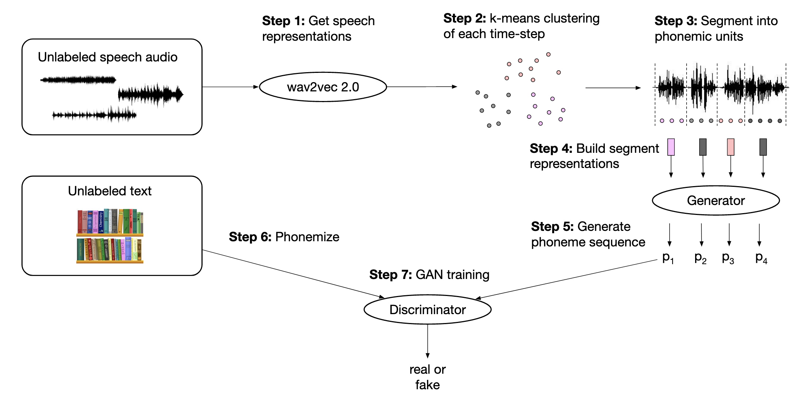
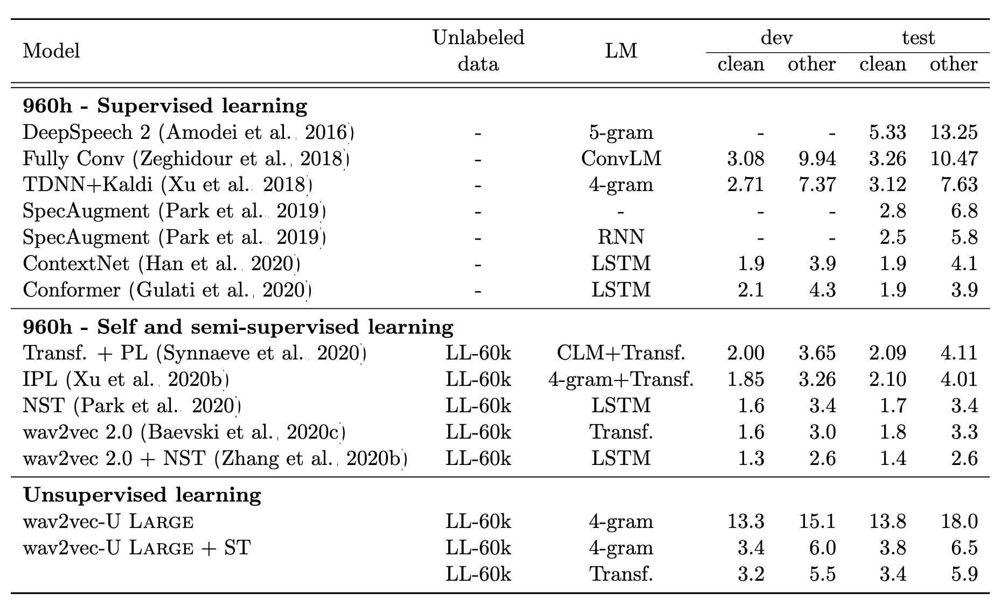

簡單介紹一下Facebook AI Research前陣子出的、以非監督的方式來做語音辨識的[paper](https://ai.facebook.com/research/publications/unsupervised-speech-recognition)。

<!--more-->

## Model Framework

在這篇[官方的部落格文章](https://ai.facebook.com/blog/wav2vec-unsupervised-speech-recognition-without-supervision/)裡面有對整篇paper有個大致的介紹，也有一段影片講解這篇paper使用的方法。

上圖是這篇paper wav2vec U的整體架構，首先會先把整段語音透過wav2vec 2.0轉換成feature sequence，再來對這些feature做k-means，藉由k-means所獲得的cluster來對語音訊號做segmentation，最後將segment好的語音訊號的feature輸入至generator中轉換成phoneme sequence，搭配GAN的方式來去做訓練。

## wav2vec 2.0

wav2vec 2.0的訓練方式跟BERT有些類似，首先會先將語音訊號透過CNN抽取出這段語音的特徵，接著對它做product quantization，在把quantization前的feature輸入進transformer以後，希望在被mask掉的位置所產生出來的feature要越像quantization後的feature越好，在訓練的時候也會拿其他時間點經過quantization後的feature來做contrasive training。

### Product Quantization

*[实例理解product quantization算法](http://www.fabwrite.com/productquantization)*

假如說我們現在有5萬張圖片的feature，每個feature有1024維，我們將這1024維切成8份，每份有128維如上圖那樣，接著以維度為單位來做k-means，這邊令k=256，我們就可以將原先1024維的feature轉換成由8個cluster id所組成的向量，把1024維降成了8維。

## Segment Representations

一段語音輸入進wav2vec 2.0以後，我們可以得到一串vector sequence，而作者們把所有訓練資料裡面的語音都丟進去wav2vec 2.0，將產生出來的一堆向量拿去做k-means，可以說是對每一小段語音訊號都給它一個編號。如果我們發現到說一段語音裡面相鄰兩個feature的編號相同，就可以將他們視為在同一個segment裡面，直到碰到不同編號。

作者們將同一個segment裡面的feature做平均來當作是這個segment的representation，值得一提的是，作者們並不是直接使用wav2vec 2.0產生出來的feature做平均，而是先對所有訓練資料經過wav2vec 2.0產生出的feature做PCA，用經過PCA轉換的feature再來做平均以後當作segment的representation。

## GAN

在得到了segment representation以後，接下來作者們將這些representation輸入進generator裡面，希望generator直接產生出phoneme distribution，這邊再搭配實際上文字的所轉換出來的phoneme 1-hot encoding，透過discriminator來讓generator產生出的phoneme distribution能越像真實的phoneme越好。另外在這邊作者們有將generator產生出來、argmax以後是相同的output再做一次平均，之後才輸入進discriminator中。

## Experiment Results

在經過繁複的訓練流程以後，可以看到wav2vec U的表現不俗，搭配厲害的language model以後，error rate可以媲美數年前supervised learning的結果。

在low-resource上的表現甚至可以贏過supervised learning的結果。

## 參考資料

1. [实例理解product quantization算法](http://www.fabwrite.com/productquantization)
