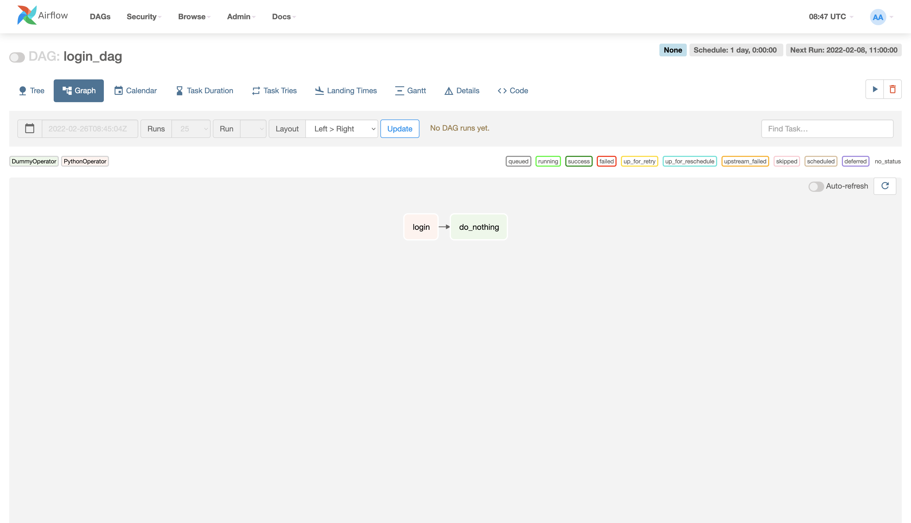

這篇文章紀錄一下嘗試使用Airflow的經歷。

<!--more-->

之前在聽一些技術分享的時候，有聽到別人使用Airflow來作為他們的排程系統，剛好在網路上也有看到別人[使用Airflow來追漫畫連載](https://leemeng.tw/a-story-about-airflow-and-data-engineering-using-how-to-use-python-to-catch-up-with-latest-comics-as-an-example.html)，想說我也來做一個簡單的每天登入領獎勵的程式來學習Airflow怎麼使用，底下紀錄一下製作的過程。

## 安裝Airflow

[Airflow](https://airflow.apache.org/)是由Airbnb開發的排程系統，主要是由python編寫，安裝起來也相當地方便，只需要執行底下的指令就行。

```bash
pip3 install "apache-airflow[crypto, slack]"
```

### 初始化database

在安裝完成以後，會需要先初始化airflow的database，這個database會用來儲存任務執行的設定和log。

```bash
# export AIRFLOW_HOME=/path/you/want
airflow db init
```

預設的路徑會放在`~/airflow`，你也可以藉由`export AIRFLOW_HOME`來選擇自己喜歡的位置。

### 開啟web server

接下來就可以準備啟動airflow了，我們可以使用底下的指令開啟web server，並設定port為8080。

```bash
airflow webserver -p 8080
```

這時就可以連去`localhost:8080`來看到airflow的使用者介面了，但進去的時候會發現要帳號密碼才能登入，我們可以透過下面的指令來創建一個權限為admin的帳戶，其帳號密碼都是`admin`。

```bash
airflow users create --role Admin --username admin --email admin --firstname admin --lastname admin --password admin
```

理論上在這個步驟做完以後就能順利地看到類似於底下的畫面了。


### 開啟scheduler

雖說UI已經打得開了，但會發現上面的任務都沒辦法執行，原因是因為實際上排程這些任務的是scheduler，而web server就真的只是一個UI讓使用者方便使用，所以我們還需要執行底下的指令才能啟動。

```bash
airflow scheduler
```

scheduler和web server的關係可以參考[airflow官方文件](https://airflow.apache.org/docs/apache-airflow/stable/concepts/overview.html)裡面的架構圖。


## 建立屬於自己的任務

前面有提到airflow主要是由python來編寫的，當我們要加入一個新的任務時，我們也是寫一個python的script，並放入`${AIRFLOW_HOME}/dags/`（預設是`~/airflow/dags/`）這個路徑底下，airflow就會自動抓取你寫的script，在UI上面顯示出來。

### Airflow Python Script

一個簡單的任務可以參考底下的程式碼。

```python
from datetime import datetime, timedelta

from airflow import DAG
from airflow.operators.python_operator import PythonOperator
from airflow.operators.dummy_operator import DummyOperator


def login_func(account, password):
    print(f"Attempt to login with account = {account}, password = {password}")


account = "user"
password = "password"
default_args = {
    "owner": "THE_ONE",
    "start_date": datetime(2022, 2, 8, 11, 0),
    "schedule_interval": "@daily",
    "retries": 2,
    "retry_delay": timedelta(minutes=5)
}

with DAG("login_dag", default_args=default_args) as dag:
    login = PythonOperator(
        task_id="login",
        python_callable=login_func,
        op_args=[account, password],
        provide_context=True
    )
    end = DummyOperator(task_id="do_nothing")

    login >> end
```

在上面的程式碼裡面，我們先定義了一個function，假裝是要登入某個服務，接著定義了function需要使用到的參數`account`和`password`，再來是這個任務的參數，最後是整個任務的流程。

[airflow提供了許許多多的operator](https://airflow.apache.org/docs/apache-airflow/stable/concepts/operators.html)，可以根據自己的需要來去選擇哪一個operator比較適合這個任務，在定義好了operator的object以後，再透過`login >> end`這樣的方式來去把這些operator串在一起，這邊也支援分支，只要整個流程是一個Directed Acyclic Graph（DAG）就行。

值得一提的是，我在寫的時候如果把`with DAG(...):`這一段放進`if __name__ == "__main__"`的話，好像airflow就抓不到的樣子，在寫的時候需要注意一下。

### 測試新加入的任務

在寫好上面的script以後，可以直接像以往寫python的方式那樣去執行看看，它並不會真的去執行，airflow會去看有沒有哪邊有語法上的錯誤。

```bash
python3 /path/to/your/script.py
```

如果想要實際測試看看，可以上去UI、點進job裡面，右上角有個三角形可以手動跑整個流程試試看。



如果跑起來有符合預期的話，就能toggle左上角的選項，啟動這個DAG，讓它根據設定的頻率來執行了。

值得一提的是，當開啟這個DAG以後，airflow會補跑`start_date`到今天的所有job，所以要先確定一下`start_date`有沒有設定對再開啟會比較好。

### 開始的時間跟預期的不同？

在上面的script裡面，我們設定

```python3
    "start_date": datetime(2022, 2, 8, 11, 0),
    "schedule_interval": "@daily",
```

期望它可以從2022/2/8的早上11點開始執行第一次，並以天為頻率來執行，但實際上會發現它第一次的執行時間會是2022/2/9的早上11點，原因是因為上面寫的是任務時間，跟實際上執行的時間不同，airflow會在`start_date+schedule_interval`的時間過完以後才開始處理`start_date+schedule_interval`的資料。

想法上有點類似於，我想將今天使用者的資料統整起來，並壓上今天的日期，但我實際執行統整這個動作的時間會是在明天，因為今天還沒有過完，如果今天就做統整，就會有部分的資料被漏掉。

## 結論

Airflow是個安裝簡單、功能也很齊全的排程系統，上面敘述的部分只是airflow的九牛一毛而已，還有許許多多的功能沒有被覆蓋到，如果有興趣或是有複雜的功能想要實現，可以去看看[airflow的官方文件](https://airflow.apache.org/docs/apache-airflow/stable/index.html)。

## 參考資料

1. [一段 Airflow 與資料工程的故事：談如何用 Python 追漫畫連載](https://leemeng.tw/a-story-about-airflow-and-data-engineering-using-how-to-use-python-to-catch-up-with-latest-comics-as-an-example.html)
