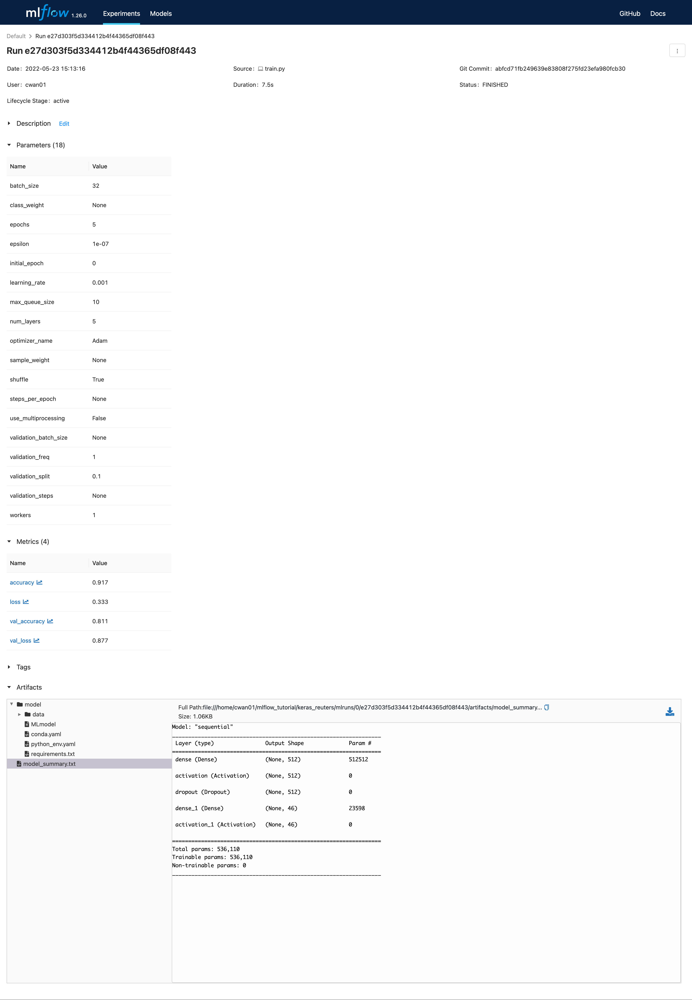

隨著機器學習的興起，有越來越多人嘗試引入MLOps在系統當中，這篇文章簡單介紹一下MLflow的使用心得。

<!--more-->

## MLOps

在開始介紹MLflow之前先簡單介紹一下MLOps想要做的事情，MLOps可以說跟DevOps一樣是一種精神，主要是希望能讓Machine Learning跟Operations能夠合作的更融洽，這邊Machine Learning的部分包含了對資料清理、建立並訓練模型、驗證模型成效等等的事情，而Operations指的是把模型部署到系統裡面進行預測。


*[MLOps: Continuous delivery and automation pipelines in machine learning](https://cloud.google.com/architecture/mlops-continuous-delivery-and-automation-pipelines-in-machine-learning#devops_versus_mlops)*

上圖是一個簡單的pipeline，左半邊ML的部分是一般machine learning的流程，包含了資料處理和建立模型的過程，而最終產生的模型會放進model registry裡面，Operations再從model registry裡面把模型拿出來做serving。

這個pipeline簡單有效，但如果未來有新的資料進來或是模型的成效開始下降等可能會需要重新訓練的模型的情況發生的話，Operations就會需要再請ML的人幫忙訓練模型，為此另一個比較穩定的pipeline可以是如下圖。


*[MLOps: Continuous delivery and automation pipelines in machine learning](https://cloud.google.com/architecture/mlops-continuous-delivery-and-automation-pipelines-in-machine-learning#devops_versus_mlops)*

在這個pipeline裡面，ML所交付的不再是一個模型，而是產生出這個模型的pipeline，包含了資料驗證、清理、建立模型、驗證模型等，而Operations會將這個pipeline部署到系統裡面自行去產生模型出來，如果說有新的資料或是有需要重新訓練模型的情況發生，Operations就能直接重跑這個pipeline來得到新的模型。

然而要建立這種pipeline會需要花費蠻多工夫的，而MLflow可以幫助我們降低一些建立這種pipeline的困難。

## MLflow

[MLflow](https://mlflow.org/)是一個開源的平台，主要是應用在machine learning lifecycle當中，MLflow包含了四個部分

* Tracking：用以記錄在訓練模型是所使用的參數和訓練過程中的一些metrics

* Projects：讓使用者可以建立一套pipeline來讓其他人可以輕易地重現出模型

* Models：把模型包裝起來，在裡面會紀錄讓模型運行所需要的環境和模型本身，讓其他人方便直接使用模型

* Registry：存放模型並支援版本控制

底下的文章將會簡述一下Tracking和Projects的部分。

### MLflow Tracking

我們先快速看一下底下的程式碼

```python
import os
from mlflow import log_metric, log_param, log_artifact

if __name__ == "__main__":
    # Log a parameter (key-value pair)
    log_param("param1", 2.5)
    log_param("param2", 4)# Log a metric; metrics can be updated throughout the run
    log_metric("foo", 1)
    log_metric("foo", 2)
    log_metric("foo", 5)# Log an artifact (output file)
    with open("output1.txt", "w") as f:
        f.write("first file!")
    with open("output2.txt", "w") as f:
        f.write("second file!")
    log_artifact("output1.txt")
    log_artifact("output2.txt")
```

在上面的程式碼中我們可以看到mlflow提供了三種不同log的function，`log_param`用來記錄這次訓練模型時所使用的hyperparameters像是learning rate、batch size等等，而`log_metric`用來記錄訓練模型中會變動的資料，像是loss、accuracy等，最後`log_artifact`會把該路徑的檔案放進artifact中，主要是把這次訓練完成以後想要留存的檔案儲存下來，像是模型本身、前處理/後處理用到的字典檔等。

有了這些function以後，我們就能在編寫程式的時候把這些function安插進來，之後就能在command line上面下`mlflow server`的指令來打開mlflow的UI來檢視訓練的成果，然而每次手動寫這些function有點麻煩，mlflow有另外提供了auto tracking的功能，只需要在程式碼裡面加個幾行，mlflow就會幫你自動紀錄這些參數和結果了。

```python
"""Trains and evaluate a simple MLP
on the Reuters newswire topic classification task.
"""
import numpy as np
from tensorflow import keras
from tensorflow.keras.datasets import reuters
from tensorflow.keras.models import Sequential
from tensorflow.keras.layers import Dense, Dropout, Activation
from tensorflow.keras.preprocessing.text import Tokenizer

# The following import and function call are the only additions to code required
# to automatically log metrics and parameters to MLflow.
import mlflow.keras

mlflow.keras.autolog()

max_words = 1000
batch_size = 32
epochs = 5

print("Loading data...")
```

*[mlflow/examples/keras/train.py](https://github.com/mlflow/mlflow/blob/master/examples/keras/train.py)*

在上面是一個用keras訓練模型的範例，在裡面我們只需要加入`import mlflow.keras`、`mlflow.keras.autolog()`這兩行就能讓mlflow幫我們紀錄參數了。



### MLflow Projects

假如我們想要分享我們訓練模型所做的所有步驟，我們可以寫一個`MLproject`的檔案，來讓其他人可以簡單下一個指令`mlflow run .`就能重現模型訓練的結果。

```yaml
name: mnist-autolog-example

conda_env: conda.yaml

entry_points:
  main:
    parameters:
      max_epochs: {type: int, default: 5}
      gpus: {type: int, default: 0}
      strategy: {type str, default: "None"}
      batch_size: {type: int, default: 64}
      num_workers: {type: int, default: 3}
      learning_rate: {type: float, default: 0.001}
      patience: {type int, default: 3}
      mode: {type str, default: 'min'}
      verbose: {type bool, default: True}
      monitor: {type str, default: 'val_loss'}

    command: |
          python mnist_autolog_example.py \
            --max_epochs {max_epochs} \
            --gpus {gpus} \
            --strategy {strategy} \
            --batch_size {batch_size} \
            --num_workers {num_workers} \
            --lr {learning_rate} \
            --es_patience {patience} \
            --es_mode {mode} \
            --es_verbose {verbose} \
            --es_monitor {monitor}
```

*[mlflow/examples/pytorch/MNIST/MLproject](https://github.com/mlflow/mlflow/blob/master/examples/pytorch/MNIST/MLproject)*

MLflow在讀取這個檔案的時候會先在conda裡面建立一個virtual environment，並按照`conda.yaml`的設定來去安裝package們，接下來會去執行entry_points裡面`main`的部分，如果說想要使用不同的參數試試看的話，可以使用`mlflow run . -P PARAM=VALUE`的方式來去替換掉預設值。

如果在整個pipeline中還有其他資料處理或模型驗證的步驟，可以參考[multistep_workflow](https://github.com/mlflow/mlflow/tree/master/examples/multistep_workflow)的範例。

## 結論

要把整個pipeline包裝成可重複執行的程式碼還是需要蠻多工夫的，好在MLflow可以幫我們省去一些，而且其auto tracking的功能也很適合在做實驗的過程當中來使用。

另外在實作的過程當中值得一提的是，如果想要在auto tracking當中另外手動存入其他artifact，需要把`log_artifact`這個function放在同一個run裡面

```python
with mlflow.start_run() as run:
    mlflow.keras.autolog()
    # Training
    mlflow.log_artifact("PATH_TO_ARTIFACT")
```

而在pipeline處理的過程中，假如說我們有個entry point是處理資料、另一個entry point是訓練模型，我們應該會希望每次pipeline跑起來便去檢查資料是否已經處理好了，如果已經處理好就直接跑訓練模型的部分就好，我目前還沒有在MLflow看到比較好的看有沒有執行過某個entry point的方法，可能還是需要像前面[multistep_workflow](https://github.com/mlflow/mlflow/tree/master/examples/multistep_workflow)的範例那樣，自己寫個`main.py`來去檢查。

## 參考資料

* [給ML Engineer的MLOps簡述: 持續開發機器學習Service的高效理念](https://medium.com/ai-blog-tw/%E7%B5%A6ml-engineer%E7%9A%84mlops%E7%B0%A1%E8%BF%B0-%E6%8C%81%E7%BA%8C%E9%96%8B%E7%99%BC%E6%A9%9F%E5%99%A8%E5%AD%B8%E7%BF%92service%E7%9A%84%E9%AB%98%E6%95%88%E7%90%86%E5%BF%B5-8bd552876299)

* [MLOps: Continuous delivery and automation pipelines in machine learning](https://cloud.google.com/architecture/mlops-continuous-delivery-and-automation-pipelines-in-machine-learning#devops_versus_mlops)
