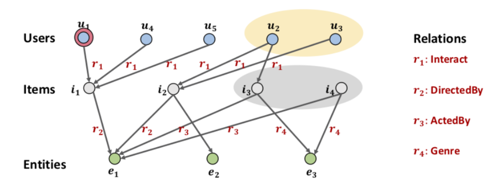
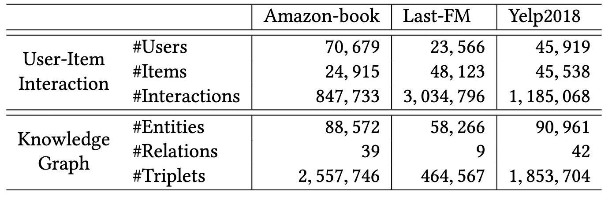
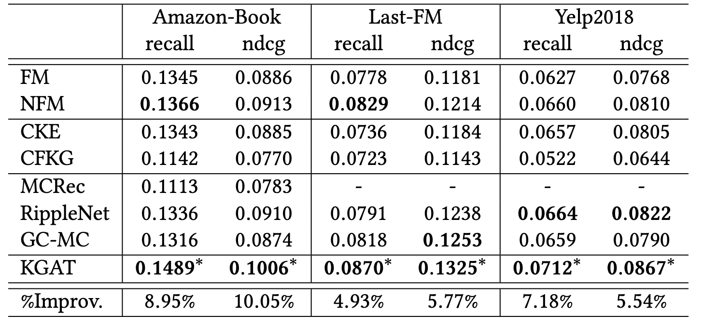

這篇文章紀錄一下看了[KGAT: Knowledge Graph Attention Network for Recommendation](https://arxiv.org/pdf/1905.07854.pdf)的筆記。

<!--more-->

在過去的推薦系統當中，蠻常使用collaborative filtering（CF）來產生推薦，藉由觀察使用者和商品的互動行為，來找出目標使用者跟哪些現有的使用者相似，用現有使用者有互動過的商品來推薦給目標使用者。

然而，在collaborative filtering當中，比較少著墨於使用者本身的特性以及商品之間的關聯，主要只使用使用者對商品的行為來當作輸入，而這篇paper嘗試引入了knowledge graph進來，藉此補足collaborative filtering不足的部分。

## Task Formulation

這邊先介紹一下在這篇paper裡面所使用到的graph，主要是由兩個bipartite組成。

上半部的Users、Items是collaborative filtering的部分，由user和item組成，其中兩者的關係$r_1$是指user看過item的意思，舉例來說user $u_1$看過item $i_1$，就會在上圖有個$u_1$的node，並有一個箭頭$r_1$指向item $i_1$的node。

下半部的Items、Entities是knowledge graph的部分，每一個$e_n$表示的是item的特性，而item和entity之間可能有很多的關係像是電影種類、導演、演員等。

作者將這個由兩個bipartite組成的graph稱之為**Collaborative Knowledge Graph**，可以簡單想成是我們把$u_1$看過$i_1$做成$(u_1, r_1, i_1)$這樣的triplet也放進knowledge graph裡面。

## Method

上面的部分主要是模型輸入的部分，而下圖是整個模型的架構圖。

### Embedding Layer

在這邊我們會給每一個user、item、entity和relation一個embedding，不過因為我們已經轉換成了knowledge graph的形式，成為了$(head, relation, tail)$的triplet們，所以在底下便會用$\mathbf{e}_h, \mathbf{e}_t \in \mathbb{R}^d$來代表head和tail的embedding，用$\mathbf{e}_r\in\mathbb{R}^k$來代表relation的embedding。

在knowledge graph裡面我們會需要一個來衡量這個triplet目前學得怎麼樣的分數，而這篇paper的定義如下

$$g(h, r, t)=\left \| \mathbf{W}_r\mathbf{e}_h+\mathbf{e}_r-\mathbf{W}_r\mathbf{e}_t\right \|_2^2$$

在上面的$\mathbf{W}_r\in\mathbb{R}^{k\times d}$是一個transformation matrix，幫忙把head和tail的embedding轉換到relation的空間，並直接用head和relation向量相加的位置跟tail的位置差異來為triplet打分數，一個越小的$g(h, r, t)$是越好的。

而要訓練的loss function便是希望有存在在graph裡面的triplet的$g(h, r, t)$要比隨機抽樣的tail $t'$的$g(h, r, t')$還要來得小。

$$\mathcal{L}_{KG}=\sum\limits_{(h, r, t, t') \in \tau}-\ln\sigma\left( g(h, r, t')-g(h, r, t) \right)\\ \tau=\{ (h, r, t, t')|(h, r, t)\in\mathcal{G}, (h, r, t')\notin\mathcal{G}\}$$

上面算式中的$\sigma$是sigmoid function。

### Attentive Embedding Propagation Layers

#### Information Propagation

在這篇paper裡面，embedding除了被上面knowledge graph的gradient更新以外，這裡還會根據鄰居的embedding來影響本身的embedding。

假如現在有一個entity $h$，它的鄰居就是與$h$相鄰的所有node，而我們把這些鄰居按照重要性weighted sum成一個單一的embedding $\mathbf{e}_{\mathcal{N}_h}$。

$$\mathbf{e}_{\mathcal{N}_h}=\sum\limits_{(h, r, t)\in\mathcal{N}_h}\pi(h,r,t)\mathbf{e}_t\\ \mathcal{N}_h = \{(h, r, t) \vert (h, r, t) \in \mathcal{G} \}$$

#### Knowledge-aware Attention

在式$(3)$裡面的$\pi(h,r,t)$所定義每個鄰居的重要程度是由底下的式子定義出來的

$$\pi(h,r,t)=(\mathbf{W}_r\mathbf{e}_t)^\top\tanh\left((\mathbf{W}_r\mathbf{e}_h+\mathbf{e}_r)\right)$$

在這邊我們把entity和它的鄰居透過transformation matrix轉換到relation的空間以後，透過dot product來算出跟entity $h$的相關性來表示鄰居的重要程度，接著再做normalize。

$$\pi(h, r, t)=\frac{\exp(\pi(h,r,t))}{\sum_{(h,r',t')\in\mathcal{N}_h}\exp(\pi(h,r',t'))}$$

#### Information Aggregation

在有了鄰居的embedding $\mathbf{e}_{\mathcal{N}_h}$以後，這篇paper提出了三種function來更新原本的entity embedding $\mathbf{e}_h$。

* GCN Aggregator

$$f_{GCN}=\mathrm{LeakyReLU}\left( \mathbf{W}(\mathbf{e}_h+\mathbf{e}_{\mathcal{N}_h}) \right)$$

* GraphSage Aggregator

$$f_{GraphSage}=\mathrm{LeakyReLU}\left( \mathbf{W}(\mathbf{e}_h\|\mathbf{e}_{\mathcal{N}_h})\right)$$

* Bi-Interaction Aggregator

$$f_{Bi-Interaction}=\mathrm{LeakyReLU}\left(\mathbf{W}_1(\mathbf{e}_h+\mathbf{e}_{\mathcal{N}_h})\right)+\mathrm{LeakyReLU}\left(\mathbf{W}_2(\mathbf{e}_h\odot\mathbf{e}_{\mathcal{N}_h})\right)$$

上面的$\mathbf{W}_1,\mathbf{W}_2\in\mathbb{R}^{d'\times d}$是可被訓練的參數，而$\odot$是element-wise product。

#### High-order Propagation

在上面我們定義了如何把entity $h$的鄰居的資訊整合起來變成一個embedding，也定義了一些function來更新entity $h$的embedding，而這樣的步驟可以重複很多次來得到多個embedding表示距離從近到遠的資訊總和，這邊假設我們重複$l$次，每次entity $h$的embedding為

$$\mathbf{e}^{(l)}_h=f\left(\mathbf{e}^{(l-1)}_h,\mathbf{e}^{(l-1)}_{\mathcal{N}_h}\right)$$

而鄰居的embedding為

$$\mathbf{e}^{(l-1)}_{\mathcal{N}_h}=\sum\limits_{(h,r,t)\in\mathcal{N}_h}\pi(h,r,t)\mathbf{e}^{(l-1)}_t$$

### Model Prediction

在經過了$l$次的擴散，也就是$L$層layer（每個step在information aggregation都可以有不同的weights）以後，每個user $u$會有$L$個embedding $\{\mathbf{e}^{(1)}_u,...,\mathbf{e}^{(L)}_u\}$，每個item $i$也會有$L$個embedding $\{\mathbf{e}^{(1)}_i,...,\mathbf{e}^{(L)}_i\}$，我們把這些embedding都concatenate起來當做是最終user和item的embedding。

$$\mathbf{e}^*_u=\mathbf{e}^{(0)}_u\|...\|\mathbf{e}^{(L)}_u,\mathbf{e}^*_i=\mathbf{e}^{(0)}_i\|...\|\mathbf{e}^{(L)}_i$$

而整個推薦系統的推薦便是以user和item embedding內積的結果大小來排序

$$\hat y(u,i)=\mathbf{e}^{*\top}_u\mathbf{e}^*_i$$

### Optimization

在loss function的部分除了式$(2)$ knowledge graph的loss $\mathcal{L}_{KG}$以外，我們還需要把使用者跟商品互動的部分，也就是collaborative filter的loss放進去

$$\mathcal{L}_{CF}=\sum\limits_{(u,i,j)\in\mathcal{O}}-\ln\sigma\left(\hat y(u,i)-\hat y(u,j)\right)\\ \mathcal{O}=\{(u,i,j)\vert(u,i)\in\mathcal{R}^+,(u,j)\in\mathcal{R}^- \}$$

式$(13)$裡面的$\mathcal{O}$指的是training data，整個式子的意思是有實際互動過的使用者和商品的組合的分數要比沒有實際互動過的組合要來得高。

整個模型的loss function合起來的樣子如下

$$\mathcal{L}_{KGAT}=\mathcal{L}_{KG}+\mathcal{L}_{CF}+\lambda\|\Theta\|^2_2\\ \Theta=\{\mathbf{E},\mathbf{W}_r,\forall l\in\mathcal{R},\mathbf{W}^{(l)}_1,\mathbf{W}^{(l)}_2,\forall l\in\{1,...,L\}\}$$

其中$\Theta$是整個模型的參數，最後一項是一個$L_2$的regularization。

## Experiments

作者將這個模型套用在三個dataset上，其相關的統計數值如下。

模型跑出來的結果如下

可以看到KGAT在各個dataset上面都有不錯的表現。

## Conclusion

這篇paper在collaborative filter上又多加了knowledge graph的資訊在裡面，在各個dataset上看獲得了不錯的結果，在paper上面也有附上實作的[程式碼](https://github.com/xiangwang1223/knowledge_graph_attention_network)讓大家試試看。
