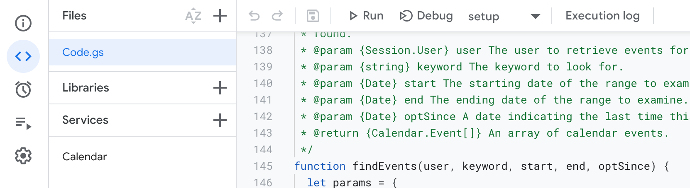

在[先前的文章](https://wjohn1483.github.io/2021/06/05/display-html-in-google-sheet/)裡面，使用了Google apps script來在Google sheet裡面顯示html，而Google apps script還可以做到更多的事情，這篇文章簡單介紹一下Google apps script是什麼，並如何使用它操作Google calendar。

<!--more-->

## Google Apps Script

[Google Apps Script（GAS）](https://www.google.com/script/start/)是一個基於javascript的開發平台，可以在其中方便地跟Google Workspace的服務像是Gmail、Google Calendar、Google Maps等做整合，讓你可以對這些服務做更細緻的操作或是讓多個服務做連動。舉例來說，可以透過Google Sheet整理要一併寄出的收件者和內容，透過GAS來串連Gmail做寄出，又或者可以用GAS來設定今天這個Google Form收到多少回覆後就自動停止等。

除了寫給讓自己的生活更便利以外，GAS還可以部署成web api或者是extension來讓其他人打、使用，是個簡單卻又強大的功能，以下會帶一個[同步group mail底下個人行事曆到共享行事曆的例子](https://developers.google.com/apps-script/samples/automations/vacation-calendar)來看看GAS要怎麼寫，如果想看其他更多的應用除了可以看[官方文件的範例](https://developers.google.com/apps-script/samples)以外，強烈建議可以看[這篇文章](https://ithelp.ithome.com.tw/articles/10275214)，裡面詳述地記載了一些常用到的scenario，並有實際的程式碼來一步一步帶領你建立屬於你的GAS。

## 同步行事曆

在一個團隊裡面有時會有不定人數的人請假，為了能更方便地一眼看到誰請假，避免打擾到休假的人，我們時常會建立一個共享的團隊行事曆，讓大家去填上哪天休假，但這時請假的人就會需要在個人的行事曆上建立請假的事件，並額外在共享的行事曆上也建立相同的事件。

這種類型的事情，就很適合透過GAS來達成，我們可以寫一個GAS去週期性地掃團隊裡面的每個人的行事曆，把有特殊關鍵字的事件引入到共享的行事曆中，就可以節省團隊成員手動建立事件到共享行事曆的時間了。

詳細的程式碼和說明可以參考[官方文件](https://developers.google.com/apps-script/samples/automations/vacation-calendar)，底下會稍微解釋一下這件事情是如何被達成的。

### 程式概覽

在跟著[官方文件](https://developers.google.com/apps-script/samples/automations/vacation-calendar)建立新的行事曆以後，有個按鈕可以打開範例的專案，建立副本以後就能做修改了，理論上照著說明把變數換成你想要的並執行就能達到上述的功能了。

在專案裡面分成兩大塊，在Services裡面可以看到有個`Calendar`的service，表示我們在`Code.gs`裡面會需要用到calendar的API，而`Code.gs`是我們主要實現邏輯的地方。

在`Code.gs`裡面有底下幾個function：

* setup：設定trigger來去定期地執行sync

* sync：程式的進入點，去逐一掃描團隊個人行事曆裡面的事件是不是有包含到定義的關鍵字，如果有，就引入到共享行事曆中

* importEvent：引入event到共享行事曆中

* findEvents：尋找哪些event該被引入到共享行事曆中

* shoudImportEvent：判斷該不該引入event

* formatDateAsRFC3339：把日期轉成特定格式

其實裡面的邏輯並不複雜，註解也寫得很詳細，可以很快速地看懂每個function想要做的事情，而裡面所使用的物件method可以在[Apps Script的文件](https://developers.google.com/apps-script/reference/calendar)當中找到每個method的定義、傳入值和回傳值。

### 測試程式



在寫好了想要的邏輯以後，可以在畫面上方的menu bar裡面選擇想要測試的function並點擊`Debug`的按鈕來測試想要的功能有沒有被實現，如果在上面找不到寫好的function，可能是因為還沒有儲存專案的關係。

如果想要印出debug訊息，除了使用`Debug`按鈕提供的sidebar以外，可以使用`console.log()`來把訊息寫在console中。

### 定期執行程式

在`setup()`裡面會透過API建立一個每30分鐘執行一次的排程作業，我們也可以透過左邊的Triggers手動建立一個trigger來定期執行GAS，而GAS會在GCP的default專案裡面被執行，也就是使用你個人的資源來運行，不過Google有提供[免費的quota](https://developers.google.com/apps-script/guides/services/quotas)來做使用，而每次執行的log都可以在左邊Executions的tab裡面找到。

如果想要把專案部署成API、使用Service API的次數超過免費額度，就會需要把這份GAS改放到其他專案裡面，根據用量來付費。

## 結論

GAS是個方便統整Google服務的平台，除了[上述文章](https://ithelp.ithome.com.tw/articles/10275214)提供的使用情境外，還可以根據自身碰到的情況來做擴充，藉由研讀Google服務們所提供的API來達到你的需求。

像是在上面同步行事曆的GAS裡面，如果有人後來決定不請假的話，在程式碼裡面是不會判斷這件事並把共享行事曆裡面的事件刪除掉的，這時就可以參考Calendar的API來自行撰寫刪除事件的function。

```javascript
/**
 * Delete all events in the calendar with id TEAM_CALENDAR_ID
 */
function deleteAllEvents(start, end) {
  let calendar = CalendarApp.getCalendarById(TEAM_CALENDAR_ID);
  let count = 0;
  console.log('Delete all events in calendar "' + calendar.getName() + '"\nfrom "' + start + '"\nto "' + end + '"');
  events = calendar.getEvents(start, end);
  events.forEach(function(event){
    console.log('Deleting: ' + event.getTitle() + '\nstarting from ' + event.getStartTime() + '\nend at ' + event.getEndTime());
    event.deleteEvent();
    count++;
  });
  console.log("Deleted " + count + " events");
}
```

上面的function會把共享行事曆裡面特定日期內的所有事件都刪除，我們就能用這個簡單的方式在import事件之前把事件都清空，再把event引入到行事曆中來達到event同步刪除的功能。
