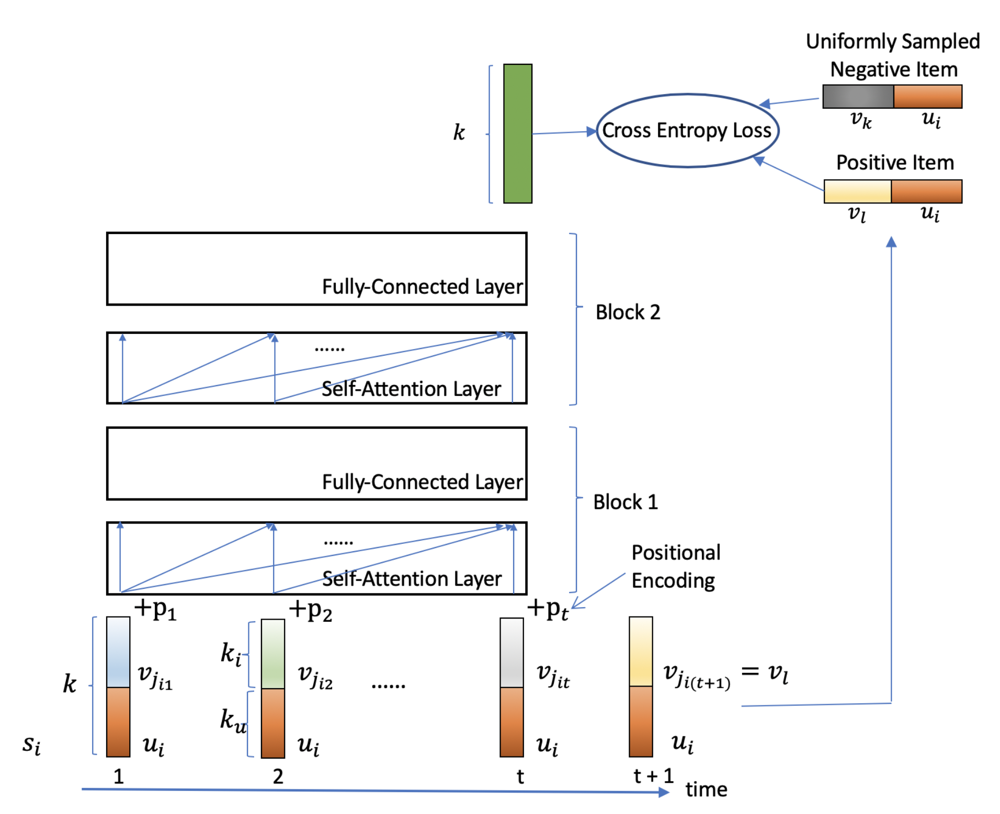
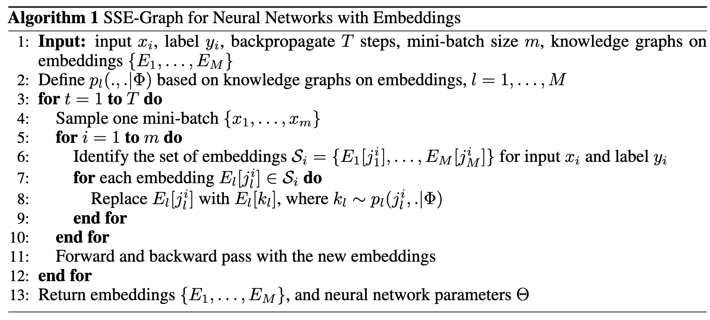
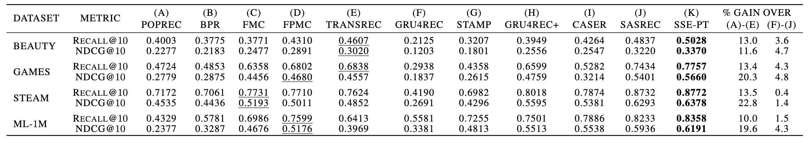

這篇文章記錄一下看完[這篇paper](https://arxiv.org/pdf/1908.05435.pdf)的筆記。

<!--more-->

## 推薦系統

推薦系統裡面常用的做法可以粗略分成三種：

* item-to-item：目標是找到與使用者互動的商品接近的其他商品

* user-to-user：找到與使用者類似的其他使用者，推薦其他使用者有互動的商品

* user-to-item：綜觀的看待使用者和商品的互動，嘗試預測使用者和未互動的商品的關係，collaborative filtering就是這樣的方法，如果有把互動的順序也納入考量的話就會變成sequential recommendation

## 模型介紹

在這篇paper裡面的模型便是sequential recommendation的方法，以transformer的模型為主要的架構來做推薦系統。

### 任務定義

在paper當中，假設我們有$n$個使用者、$m$個商品，模型想要做的就是根據使用者過去的行為，預測出下個時間點會跟這$m$個商品的哪個做互動，以分數最高的前$K$個商品作為推薦，亦即是把商品當作文字，使用language model的方式來預測下一個商品會是什麼，在這邊以$s_i$來代表使用者互動的商品序列

$$
s_i=(j_{i1},j_{i2},...,j_{iT}),for\ 1\le i\le n
$$

$s_i$表示的是使用者$i$從舊到新，在過去$T$個時間點有互動的商品們。

在切train/valid/test set的時候，作者是以最後一個商品作為test set、倒數第二個做為validation set，其他都是training set。

### Personalized Transformer

底下是這篇paper的模型架構，作者將這個模型取名為Stochastic Shared Embedding - Personalized Transformer（SSE-PT）。

#### Embedding Layer

在這邊作者將使用者的embedding和商品的embedding用兩個lookup table來做紀錄，分別是$U\in R^{n\times d_u}$、$V\in R^{m\times d_i}$，其中$n$是使用者的數量、$m$是商品的數量，而$d_u$和$d_i$分別是兩者embedding的長度。

$$
E=
\begin{bmatrix}
[v_{j_{i1}};u_i]+p_1 \\
[v_{j_{i2}};u_i]+p_2 \\
.\\
.\\
.\\
[v_{j_{iT}};u_i]+p_T \\
\end{bmatrix}
\in R^{T \times d}
$$

在輸入到Self-Attention layer之前，會把商品的embedding和使用者的embedding接在一起後加上positional encoding才輸入到下一層，這邊的$d=d_u+d_i$、$P\in R^{T\times d}$。

#### Self-Attention Layer

這邊的Self-Attention layer跟[其他地方](https://wjohn1483.github.io/2020/03/21/attention-is-all-you-need/#scaled-dot-product-attention)見到的是一樣的。

$$
S=SA(E)=\mathrm{Attention}\left (  EW^{(Q)}, EW^{(H)}, EW^{(V)} \right ), where\ W^{(Q)}, W^{(H)}, W^{(V)}\in R^{d\times d}
$$

$$
\mathrm{Attention}(Q,H,V)=\mathrm{softmax}\left ( \frac{QH^T}{\sqrt{d}} \right ) \cdot V
$$

#### Pointwise Feed-Forward Layer

在經過Self-Attention layer以後，作者為了要在結果$S\in R^{n\times d}$多加一些non-linearity，所以在之後接了兩層feed-forward layer。

$$
F=FC(S)=\mathrm{Relu}(SW+b)\cdot \tilde{W}+\tilde{b}
$$

其中$W,\tilde{W}\in R^{d\times d}$是weight、$b,\tilde{b}\in R^d$是bias。

#### Self-Attention Blocks

Self-Attention block其實就是self-attention layer和feed-forward layer兩者組合在一起做成一個block，每一個block的輸入便是上一個block的輸出。

$$
S^{(2)}=SA(F^{(1)})
$$

在這邊使用$B$來表示總共使用了多少block。

#### Prediction Layer

在經過了多層的Self-Attention block以後，這邊paper使用了最後一個block的輸出中最後一個時間點的向量$F^B_{t-1}$跟商品$l$和使用者embedding的concatenation做內積再過sigmoid來當作是模型對使用者$i$在時間點$t$推薦商品$l$的分數$p_{itl}$。

$$
p_{itl}=\sigma(r_{itl})
$$

$$
r_{itl}=F^B_{t-1}\cdot [v_l;u_i]
$$

式(7)中的$\sigma$是sigmoid function。

#### Loss Function

這邊所使用的loss function如下

$$
\sum_i\sum_{t=1}^{T-1}\sum_{k\in\Omega}-\left [ \log(p_{itl})+\log(1-p_{itk}) \right ]
$$

目標是希望positive的商品所得到的分數$p_{itl}$能越接近1越好，而negative商品所得到的分數$p_{itk}$能越小越好。

最終產生的$K$個推薦商品便是把所有商品$l$都去算出$r_{itl}$，取前$K$大的商品推薦出去。

#### Stochastic Shared Embeddings（SSE）

在這篇paper裡面嘗試了多個regularization的方式像是layer normalization、residual connections、dropout等，模型的表現都沒有很好，最終使用了作者在[另一篇paper](https://arxiv.org/pdf/1905.10630.pdf)發表的stochastic shared embeddings來做regularization才獲得了不錯的結果。

SSE的想法是，在一個knowledge graph裡面，兩個有相連的節點$j$、$k$，兩者所代表的意思應該會是相近的，所以如果在做stocahstic gradient descent的時候，我們把模型裡面embedding $j$的部分以某個特定的機率換成embedding $k$應該是不會影響到模型的成效，卻能帶來regularization的好處，SSE詳細的algorithm如下

如果今天碰到的問題並不是以graph為基礎，作者認為所有的東西還是是在一個很大的graph包含著，任一embedding $j$還是可以有微小的機率用embedding $k$來替換，而機率的定義如下

$$
p(j,k\vert \Phi)=\frac{p_0}{N-1},\forall\ 1\le k \ne j \le N
$$

$N$為整個embedding table的大小，而$p_0$是一個自定義數字，在paper裡面定義成$p_0=0.01$。

#### SSE-PT++

由於SSE-PT這個模型在架構上最多只能輸入長度最大為$T$的$s$，如果有人的互動紀錄長度大過$T$的話會塞不進模型中，為了解決這個問題，paper使用了sample的方式來把$s$輸入進模型中。

給定一個機率$p_s$，模型會從$[1,t-T]$的範圍中抽樣出一個index $v$，並把$v$以後$T$個商品當作是這個使用者$i$的$s_i$，亦即

$$
s_i=(j_{iv},j_{i(v+1)},...,j_{i(v+T-1)})
$$

而另外$1-p_s$的機率會直接使用最後$T$個商品作為$s_i$

$$
s_i=(j_{i(t-T+1)},...,j_{it})
$$

## 實驗結果

### Evaluation Metrics

這邊介紹一下實驗中使用的metrics和其他推薦系統常用到的metrics。

#### Recall@K

$Recall@K$指的是所有使用者喜歡的商品裡面，有多少個出現在推薦系統推薦的前$K$個商品裡面。

$$
Recall=\frac{\vert Relevant \cap Retrieved\vert}{\vert Relevant \vert}
$$

假如使用者喜歡100個商品，而在推薦系統推薦的商品裡面有出現10個使用者喜歡的商品，那$Recall@K$便是$\frac{10}{100}=0.1$。

#### Precision@K

$Precision@K$指的是推薦系統推薦的前$K$個商品裡面，有多少個包含到使用者實際喜歡的商品。

$$
Precision=\frac{\vert Relevant \cap Retrieved\vert}{\vert Retrieved\vert}
$$

假如推薦系統推薦了100個商品，其中有3個有被使用者實際喜歡，那$Precision@K$便是$\frac{3}{100}=0.03$。

#### MRR@K

$MRR@K$是Mean Reciprocal Rank@K的縮寫，這個metric用在衡量有多會找到一個使用者有興趣的商品，假設$K=3$，推薦系統推薦出的結果如下，其中v表示的是推薦出的商品是使用者有興趣的。

| User | Rank 1 | Rank 2 | Rank 3 |
| ---- | ------ | ------ | ------ |
| u1   |        | v      |        |
| u2   | v      |        |        |
| u3   |        |        | v      |

$MRR@K$的計算方式便是算出每一個使用者的Reciprocal Rank後平均，也就是第一個有興趣商品的排名倒數平均，在上面例子中u1的reciprocal rank是$\frac{1}{2}$、u2的reciprocal rank是$\frac{1}{1}$，整個推薦系統的$MRR@K$就是$\frac{\left ( \frac{1}{2}+\frac{1}{1}+\frac{1}{3} \right )}{3}$。

#### MAP@K

MAP的全稱是Mean Average Precision，指的是每一個使用者的Average Precision再平均起來，假如說推薦結果推薦出的結果如下，其中v表示推薦出的商品是使用者有興趣的。

| User | Rank 1 | Rank 2 | Rank 3 | Rank 4 | Rank 5 | Rank 6 |
| ---- | ------ | ------ | ------ | ------ | ------ | ------ |
| u1   |        | v      |        | v      |        | v      |
| u2   | v      |        | v      |        | v      |        |
| u3   |        | v      | v      | v      | v      |        |

使用者的average precision的計算方式是看截止目前推薦順序為止，算出目前的$Precision@K$，最後再平均起來

$$
Average\ Precision@6(u1)=\frac{\frac{0}{1}+\frac{1}{2}+\frac{1}{3}+\frac{2}{4}+\frac{2}{5}+\frac{3}{6}}{6}
$$

$$
Average\ Precision@6(u2)=\frac{\frac{1}{1}+\frac{1}{2}+\frac{2}{3}+\frac{2}{4}+\frac{3}{5}+\frac{3}{6}}{6}
$$

而整個推薦系統的$MAP@K$便是上面算出來的每個使用者的Average Precision的平均。

#### NDCG@K

NDCG是Normalized Discounted Cumulative Gain的縮寫，在上面的例子裡面，使用者只會有有興趣和沒興趣兩種標示，如果我們擁有每個使用者對商品的評分的話，就可以算出更精確的方式算出推薦系統的好壞。

假如使用者對每個商品的評分如下，這邊使用者對商品的評分稱之為$Gain$

| User | Item 1 | Item 2 | Item 3 | Item 4 | Item 5 |
| ---- | ------ | ------ | ------ | ------ | ------ |
| u1   | 1      | 3      | 5      | 7      | 9      |
| u2   | 8      | 4      | 7      | 9      | 0      |

假如推薦系統推薦出的商品如下

| User | Rank 1 | Rank 2 | Rank 3 | Rank 4 | Rank 5 |
| ---- | ------ | ------ | ------ | ------ | ------ |
| u1   | Item 4 | Item 3 | Item 5 | Item 2 | Item 1 |
| u2   | Item 1 | Item 2 | Item 5 | Item 3 | Item 4 |

我們先看u1的推薦結果，把裡面的商品替換成使用者的評分

|                        | Rank 1 | Rank 2 | Rank 3 | Rank 4 | Rank 5 |
| ---------------------- | ------ | ------ | ------ | ------ | ------ |
| $Gain(u1)$             | 7      | 5      | 9      | 3      | 1      |
| $Cumulative\ Gain(u1)$ | 7      | 12     | 21     | 24     | 25     |

表格內的$Cumulative\ Gain$表示的是$Gain$隨著推薦順序的累加，由於我們希望推薦系統要能優先推薦使用者評分比較高的商品出來，所以越後面商品的分數需要有一個折扣，乘上折扣算出來的結果稱之為$Discounted\ Cumulative\ Gain\ (DCG)$

$$
DCG@K=\sum_{r=1}^{K}\frac{2^{Gain@r}-1}{\log_2(r+1)}
$$

可以想成是我們把使用者原本的$Gain$都根據它們的分數和排名重新計算，之後再累積起來，而上面例子u1的$DCG@5$便是

$$
DCG@5(u_1)=\frac{2^7-1}{\log_2(1+1)}+\frac{2^5-1}{\log_2(1+2)}+\frac{2^9-1}{\log_2(1+3)}+\frac{2^3-1}{\log_2(1+4)}+\frac{2^1-1}{\log_2(1+5)}
$$

雖說這樣可以從$DCG$裡面判斷出哪個推薦系統可以把使用者評分高的商品放在前面，但不同資料使用者的評分量級都不一樣，有可能評分從1到100或是只有1到5，這會造成$DCG$算出來的數字無法在不同資料集做比較，因此我們會需要做一個normalization，作法是去對$DCG$除上$Idealized\ DCG\ (IDCG)$，也就是除上最理想情況上的$DCG$，亦即推薦結果是按照分數由大到小排序的$DCG$

| 對u1的推薦 | Rank 1 | Rank 2 | Rank 3 | Rank 4 | Rank 5 |
| ------ | ------ | ------ | ------ | ------ | ------ |
| 實際排序   | Item 4 | Item 3 | Item 5 | Item 2 | Item 1 |
| 理想排序   | Item 5 | Item 4 | Item 3 | Item 2 | Item 1 |

根據上表的理想排序可以依照先前的方式算出$DCG$，而整個推薦系統的$NDCG$便是每一個使用者實際排序的$DCG$去除上理想排序的$DCG$算出來的數字再平均

$$
NDCG@K=\frac{1}{n}\sum_{i=1}^{n}\frac{DCG@K(u_i)}{IDCG@K(u_i)}
$$

### Results

底下是SSE-PT和其他模型的比較，可以看到SSE-PT的表現不俗。

## 參考資料

* [推荐系统炼丹笔记：RecSys2020-SSE-PT解锁序列数据挖掘新姿势](https://zhuanlan.zhihu.com/p/293082914)
* [文件檢索的評價 - iT 邦幫忙::一起幫忙解決難題，拯救 IT 人的一天](https://ithelp.ithome.com.tw/articles/10192869)
* [IR的评价指标-MAP，MRR和NDCG的形象理解_ndcg和mrr_anshuai_aw1的博客-CSDN博客](https://blog.csdn.net/anshuai_aw1/article/details/83117012)
