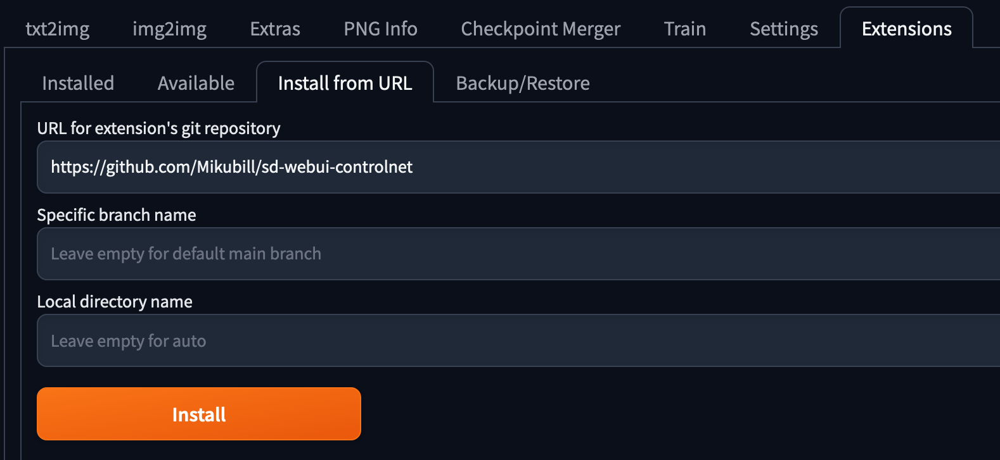
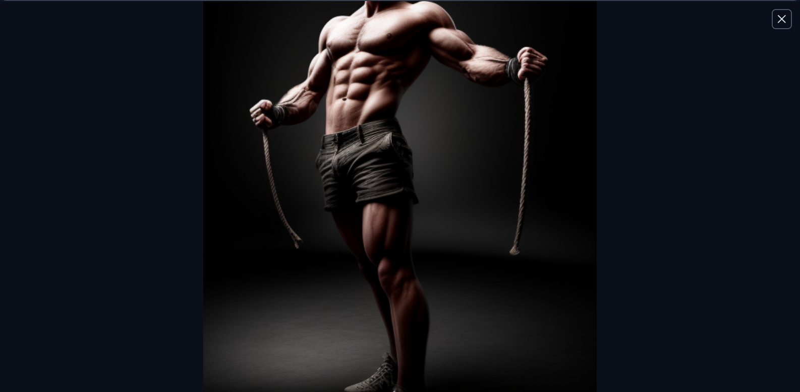

在ChatGPT出來以前有一波使用機器學習產生圖片的熱潮，這篇文章記錄一下如何在本機上面使用Stable Diffusion來產生圖片。

<!--more-->

## Stable Diffusion介紹

Stable Diffusion是一種擴散模型（Diffusion model）的衍生，關於擴散模型的介紹可以參考[李宏毅老師的影片](https://www.youtube.com/watch?v=ifCDXFdeaaM)，簡單來說就是使用一個類神經網路去不斷地對照片做去除雜訊的動作，於此同時，我們可以在這整個過程裡面加入其他latent variable，來指示圖片生的的樣子，隨著開源的社群把相關的程式碼整理得很好、有簡潔的UI來讓大家使用，造就了一波AI算圖的風潮。

## 安裝Stable Diffusion

這邊就來介紹一下如何在本機上面安裝Stable Diffusion及其UI，更詳細的說明可以參考[官方文件](https://github.com/AUTOMATIC1111/stable-diffusion-webui)，根據文件裡面的說明，要在Linux上面安裝Stable Diffusion的UI只需要執行底下的指令就可以了。

```bash
bash <(wget -qO- https://raw.githubusercontent.com/AUTOMATIC1111/stable-diffusion-webui/master/webui.sh)
cd ./stable-diffusion-webui
bash ./webui.sh
```

### 疑難排解

如果在安裝的過程當中碰到了一些錯誤，可以參考[網路上整理的疑難排解](https://ivonblog.com/posts/stable-diffusion-webui-manuals/installation/errors/)，這邊放上我在安裝時碰到的問題及解法。

#### 執行webui.sh時碰上repository clone不下來

```bash
RuntimeError: Couldn't checkout {name}'s hash: {commithash}.
Command: "git" -C "/home/wjohn1483/stable-diffusion-webui/repositories/k-diffusion" checkout c9fe758757e022f05ca5a53fa8fac28889e4f1cf
Error code: 129
stderr: Unknown option: -C
```

會碰到這個問題是因為git的版本太舊了，還沒有支援`-C`的選項，只需要更新git的版本就可以了，在CentOS裡面更新的指令如下。

```bash
sudo yum -y install https://packages.endpointdev.com/rhel/7/os/x86_64/endpoint-repo.x86_64.rpm
sudo yum install git
```

#### 執行webui.sh時碰上libGL找不到

```bash
ImportError: libGL.so.1: cannot open shared object file: No such file or directory
```

網路上是建議將`opencv-python`移除掉，改安裝`opencv-python-headless`就能解決。

```bash
pip3 uninstall opencv-python
pip3 install opencv-python-headless
```

不過有些套件的requirements裡面會要求安裝`opencv-python`，所以建議的解法會是安裝好相關的套件，如果是CentOS的話可以使用下面的指令。

```bash
sudo yum install -y mesa-libGL
```

#### 啟動server時，出現not implemented for 'Half'

```bash
RuntimeError: "addmm_impl_cpu_" not implemented for 'Half'
RuntimeError: "LayerNormKernelImpl" not implemented for 'Half'
```

這個查起來是浮點數精度的問題，可以在**webui-user.sh**裡面的`COMMANDLINE_ARGS`多加底下的參數來解決。

```bash
export COMMANDLINE_ARGS="--precision full --no-half"
```

#### 成功啟動server了，但是想讓遠端連進來

預設server會起在`127.0.0.1`，如果想改成`0.0.0.0`讓其他人可以連線的話，可以在**webui-user.sh**中新增`--listen`到`COMMANDLINE_ARGS`中。

```bash
export COMMANDLINE_ARGS="--precision full --no-half --listen"
```

如果想讓遠端連進來的人可以隨意安裝擴充套件的話，需要額外再加`--enable-insecure-extension-access`到其中。

```bash
export COMMANDLINE_ARGS="--precision full --no-half --listen --enable-insecure-extension-access"
```

## 使用各種模型、擴充套件

在安裝好UI以後，它會預設幫你下載好一個模型，我們就可以直接在上面打字讓模型幫我們產生圖片了，但如果你想要使用其他特化的模型，或是使用擴充套件的話，可以直接在UI上面擴充。

### Civitai

如果想要擴充模型的話，除了在HuggingFace上面搜尋以外，還可以在[Civitai](https://civitai.com/)上面下載，另外在[這邊](https://ivonblog.com/posts/stable-diffusion-webui-manuals/installation/download-models/)也有人整理了一些有趣的模型們。

安裝的方式很簡單，只需要把下載下來的`.ckpt`或者是`.safetensors`的檔案放進**stable-diffusion-webui/models/Stable-diffusion**的資料夾下就行了，也可以使用wget來下載。

```bash
# https://civitai.com/models/56383/pirsus-epic-realism
wget https://civitai.com/api/download/models/96535
mv 96535 ./models/Stable-diffusion/pirsusEpicRealism_v21.safetensors
```

這邊的模型編號跟網址列上面的不同，需要使用網頁開發工具來看Download按鈕的URL。

下載完以後應該就能在UI最上方checkpoint的地方看到新的模型了。


### ControlNet

除了嘗試用各式各樣的模型和prompt來產生想像中的圖片以外，還可以使用[ControlNet](https://github.com/lllyasviel/ControlNet)這個擴充套件來給予模型更精細的指示，像是希望產生的圖片動作要跟範例圖片中的相同。

安裝的方式蠻簡單的，在`Extensions`的頁面、選擇`Install from URL`、貼上下面的網址、按下Install、到`Installed`的tab按下重啟就行了。

```bash
https://github.com/Mikubill/sd-webui-controlnet
```



接著我們還需要去[HuggingFace](https://huggingface.co/webui/ControlNet-modules-safetensors/tree/main)上面下載ControlNet的模型下來到**extensions/sd-webui-controlnet-main/models**的目錄底下。

```bash
wget https://huggingface.co/webui/ControlNet-modules-safetensors/resolve/main/control_openpose-fp16.safetensors -P ./extensions/sd-webui-controlnet/models
wget https://huggingface.co/webui/ControlNet-modules-safetensors/resolve/main/control_normal-fp16.safetensors -P ./extensions/sd-webui-controlnet/models
wget https://huggingface.co/webui/ControlNet-modules-safetensors/resolve/main/control_scribble-fp16.safetensors -P ./extensions/sd-webui-controlnet/models
```

這邊先下載了三個模型下來，可以根據自己的需求下載不同的模型，這些模型的效果可以參考[這篇文章](https://home.gamer.com.tw/artwork.php?sn=5662905)。

安裝擴充套件回到`txt2img`的頁面後，應該就能在底下看到ControlNet的區塊了，在這邊我們可以把`Enable`打勾、丟上參考圖片、並在Preprocessor的地方選擇你想要的preprocessor，就能使用prompt跟參考圖片來產生更細緻的的圖片了。


這邊我胡亂使用prompt `A strong male`和上面的參考圖片，就能產生如底下的圖片了。



## 參考資料

1. [Stable diffusion ControlNet使用心得 - tark455365的創作 - 巴哈姆特](https://home.gamer.com.tw/artwork.php?sn=5662905)

2. [AI繪圖：Windows安裝Stable Diffusion WebUI教學 \| Ivon的部落格](https://ivonblog.com/posts/windows-stable-diffusion-webui/)
