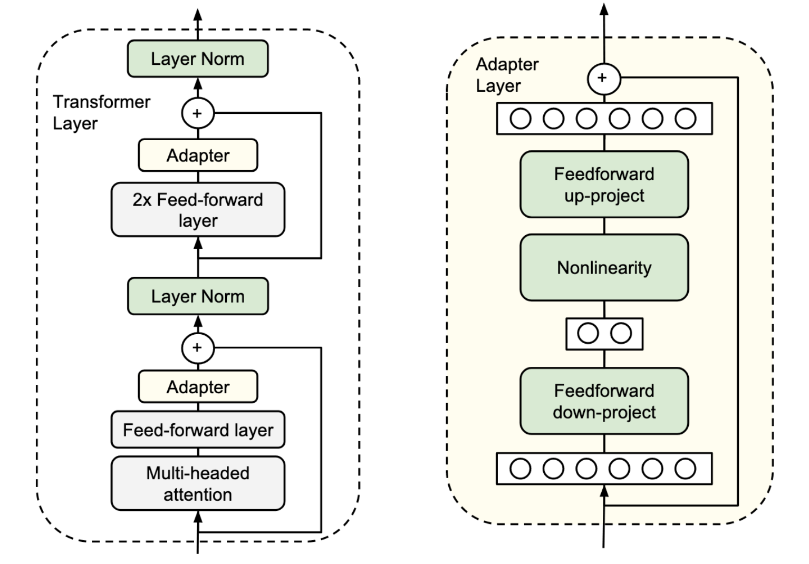
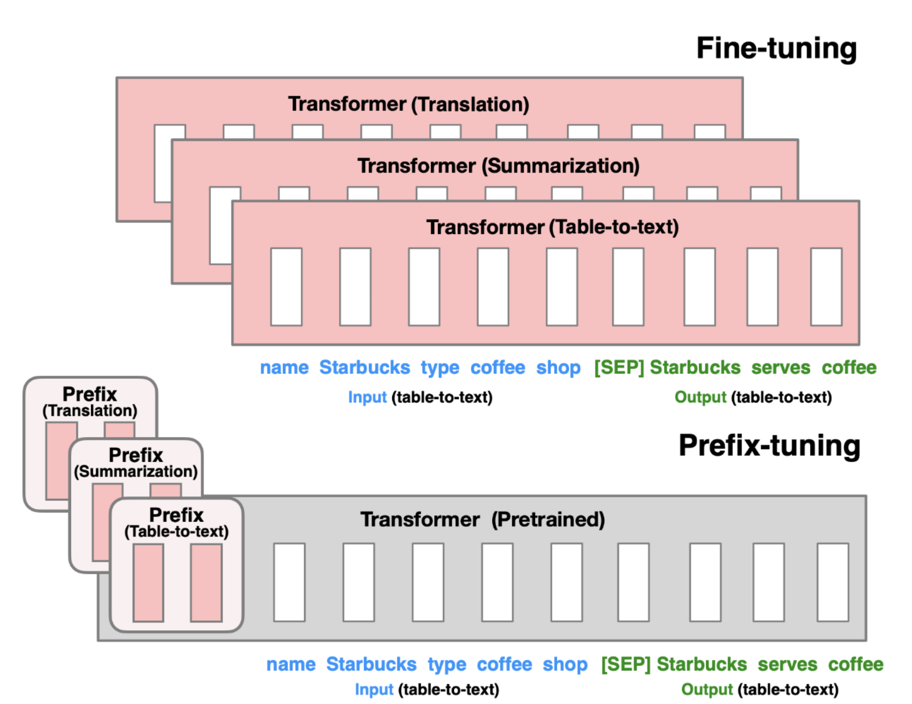
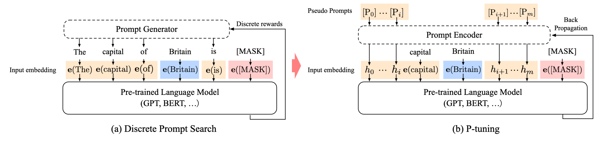

隨著大型語言模型（LLM）的蓬勃發展，各式各樣的應用也隨之而來，但如果想要為自己的應用而fine-tune LLM的話，除了更新整個LLM的參數外，還有很多只訓練少量參數的方法，這篇文章簡單介紹一些有效率調整參數的方法。

<!--more-->

PEFT又或是Parameter-Efficient Fine-Tuning指得便是使用少少的參數來有效率地調整模型，省去調整整個模型的參數來達到fine-tune模型的效果，底下會介紹一些常見的PEFT方法。

## Adapter Tuning

[Adapter Tuning](https://arxiv.org/pdf/1902.00751.pdf)的概念是在原本Transformer的架構當中，插入Adapter，並在接下來的訓練裡面只訓練Adapter。

在上圖的左邊是Transformer的架構，主要由Attention layer和Feed-forward layer組成，而在paper裡面，作者們把Adapter插在Feed-foward layer後面、skip connection之前。Adapter的架構展示在上圖右邊，是一個會先降維再升維的Feed-forward layer們，其中也包含了一個skip connection，讓Adapter最差的效果等同於Identity matrix，維持原本LLM的水準。

## Prefix Tuning

[Prefix Tuning](https://arxiv.org/pdf/2101.00190.pdf)的概念是仿照人類在Prompt Engineering裡面，嘗試使用指示性的文字、給一些範例給LLM的方法，以embedding的方式放進模型裡面，作法上是在Transformer的每一層，多加一些可以被訓練的prefix embedding，當Transformer在做attention的時候，就可以參考訓練出來的prefix們來獲得更好的結果。

在paper裡面有提到，如果直接放進prefix讓模型自己去訓練的話，模型的效果會下降而且訓練的時候會不穩定，所以在原始的paper裡面會另外使用一個MLP來產生prefix embeddings，使用比較低維度的向量經過MLP對應到Transformer token的維度大小，等訓練完成以後就只需要留下prefix embeddings，MLP相關的參數就可以拋棄掉了。

## Prompt Tuning

[Prompt Tuning](https://aclanthology.org/2021.emnlp-main.243.pdf)跟Prefix Tuning的想法類似，不過Prompt Tuning只有在輸入的地方加入task specific的prefix，不像Prefix Tuning會在Transformer的每一層都加入embedding。

在做訓練的時候，Prompt Tuning會把各個Task混在一起訓練來增加訓練的穩定度，避免訓練時特別偏重某個Task而偏掉。

## P-Tuning

### v1

[P-Tuning](https://arxiv.org/pdf/2103.10385.pdf)的作法跟前面的各種tuning不同的地方在於，P-Tuning會重新調整預訓練的文字embedding，在上圖左方表示的是原本人類或是機器搜尋最佳prompt的方式，會由Prompt Generator調整prompt裡面的文字，而這些文字進到模型裡面以後會被對應到word embedding，再往後面的Transformer傳，而右方是P-Tuning提出的方法。

在這邊P-Tuning使用了Bidirectional LSTM加上MLP來去替換掉原本word embedding，不過並不是替換掉所有的embedding，只替換了prompt template裡面的embedding而已，prompt template指的是制式化的問題模板，舉例來說我們想問各個地方的首都是哪裡，所以我們準備了各個地方的名字（e.g. Britain、United States等），這些輸入在paper裡面被定義為context，而問題裡面希望LLM產生、但在訓練時會被遮起來的`MASK`是target，剩下的`The capital of ___ is ___`便是prompt template。

### v2

[P-Tuning後來出了改良版](https://aclanthology.org/2022.acl-short.8.pdf)，在前一個版本裡面雖然方法有效，但在參數量比較少的模型上面表現並不理想，這邊提出的改良方式是搭配Prefix Tuning的想法，把產生出來的embedding當作是prefix放進Transformer的各個layer裡面。

## LoRA: Low-Rank Adaptation

在前面的各種Tuning裡面雖然可以達到Fine-tune的效果，但是各自有一些些缺點，像是Adapter Tuning因為增加了模型的深度，所以在inference的時候會需要更多的時間，而Prefix Tuning、Prompt Tuning和P-Tuning因為在Transformer裡面增加了token的數量，使得使用者想要輸入進模型的prompt token數量會被排擠到，而[LoRA](https://arxiv.org/pdf/2106.09685.pdf)解決了上述的兩個問題。

在Neural Network裡面，主要的構成是把輸入一個向量，經過矩陣運算以後轉換成另外一個向量，而LoRA做的事情就是在原本預訓練好的Neural Network旁邊多加一個中間維度比較少的另一個Neural Network，把相同的input $x$丟進去，把產生出來的結果加回原本Neural Network的輸出當中

$$
h=Wx+BAx
$$

在初始化的時候，$A$是從Gaussian隨機生成，而$B$則是零矩陣，好讓Fine-tune的時候不會一下就偏掉了。

如果想在Transformer中使用的話，Transformer裡面有很多Multi-head attention，其中包含了很多矩陣像是$W_q,W_k,W_v,W_o$，以及很多MLP，這些矩陣們都可以使用LoRA的方式來Fine-tune，而作者們在paper裡面固定MLP的部分，只把LoRA套用在attention weights上面。

## 參考資料

* [让天下没有难Tuning的大模型-PEFT技术简介](https://zhuanlan.zhihu.com/p/618894319)
