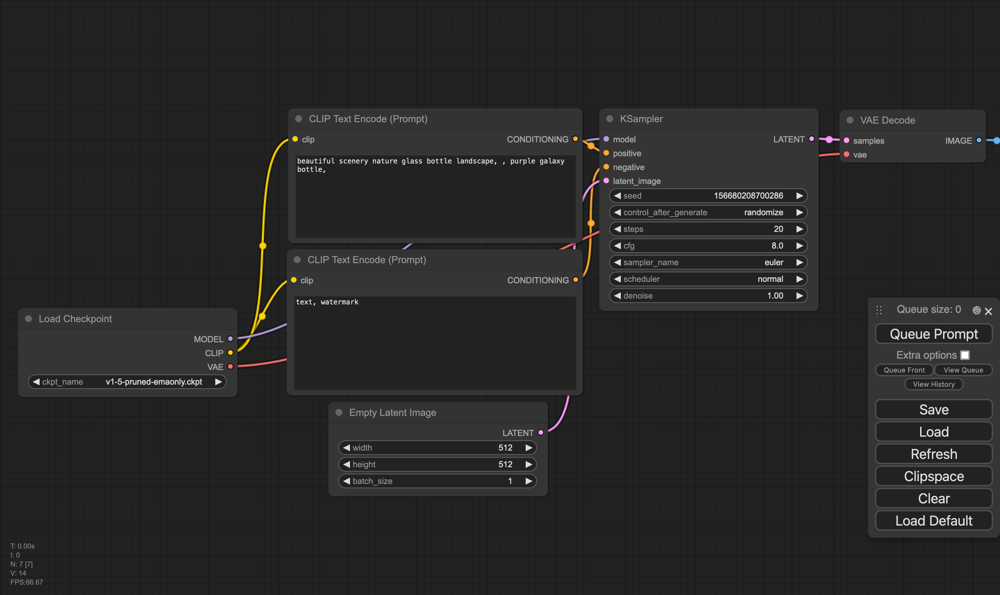

先前介紹了如何[在本機上面跑Stable Diffusion](https://wjohn1483.github.io/2023/07/02/stable-diffusion/)，這篇文章來記錄一下如何安裝Comfy UI，來讓產圖變得更容易。

<!--more-->

## Comfy UI

[Comfy UI](https://github.com/comfyanonymous/ComfyUI)是個使用stable diffusion產圖，但把介面變成流程圖的方式來呈現，方便使用者可以一目了然地理解產圖的過程，還可以直接在上面調整prompt和參數。

## 安裝流程

### 安裝Comfy UI

首先先從[GitHub](https://github.com/comfyanonymous/ComfyUI)上面把Comfy UI clone下來，接下來安裝python相關的套件

```bash
pip3 install -r requirements.txt
```

### 下載模型

在有了UI以後，我們還需要去下載其背後所使用到的stable diffusion的模型們，我們可以在[huggingface](https://huggingface.co/stabilityai/stable-diffusion-xl-base-1.0/tree/main)上面下載到，至少會需要模型本身的safetensors，如果有更新的模型也可以下載最新的。將下載下來的safetensors檔案放在clone下來repository的**models/checkpoints**即可。

### 執行Comfy UI

只要下底下的指令，理論上就可以順利地跑起來了。

```bash
# Use GPU
python3 main.py

# Use CPU only
python3 main.py --cpu
```

預設的port是8188，所以打開瀏覽器連上`http://localhost:8188`應該就能看到使用者介面了。



上面的文字框可以填上你想要用來產生圖片的prompt，而下面的文字框是填上你不想要在圖片中看到的prompt，記得在左邊的Checkpoint區塊選擇你下載下來的模型，最後按下`Queue Prompt`就可以產圖了。

### 上傳pipeline

基本版的pipeline雖然挺好用的，但網路上有更多更厲害的pipeline，這邊舉[Sytan-SDXL-ComfyUI](https://github.com/SytanSD/Sytan-SDXL-ComfyUI/blob/main/Sytan's%20SDXL%201.0%20Workflow%20.json)為例子，直接從GitHub上面把json下載下來Load到Comfy UI上面就可以使用了。

## ComfyUI-Manager

隨著Comfy UI的盛行，有越來越多人寫了一些其他的套件來擴充現有Comfy UI的功能，我們可以透過ComfyUI-Manager來安裝其他實用的套件，安裝的方法很簡單，在前面clone下來的Comfy UI repository裡面下底下的指令就可以了。

```bash
cd custom_nodes
git clone https://github.com/ltdrdata/ComfyUI-Manager.git
# Restart Comfy UI
```

重啟Comfy UI以後就可以看到右邊選單列表內多了`Manager`的按鈕可以點選，在裡面可以搜尋各式各樣的套件來安裝。

### Comfyspace

在眾多的套件裡面，推薦可以先安裝[ComfySpace](https://github.com/11cafe/comfyui-workspace-manager)，在Manager裡面搜尋`ComfyUI Workspace Manager`，接著重啟Comfy UI就可以了，其功用是幫你記錄和尋找Comfy UI的pipeline，如此就可以不用自己存pipeline的json，增加產圖的效率。
