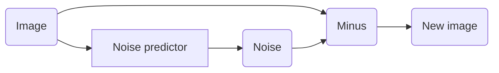
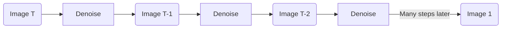
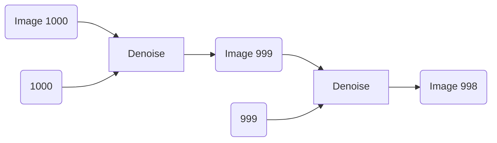
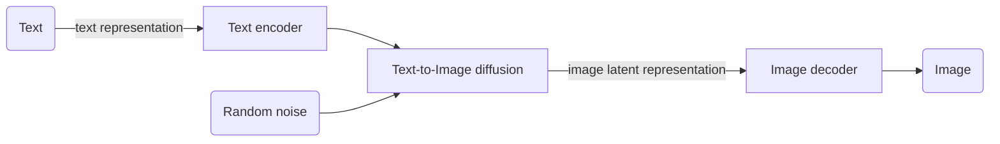

這篇文章來記錄一下學習diffusion model的筆記。

<!--more-->

在過去如果要讓機器產生圖片，通常會使用VAE或是GAN的方法來產生，而後來出現了diffusion model，產圖的效果很好，近期幾乎所有產圖的模型都是基於diffusion model來設計的。

## Diffusion Model的運作原理

Diffusion model的想法可以想成是我們去訓練一個noise predictor，輸入一張圖片，去預測圖片當中有哪些部分是雜訊，接下來就是將原始圖片減去noise predictor預測出來的雜訊來獲得新的圖片

我們可以從一張隨機分佈上面抽樣出來的圖片，反覆上面的動作來獲得一張清晰的圖片，有點類似米開朗基羅雕塑大衛像，雕像已經在石頭裡面了，只是把多餘的部分拿掉。

具體在訓練這個noise predictor的時候，我們會把當下是第幾步也放進noise predictor當中

可以想像在剛開始從都是雜訊的圖片需要去除雜訊的時候，消除雜訊的力道需要比較大一些，而到後面圖片已經成形以後，消除雜訊的力道就可以不用這麼大了，因為需要把當下的步數給noise predictor當作輸入。

而訓練資料的取得方法也相對簡單，從網路上找到各式各樣的圖片以後，往圖片裡面加入noise就取得了一組paired data，被加入noise的圖片是noise predictor的輸入，而加進去的noise便是noise predictor的label。

## 文字生成圖片

在上面的部分我們是直接從都是雜訊的圖片裡面去產生一張清晰的圖片，如果想要產生出來的圖片能跟我們給予的文字敘述相符合，通常的做法像底下這樣

首先會有一個Text encoder把使用者給予的文字轉換成vector，而這個vector會在text-to-image的diffusion model裡面在產生圖片的時候被使用到，最後是一個image decoder model，專門把diffusion model產生出來的tensor轉換成圖片，在前面diffusion model當中，我們可以直接產生圖片也可以讓後面的decoder產生，在目前的研究中看起來，分成兩步驟，讓decoder產生圖片的效果是比較好的。

### Text Encoder

這邊text encoder的目標是把敘述轉換成vector，我們可以直接使用已經訓練好的語言模型像是BERT、GPT來幫助我們將文字轉換成向量。

### Image Decoder

Image decoder做的事情是將diffusion model產生出來的向量或是小圖片轉換成大圖片，這邊我們可以去網路上搜尋各式各樣的圖片，透過訓練一個VAE來獲得這個image decoder，因為VAE可以不需要文字和圖片成對的資料，所以有機會可以用很多圖片來得到一個比較好的decoder。

### Diffusion

在diffusion的部分，大致上的做法跟上面雷同，比較不一樣的是因為我們想要根據使用者輸入的文字來產生圖片，所以在noise predictor的每一步都會把text encoder做出來的文字向量輸入給noise predictor。

如果diffusion model最後的輸出是latent representation，當我們在把成對的圖片和文字拿來訓練diffusion model的時候，我們可以使用VAE的encoder把圖片轉換成tensor，而上方diffusion model的中間產物也會從圖片變成tensor，亦即noise predictor在預測的就不是圖片上的noise，而是圖片的latent representation的noise。

## 結論

這篇文章簡單介紹了一下diffusion model的概念以及text to image所會使用到的模組，但如果實際上去看stable diffusion的演算法會發現跟上面的說法有一些出入，詳細的數學可以參考[這邊的影片](https://www.youtube.com/watch?v=ifCDXFdeaaM&list=PLJV_el3uVTsNi7PgekEUFsyVllAJXRsP-&index=4)。

## 參考資料

* [Diffusion Model - YouTube](https://www.youtube.com/playlist?list=PLJV_el3uVTsNi7PgekEUFsyVllAJXRsP-)
