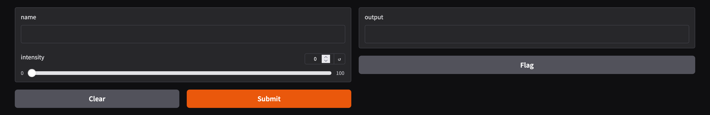
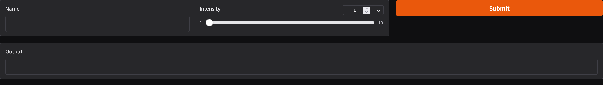
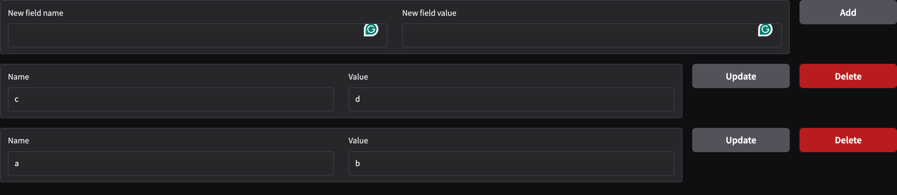

在做出了令人驚艷的模型或是功能以後，為了可以讓更多人使用，需要一個UI的介面來讓大家來操作，這邊簡單介紹一個可以快速透過python做出網頁UI的套件Gradio。

<!--more-->

## Gradio

[Gradio](https://www.gradio.app/)是一個python的套件，讓使用者可以透過python來快速地創造出一個網頁來展示你所製作的模型或者是其他功能，在huggingface上面有許許多多的模型就是使用Gradio來展示給大家。

安裝的方式很簡單，可以直接透過pip來安裝

```bash
pip install --upgrade gradio
```

## 簡單的範例

在安裝完成以後就可以著手來製作第一個簡單的網頁了，這邊可以來看一下[官方文件](https://www.gradio.app/guides/quickstart#building-your-first-demo)裡面的第一個範例程式碼

```python
# app.py
import gradio as gr

def greet(name, intensity):
    return "Hello, " + name + "!" * int(intensity)

demo = gr.Interface(
    fn=greet,
    inputs=["text", "slider"],
    outputs=["text"],
)

demo.launch()
```

透過`python app.py`或是`gradio app.py`的方式來執行這個程式碼，兩者的差異在於`gradio app.py`會反應程式碼的改動，當你在開發的時候可以透過這個方式來開發，但開發完成以後建議使用`python app.py`的方式來host會比較好。

跑出來的結果會長得像下面的樣子，如果點上面官方文件的連結，可以直接在網站裡面與它互動看看



在這邊我們透過字串的方式宣告了一個Interface的輸入和輸出，而且定義了一個python function `greet()`來去做邏輯的處理，需要注意`greet()`的argument的個數必須與inputs的個數相同，而`greet()`回傳的argument個數也必須與outputs的個數相同，在按下submit以後，`greet()`這個function會被執行，並將結果回傳到outputs當中，這時修改過後的文字就會出現在上方圖片右手邊的文字框裡面。

如果想要調整server的port，可以在`launch()`裡面加入相關的參數來設定。

```python
demo.launch(server_name="0.0.0.0", server_port=8080)
```

### 更細緻的操控

在上面的例子裡面，我們使用了`Interface()`來幫助我們創建了一個簡單的UI出來，並指定了一個python function來處理對應的邏輯，如果你想要自行決定文字框和按鈕的排版、python function被觸發的條件，我們可以透過`Blocks()`來達成

```python
import gradio as gr

def greet(name, intensity):
    return "Hello, " + name + "!" * int(intensity)

with gr.Blocks() as demo:
    with gr.Row():
        name = gr.Textbox(label="Name")
        intensity = gr.Slider(minimum=1, maximum=10, label="Intensity")
        submit_button = gr.Button("Submit", variant="primary")
    output = gr.Textbox(label="Output")

    submit_button.click(fn=greet, inputs=[name, intensity], outputs=[output])
    name.change(fn=greet, inputs=[name, intensity], outputs=[output])
    intensity.change(fn=greet, inputs=[name, intensity], outputs=[output])

demo.launch()
```



在上面的程式碼裡面，我們將`Interface()`替換成了`Blocks()`，同時引入了`Row()`，把在with clause底下的所有元件放在同一列裡面，而先前用字串指定的輸入輸出我們改成了gradio的物件來做更多的設定，最後對於每一個物件設定其觸發條件，`click()`為當按鈕被按下去的時候觸發，而`change()`為當元件的內容有被改變的時候就觸發，`Textbox()`還有像是`submit()`的觸發條件，當在文字框內按下enter就觸發等等，gradio有什麼元件以及各個元件有什麼可以設定及其觸發條件，可以參考[這邊的文件](https://www.gradio.app/docs/gradio/introduction)。

## API的範例

除了使用網頁上面的UI來使用自己寫好的功能，Gradio還有提供API的方式來開放讓大家使用，我們可以透過[python client](https://www.gradio.app/guides/getting-started-with-the-python-client)來呼叫前面寫好的`greet()` function

```python
from gradio_client import Client

client = Client("http://localhost:7860/")
result = client.predict(
    name="World",
    intensity=3,
    api_name="/greet"
)
print(result)
```

這邊我們使用一個URL來初始化`Client()`這個物件，接著將function需要的輸入放進去，而API的名字會對應前面在設定觸發條件時，給定的python function，可以透過網頁UI最下方`Use via API`的按鈕來查看有哪些API可以被調用。

除了透過python client來使用以外，Gradio還可以[使用一般的curl指令](https://www.gradio.app/guides/querying-gradio-apps-with-curl#authentication)來呼叫

```bash
EVENT_ID=$(curl -X POST http://localhost:7860/gradio_api/call/greet -s -H "Content-Type: application/json" -d '{
  "data": ["World", 3]
}' | awk -F'"' '{ print $4}')
curl -N http://localhost:7860/gradio_api/call/greet/${EVENT_ID}
```

這邊比較特別的地方是，使用curl並不像python client，直接呼叫就可以得到結果，而是會先用POST把資料餵進去以後拿到一個`event_id`，接著再用這個`event_id`透過GET的方式去取得跑出來的結果。

## 動態的範例

在前面的範例裡面，我們都是設定好固定的UI來讓使用者來使用，如果說想要讓UI隨著使用的的輸入而動態變化的話也是可以做到的，我們可以透過`@gr.render()`的方式來達成

```python
import gradio as gr

def add_field(fields, name, value):
    return fields + [{"name": name, "value": value}], "", ""

def main():
    with gr.Blocks() as web:
        fields_state = gr.State([])
        with gr.Row():
            field_name_text = gr.Textbox(label="New field name")
            field_value_text = gr.Textbox(label="New field value")
            add_field_btn = gr.Button("Add", scale=0)
        add_field_btn.click(add_field, inputs=[fields_state, field_name_text, field_value_text], outputs=[fields_state, field_name_text, field_value_text])

        @gr.render(inputs=fields_state)
        def render_fields(fields):
            for field in fields:
                with gr.Row():
                    name = gr.Textbox(field["name"], label="Name")
                    value = gr.Textbox(field["value"], label="Value")
                    update_btn = gr.Button("Update", scale=0)
                    delete_btn = gr.Button("Delete", scale=0, variant="stop")
                    def delete_field(field=field):
                        fields.remove(field)
                        return fields
                    def update_field(name, value):
                        new_fields = delete_field()
                        return new_fields + [{"name": name, "value": value}]
                    update_btn.click(update_field, inputs=[name, value], outputs=fields_state)
                    delete_btn.click(delete_field, inputs=None, outputs=fields_state)

    web.launch()


if __name__ == "__main__":
    main()
```



在`gr.Blocks()`的第一段裡面，我們宣告了一個`gr.State()`，裡面存放的是一個python list，同時做了兩個`Textbox()`，讓使用可以輸入`name`、`value`，並加入一個按鈕來去將使用者輸入的name、value pair放到state裡面。

接著我們透過`gr.render()`，並以前面的state當作輸入，根據state裡面儲存的list的資訊去產生對應的元件出來，於此同時我們也可以對新產生出來的元件去設定其觸發的條件，進而更新state裡面的資訊，如此便可以動態地新增、移除網頁上面的元件了。

## 參考資料

* [【Gradio】Building With Blocks 块中的状 态 + 动态应用程序与渲染装饰器-CSDN博客](https://blog.csdn.net/cxyhjl/article/details/139712016)
