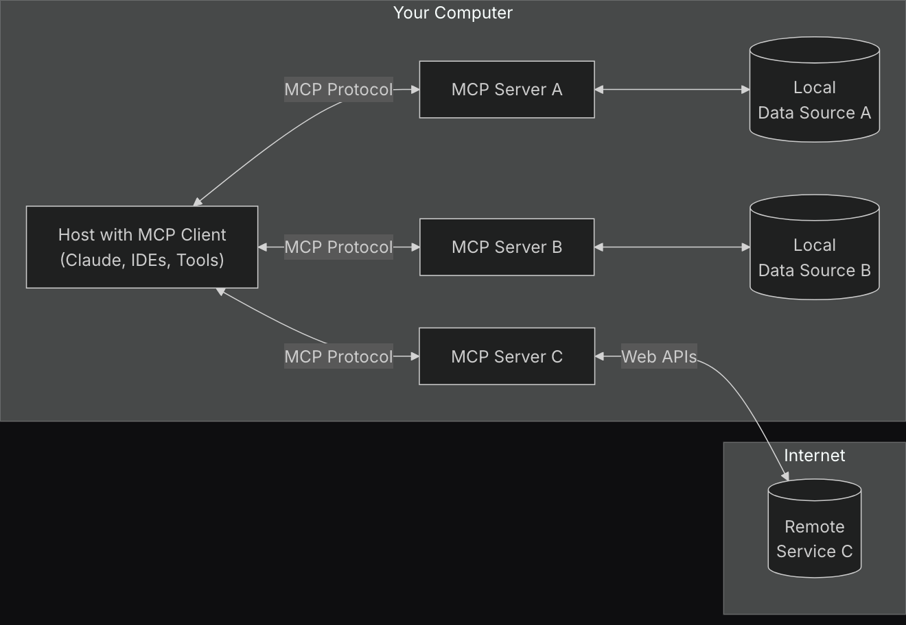
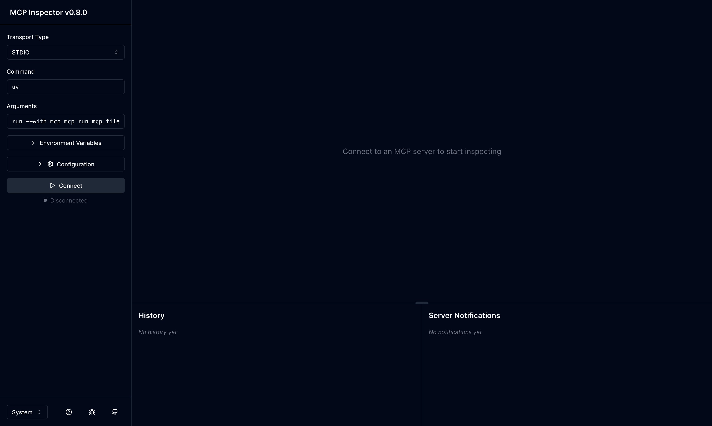
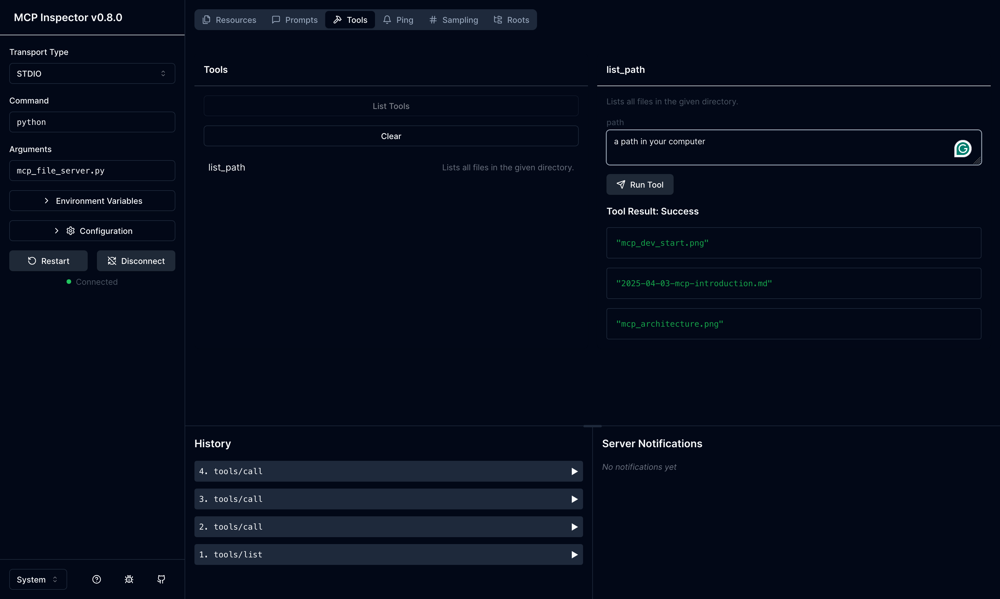
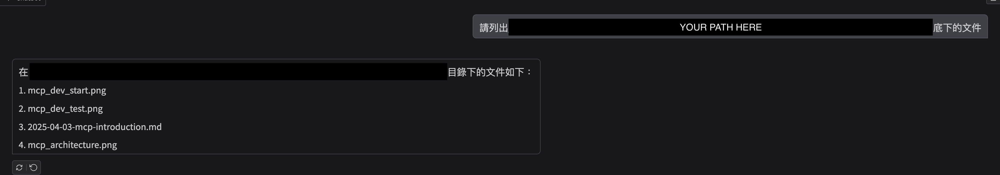

最近Model Context Protocol（MCP）蔚為風潮，這篇文章嘗試簡單介紹一下並使用一個範例來實作看看。

<!--more-->

## Model Context Protocol

Model Context Protocol（MCP）是一個由Claude背後的公司[Anthropic提出來的概念](https://www.anthropic.com/news/model-context-protocol)，我們知道現在要讓LLM產生一個json response已經是一件可行的事情了，而MCP想要做到的事情是讓LLM在產生答案的時候自行決定要不要調用外部的function來取得資料，有點類似Retrieval Augmented Generation（RAG）的概念，只是在RAG的時候，我們需要先把資料放進到資料庫裡面，LLM才可以取得相對應的資料出來，而MCP可以取得更即時的資料。

舉例來說，假設我想要知道台北現在的天氣並詢問LLM，LLM可以透過MCP的server去打API獲得天氣的資訊回來以後再產生回覆給我，如果是RAG的方式，使用者必須先把今天天氣的資訊輸入到資料庫裡面以後，LLM才有機會可以回答出即時的資訊。



*[Introduction - Model Context Protocol](https://modelcontextprotocol.io/introduction)*

上圖是一個MCP運作的示意圖，左邊的Host可以想成是LLM的操控介面，可以透過Claude的app或者是其他IDE甚至是自己寫的UI來操作LLM，而這個Host會根據需求去與本機上面的其他MCP server溝通，可能是去得到本機上某一個路徑底下的檔案有哪些、可能是去讀取機器上的某一個檔案或者是去打API拿到相關的資料回來，最後Host會將從MCP server取得的資訊彙整起來再產生回覆給使用者。

## 創建MCP Server

底下來演示一下一個簡單的MCP server要如何創建，假設我們想要創建一個server，讓LLM可以知道機器上某一個路徑底下的檔案有哪些，我們可以這樣實作。

```python
# mcp_file_server.py
import os
from typing import List

from mcp.server.fastmcp import FastMCP


mcp = FastMCP("File")

@mcp.tool()
def list_path(path: str) -> List[str]:
    """Lists all files in the given directory."""
    return os.listdir(path)


if __name__ == "__main__":
    mcp.run(transport="stdio")
```

我們可以先透過`pip3 install mcp`把相關的dependency安裝起來，接著定義一個function `list_path`並用decorator `@mcp.tool()`包起來，讓LLM知道底下的function是一個tool，建議這邊把function的註解寫得詳盡一點，這樣LLM會比較清楚這個工具的功能是什麼。

在做好工具以後，我們可以透過底下的指令來測試一下我們做出來的工具

```bash
mcp dev PATH_TO_YOUR_TOOL.py
# e.g. mcp dev mcp_file_server.py
```

這時透過瀏覽器連上畫面跑出來的網址，我們可以看到一個UI介面



這時候調整一下左邊的command和argument，分別換成`python`和你檔案的名稱像是`mcp_file_server.py`，按下Connect以後應該就能順利地連上MCP server了，接著點選上方的Tools、再點選List Tools就可以看到我們自定義的function `list_path`。



我們點選`list_path`後可以在右邊看到我們寫的註解和需要輸入的參數，這邊可以自己給一些參數進去看看function執行的結果有沒有符合預期。

## 與LLM Agent融合

前面我們製作了一個MCP server可以幫忙列出機器上某一個路徑底下的檔案，接下來我們想要讓LLM知道有這個工具並讓它來使用，這邊我們可以透過OpenAI的模型和[LangChain](https://www.langchain.com/)來實現。

```bash
pip install gradio langchain langchain-mcp-adapters langchain-openai langgraph
```

```python
# llm_server.py
from dotenv import load_dotenv
import gradio as gr
from langchain_mcp_adapters.tools import load_mcp_tools
from langchain_openai import ChatOpenAI
from langgraph.prebuilt import create_react_agent
from mcp import ClientSession, StdioServerParameters
from mcp.client.stdio import stdio_client

load_dotenv()

model = ChatOpenAI(model="gpt-4o-mini")

server_params = StdioServerParameters(
    command="python",
    args=["mcp_file_server.py"],
)


def get_prompt(user_input, history):
    messages = []
    for chat in history:
        role = chat["role"]
        content = chat["content"]
        messages.append({"role": role, "content": content})
    messages.append({"role": "user", "content": user_input})
    return messages


async def run_agent(user_input, history):
    async with stdio_client(server_params) as (read, write):
        async with ClientSession(read, write) as session:
            await session.initialize()
            tools = await load_mcp_tools(session)

            agent = create_react_agent(model, tools)
            messages = get_prompt(user_input, history)
            agent_response = await agent.ainvoke({"messages": messages})
            print(messages)
            print(agent_response)

            return agent_response["messages"][-1].content


if __name__ == "__main__":
    with gr.Blocks(fill_height=True, fill_width=True) as demo:
        gr.ChatInterface(fn=run_agent, type="messages")
    demo.launch()
```

這邊我們把OpenAI的key放進`.env`的檔案裡面，並在上面的script透過`load_dotenv()`放到環境變數裡面

```bash
# .env
OPENAI_API_KEY="YOUR_KEY_HERE"
```

接下來定義`server_params`來設定一下我們的MCP server該怎麼被執行，而`get_prompt()`這個function會把使用者和LLM過去的對話紀錄整理起來變成下一次要輸入的prompt，最後透過`run_agent()`來串起MCP server和LLM，並使用[Gradio的UI](https://wjohn1483.github.io/2025/02/22/gradio-introduction/)來讓使用者來操作。

透過`python3 llm_server.py`把Gradio的server起起來後，下一個列出文件的prompt就可以成功呼叫到上面創建的MCP server，並回傳機器上面的檔案名稱了。



如果覺得需要自己弄一個Gradio UI來使用MCP server太麻煩，可以參考[網路上的教學](https://www.linkedin.com/pulse/how-use-mcp-server-tools-claude-app-mariusz-misiek-aszxe/)來使用Claude app或是[透過Cursor](https://www.youtube.com/watch?v=McNRkd5CxFY)來操作。

## 結論

這篇文章實作了一個簡單的MCP server，賦予LLM能力來根據需求自行調用來得知機器上某個路徑底下的檔案有哪些，以這個為基礎，我們可以擴充MCP server的function，讓LLM可以使用更多的工具來減少人類需要自行調用資料再放進prompt裡面的負擔。

## 參考資料

* [Introduction - Model Context Protocol](https://modelcontextprotocol.io/introduction)
* [How to use MCP server tools in the Claude App?](https://www.linkedin.com/pulse/how-use-mcp-server-tools-claude-app-mariusz-misiek-aszxe/)
* [MCP是啥？技术原理是什么？一个视频搞懂MCP的一切。Windows系统配置MCP，Cursor,Cline 使用MCP - YouTube](https://www.youtube.com/watch?v=McNRkd5CxFY)
* [How to use MCP servers from a custom AI agent (step by step) - YouTube](https://www.youtube.com/watch?v=x8LQC6ut53Y)
* [Claude Desktop MCP 使用指南：完整設置教學](https://tenten.co/learning/claude-desktop-mcp/)
