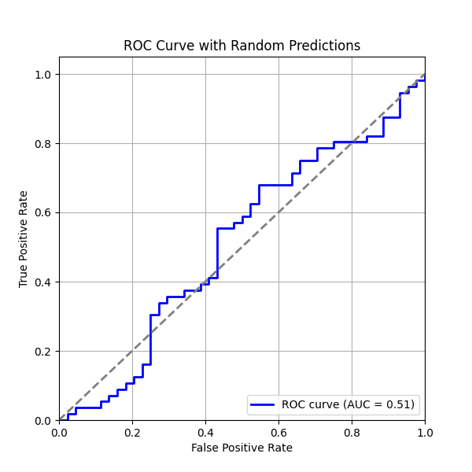
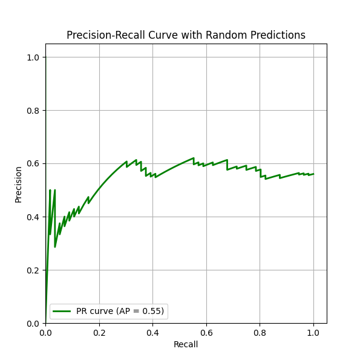

最近剛好碰到了個binary classification的問題，來順便複習一下ROC和PR曲線。

<!--more-->

## 4種可能的結果

為了要訓練一個binary classification的模型，我們通常會先去蒐集有被標註的資料集，而資料集裡面會包含每一筆資料的特徵以及它是positive還是negative的label。用這個資料集訓練好一個binary classification的模型以後，我們可以將這個模型拿去預測資料集裡面testing set的資料，並設定一個門檻，高於門檻的認定為positive data，低於的認定為negative，比較模型預測的結果和實際資料的標註，我們可以得到下面的confusion matrix。

| **模型預測** | **實際資料** | **狀況名稱**       |
| -------- | -------- | -------------- |
| Positive | Positive | True Positive  |
| Positive | Negative | False Positive |
| Negative | Positive | False Negative |
| Negative | Negative | True Negative  |

## Receiver Operating Characteristic（ROC）

ROC曲線就是根據上面的confusion matrix展開，ROC曲線將False positive rate當作是橫軸，True positive rate當作是縱軸，每一個點設定不同的門檻值以此來畫出來的曲線，而兩者的定義分別是

$$False\ positive\ rate=\frac{False\ positive}{False\ positive + True\ negative}$$

$$True\ positive\ rate=\frac{True\ positive}{True\ positive+False\ negative}$$

可以把False positive rate想成是所有實際資料被標註成negative的情況中，有多少比例模型判斷為是positive，越高表示模型越**不會**判斷negative data；而True positive rate可以想成是所有實際資料被標註成positive的情況中，有多少比例模型判斷為是positive，越高表示模型越會判斷positive data。

下圖是一個ROC曲線的範例，使用的資料和模型的預測都是隨機產生的

在這張圖片裡面有3個點比較重要

* (0, 1)：這個點表示True positive rate是1，且false positive rate是0，代表模型達到了完美的狀態，可以完全分辨出positive data和negative data

* (0, 0)：這個點表示兩個rate都是0，也就是把模型的threshold設定成1，把所有的資料都判定成negative data

* (1, 1)：這個點表示兩個rate都是1，也就是把模型的threshold設定成0，把所有的資料都判定成positive data

而在這個曲線下面的面積Area Under Curve（AUC）表示了這個模型整體的表現如何，面積越大通常表示這個模型越能分辨出positive data和negative data，而在45度的斜線是隨機猜positive或negative可以獲得的結果。

## Precision Recall

PR曲線是以Recall為X軸、Precision為Y軸，每個點設定不同的門檻值畫出來的曲線，兩者的定義分別是

$$Precision=\frac{True\ positive}{True\ positive+False\ positive}$$

$$Recall=\frac{True\ positive}{True\ positive+False\ negative}$$

Precision表示的是，模型認為是positive data的條件下，真的是positive data的比例有多少；Recall表示的是，所有positive data裡面，有多少是有被模型正確分辨出來的，跟True positive rate的定義一樣。

在PR曲線裡面我們也可以計算AUC，這邊的AUC被稱作是Average Precision（AP），而(1, 1)表示最理想的情況，模型可以完美地分辨positive data和negative data，因此PR曲線越往右上角代表模型整體表現更好，越平表示越差。

## F1 Score

F1 score的定義是

$$F1=\frac{2*Precision*Recall}{Precision+Recall}$$

表示的是在PR曲線上的一個點，亦即是在固定一個門檻值的時候，模型的表現如何，相較於上面AUC和AP，他們表示的是不論門檻值，模型整體的表現。

## 兩個曲線的比較

| **比較項目** | **ROC 曲線**                           | **PR 曲線**                 |
| -------- | ------------------------------------ | ------------------------- |
| 側重點      | 整體分類能力                               | 正例（Positive Class）的分類能力   |
| 適用場景     | 當正負樣本數量相近時效果較好，如果負樣本很多，ROC曲線會看起來比較樂觀 | 當正負樣本數極度不平衡時更適用           |
| X 軸變數    | 假正例率（FPR）                            | 召回率（Recall）               |
| Y 軸變數    | 真正例率（TPR）                            | 精確率（Precision）            |
| 曲線形狀影響因素 | 負例（Negative Class）的影響較大              | 主要關注正例（Positive Class）的表現 |

## 參考資料

* [Chen Tse-Pei's Blog](https://tsupei.github.io/nlp/2019/12/30/prcurve.html)
