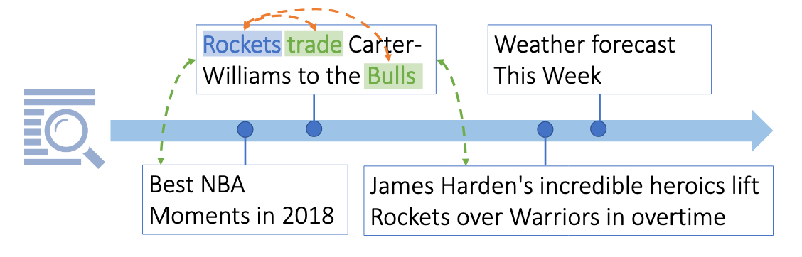
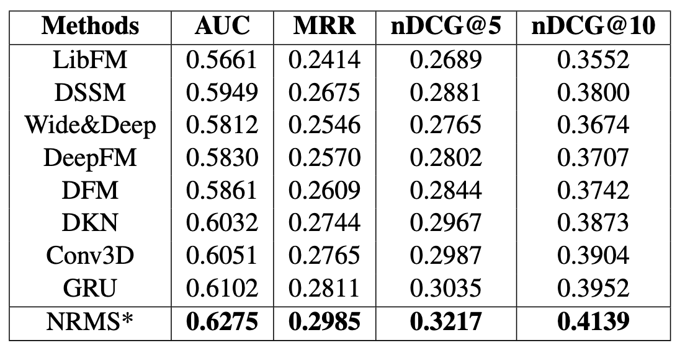

最近剛好又回頭碰了一下推薦系統，這邊記錄一下看了NRMS這篇paper的筆記。

<!--more-->

## 簡介

[這篇paper](https://wuch15.github.io/paper/EMNLP2019-NRMS.pdf)是刊登在EMNLP 2019上面的，做新聞推薦的paper。

作者認為，要了解新聞本身，新聞標題裡面字跟字的關聯是很重要的，所以採用self-attention的方式來去得到新聞的embedding，而使用者看過的新聞展示出了使用者的喜好，中間也適合使用attention來找到使用者真正在意的主題是什麼。

以上圖為例子，Rockets trade Carter Williams to the Bulls中的Rockets、trade、Bulls就是重要的關鍵字；而使用者看過的文章裡面，可以明顯看出使用者是比較在意NBA相關的新聞，雖然中間穿插了些天氣預報等，但使用者喜歡的東西還是有一個主題在。

## 模型架構

上圖是NRMS這篇paper的模型架構，主要分成兩個部分：News Encoder和User Encoder。

### News Encoder

News encoder的架構在整體架構圖的左手邊，主要就是一個self-attention layer。

新聞的標題會先被斷詞以後，透過預先訓練好的word embedding像是Glove轉換成$\textbf{e}_1, \textbf{e}_2, ..., \textbf{e}_M$，接著通過self-attention layer以後最終得到新聞的embedding $\textbf{r}$，細節的計算方法如下

$$\alpha^k_{i,j}=\frac{\exp\left( \textbf{e}_i^T\textbf{Q}^w_k\textbf{e}_j \right)}{\sum^m_{m=1}\exp\left( \textbf{e}^T_i\textbf{Q}^w_k\textbf{e}_m \right)}$$

$$\textbf{h}^w_{i,k}=\textbf{V}^w_k\left( \sum\limits^M\limits_{j=1}\alpha^k_{i,j}\textbf{e}j \right)$$

這邊計算的是某一個multi-head當中的$head_k$對於某一個字 $word_i$，其對同一篇新聞的其他字的self-attention，透過$\textbf{Q}^w_k$計算出其他字的attention weight $\alpha^k_{i,j}$，然後透過一個projection parameters$\textbf{V}^w_k$得到這個字的hidden state $\textbf{h}^w_{i,k}$，最後把所有head的結果接在一起變成了$\textbf{h}^w_i$

$$\textbf{h}^w_i=\left[ \textbf{h}^w_{i,1};\textbf{h}^w_{i,2};...;\textbf{h}^w_{i,h} \right]$$

把每個字$w_i$轉成word embedding $\textbf{e}_i$，再經過self-attention得到$\textbf{h}^w_i$以後，最終再經過一個attention layer來得到最後的新聞embedding $\textbf{r}$

$$a^w_i=\textbf{q}^T_w\tanh\left( \textbf{V}_w\times\textbf{h}^w_i+\textbf{v}_w \right)$$

$$\alpha^w_i=\frac{\exp (a^w_i)}{\sum^m_{j=1}\exp(a^w_j)}$$

$$\textbf{r}=\sum\limits^{M}\limits_{i=1}\alpha^w_i\textbf{h}^w_i$$

這邊使用一個fully connected的layer去算出attention weight，然後把先前算出來的$\textbf{h}^w_i$再weighted sum起來，從paper上面看起來，這邊的$\textbf{q}^T_w$好像就是讓模型自己訓練出來的參數。

### User Encoder

User encoder的架構跟上面的news encoder一模一樣，只是這邊輸入的部分從一個新聞標題變成了使用者瀏覽過的新聞的embedding $\textbf{r}_i$，計算的方法如同上面news encoder的算法，最終會得到一個使用者embedding $\textbf{u}$。

在有了使用者embedding $\textbf{u}$以後，我們可以把想要推薦給使用者的候選新聞，通過news encoder得到$\textbf{r}^c$，直接透過dot product來決定這則候選新聞的分數，最後照著分數排序把結果推薦給使用者。

$$\hat{y}=\textbf{u}^T\textbf{r}^c$$

### Training

訓練的方式跟siamese network的訓練方式相近，從所有的資料裡面去抽樣出$K$筆negative data出來，希望模型給positive data的分數要大過給negative data的分數。

$$p_i=\frac{\exp(\hat{y}^+_i)}{\exp(\hat{y}^+_i)+\sum^K_{j=1}\exp(\hat{y}^-_{i,j})}$$

$$\mathcal{L}=-\sum\limits_{i\in S}\log(p_i)$$

## 實驗結果

從結果當中可以看到，NRMS在各個經典的模型裡面表現不俗。

## 結論

NRMS是一個架構沒有很複雜，但效果還不錯的一個模型，在[recommenders](https://github.com/recommenders-team/recommenders)裡面也有支援，如果有需要推薦新聞的場景可以試試看。

## 參考資料

* [[Notes](EMNLP2019) NRMS: Neural News Recommendation with Multi-Head Self-Attention](https://haren.medium.com/notes-nrms-neural-news-recommendation-with-multi-head-self-attention-99ad5e9bd320)
