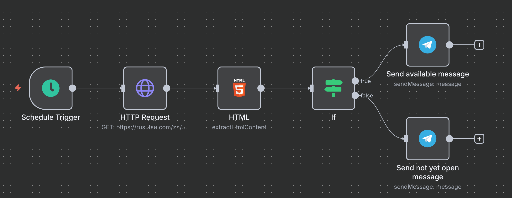
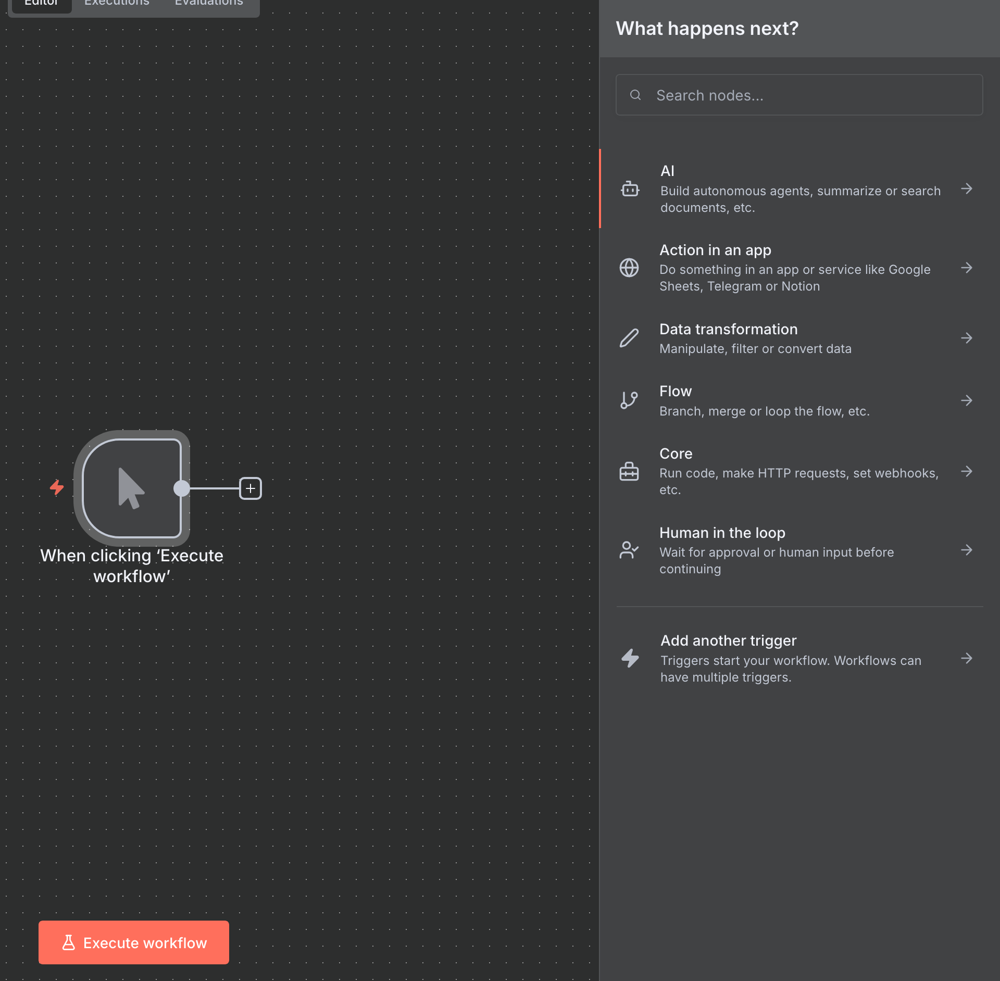
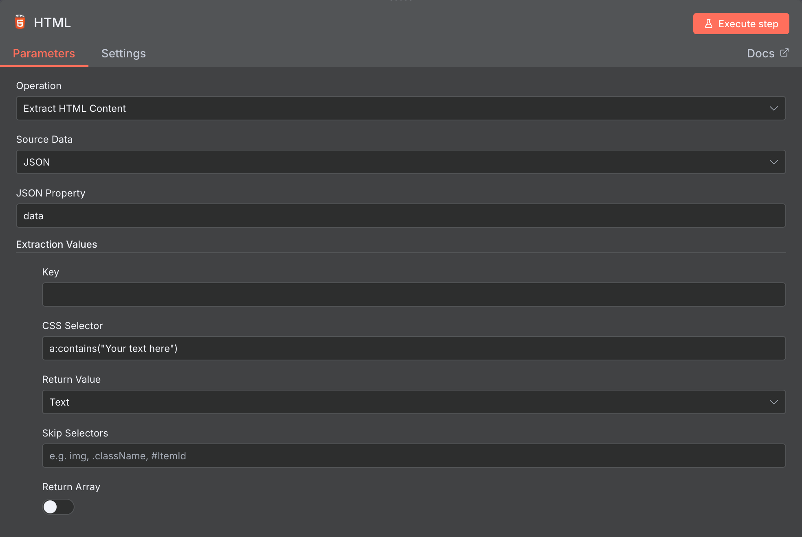

n8n是一個包含了AI的排程管理系統，可以透過簡單拖曳來建立你的資料流，這邊記錄一下我使用n8n的過程。

<!--more-->

## n8n是什麼

[n8n](https://n8n.io/)是一個開源的工作流程自動化工具，可以讓使用者透過滑鼠的拖拉，在UI上面就能將不同的服務像是Gmail、Chatgpt、Telegram組合起來建立一個資料流。

## 如何安裝n8n

n8n本身有提供雲端服務可以免費試用，如果想要自己host的話，可以參考他們的[文件](https://docs.n8n.io/hosting/)。

我自己使用的方式是用[docker的方式](https://docs.n8n.io/hosting/installation/docker/)來host，只要執行下面的指令，就可以建立起一個n8n的server，並聽本機的port 8000。

```bash
docker volume create n8n_data

TIMEZONE="Asia/Taipei"

docker run -it --rm \
    --name n8n \
    -p 8000:5678 \
    -e GENERIC_TIMEZONE="${TIMEZONE}" \
    -e TZ="${TIMEZONE}" \
    -e N8N_ENFORCE_SETTINGS_FILE_PERMISSIONS=true \
    -e N8N_RUNNERS_ENABLED=true \
    -e N8N_SECURE_COOKIE=false \
    -v n8n_data:/home/node/.n8n \
    docker.n8n.io/n8nio/n8n
```

透過瀏覽器連上server以後，可以創建一個n8n的帳號來登入，接下來就可以創建自己的資料流了。

## 實作範例

這邊先胡亂每天幫忙檢查車票開賣了沒的簡單資料流，整體的架構長得像下面這樣



這邊會定期觸發這個資料流，發http request到售票網站上面，透過一個html的parser去抓特定位置的文字，如果顯示可以訂票就發可以訂票的訊息到telegram上，如果還不行也一樣發個訊息說目前還不能訂票到telegram上。

在一開始開發這個資料流的時候，可以在觸發的地方選擇Trigger manually，這樣手動點一下就可以驗證資料流是不是如你預期般的執行，而後面的處理可以點擊+號來搜尋你想要做的事情，其中你也可以把輸入的結果丟給AI模型，下prompt讓模型去幫你處理輸入再輸出你想要的結果到後面的節點



每一個方框都可以點擊兩下來編輯設定，下面是html parser的設定，我們在發完http request以後拿到了html，這邊透過寫CSS selector來拿到特定的文字出來，除了一般的寫法外，我們還可以用比較特別的`a.contains("string")`的方式來抓。



最後就是透過telegram的bot將結果傳送到手機上，如何設定telegram bot可以參考下面的文章。

### Telegram Bot

要創建一個telegram bot，我們首先要先在telegram上面去找`@BotFather`跟他下`/newbot`的指令，接著按照指示設定顯示的名稱和實際的username，設定好以後可以得到一個API token，有了這個token就可以透過n8n內建的節點來收取或是發送訊息給使用者了。

值得一提的是，在發送訊息的部分我們除了API token外，還需要設定一個chat id，也就是聊天室的id，我們可以先傳個訊息到你創建的bot的聊天室，再透過下面的網址去拿到最近有互動的chat id，用這個來設定在n8n的節點上。

```html
https://api.telegram.org/bot{BOT_TOKEN}/getUpdates
```

中間的`{BOT_TOKEN}`要替換成上一個步驟裡面拿到的API token。

## 結論

n8n是個很方便、可以快速驗證想法的工具，我們可以透過串連更多的服務來做到更多的應用，上面的例子只是一個牛刀小試，網路上有更多例子透過大型語言模型來做到更智慧的結果，而且不用寫程式碼就可以做到過去可能要寫很多才能做到的功能，如果有什麼好想法不妨先用n8n兜看看。

## 參考資料

* [學會 n8n 為你省下 80% 時間！(EP.2) 這個 AI 助理只認你這個主人，不但使命必達且全天候待命！ - YouTube](https://www.youtube.com/watch?v=sRU6Y7DXkLI)

* [Telegram Bot (1) 懶得自己做的事就交給機器人吧](https://z3388638.medium.com/telegram-bot-1-%E6%87%B6%E5%BE%97%E8%87%AA%E5%B7%B1%E5%81%9A%E7%9A%84%E4%BA%8B%E5%B0%B1%E4%BA%A4%E7%B5%A6%E6%A9%9F%E5%99%A8%E4%BA%BA%E5%90%A7-c59004dc6c7b)
