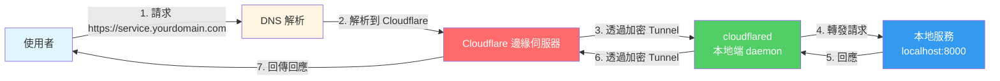
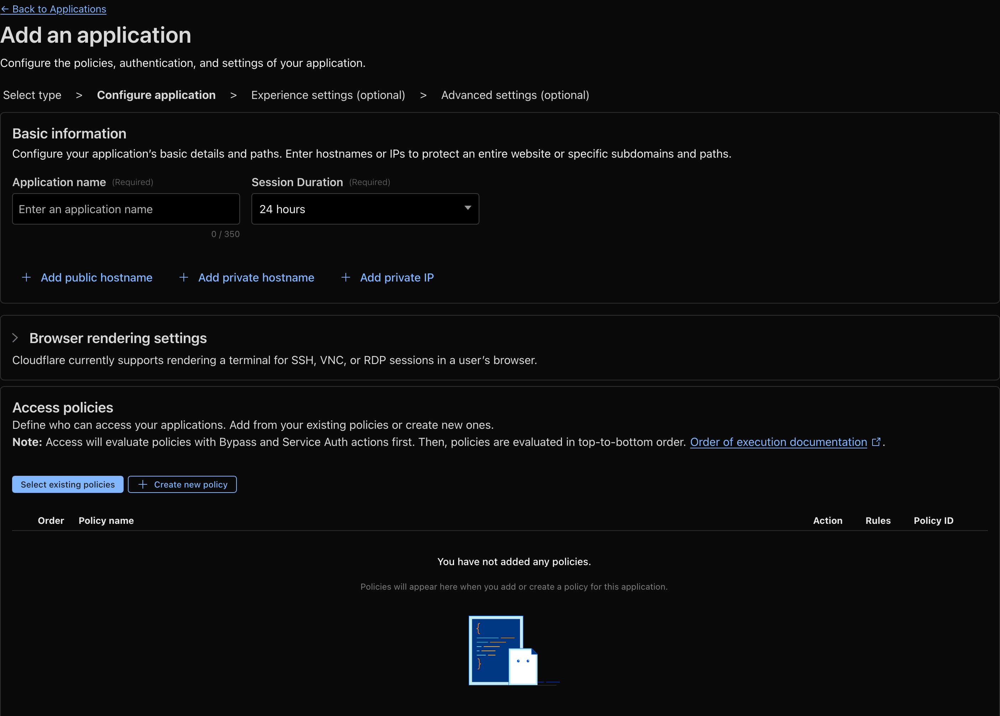
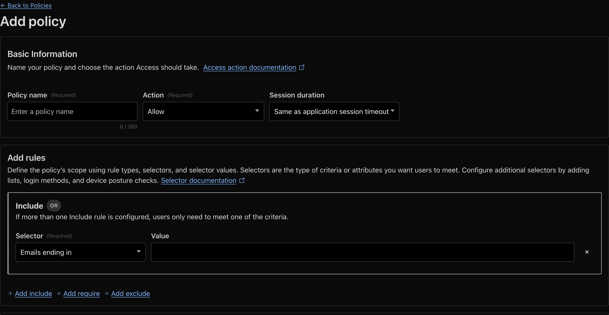

這篇文章介紹一下如何透過Cloudflare tunnel來把在內網的服務讓外面的人可以存取。

<!--more-->

## 介紹

[Cloudflare](https://www.cloudflare.com/)是一個提供CDN、DNS、DDoS防護等服務的雲端平台，而[Cloudflare Tunnel](https://www.cloudflare.com/products/tunnel/)是Cloudflare提供的一項服務，可以讓你在不需要開放任何port到公網的情況下，將內網的服務暴露到網際網路上。

傳統上，如果我們想要讓外部使用者存取內網的服務，通常需要：

1. 確保有固定的公網IP
2. 處理防火牆設定
3. 面對直接暴露在公網上的安全風險

Cloudflare Tunnel解決了這些問題，它透過在本地端建立一個輕量級的daemon（cloudflared），這個daemon會主動與Cloudflare的邊緣伺服器建立一個加密的連線，所有的流量都會透過這個加密通道傳輸，因此不需要在防火牆上開放任何port，也不需要公網IP。

## 網域

在使用Cloudflare Tunnel之前，你需要有一個網域，並且將這個網域的DNS管理權交給Cloudflare。如果你還沒有網域，可以在Cloudflare上購買，或者使用你現有的網域並將DNS轉移到Cloudflare。

在Cloudflare上面創建一個帳號以後，在左邊側邊欄裡面可以找到Register Domain的選項，在這邊可以打上你想要的關鍵字，Cloudflare會推薦對應的網域給你並附上價格，可以選擇`.xyz`、`.me`、`.org`、`.uk`等網域，價格相對比較低一點點。


在擁有網域以後，就可以開始建立tunnel連結內網的機器和這個網域了。

## Cloudflare Tunnel



要從內網的機器建立tunnel可以在Cloudflare側邊欄中的Zero Trust裡面的Networks下面的Connectors裡面找到，點擊建立tunnel以後照著流程走就可以了。


1. **安裝cloudflared**
   
   首先需要在本地端安裝cloudflared，這是Cloudflare提供的命令列工具。可以到[Cloudflare的GitHub](https://github.com/cloudflare/cloudflared/releases)下載對應作業系統的版本，或是使用套件管理器安裝
   
   ```bash
   # Add cloudflared.repo to /etc/yum.repos.d/
   curl -fsSl https://pkg.cloudflare.com/cloudflared.repo | sudo tee /etc/yum.repos.d/cloudflared.repo
   
   #update repo
   sudo yum update
   
   # install cloudflared
   sudo yum install cloudflared
   ```

2. **連接Tunnel**
   
   在Dashboard的Tunnel頁面中，會顯示一個連接命令，類似
   
   ```bash
   cloudflared tunnel run <tunnel-id>
   ```
   
   在本地端執行這個命令，Tunnel就會開始運作。你也可以使用service或其他服務管理器來讓Tunnel在背景持續運行。
   
   ```bash
   sudo cloudflared service install <tunnel-id>
   ```

完成以上步驟後，你的機器理論上就連上了Cloudflare的伺服器了，接下來在Published application routes裡面可以設定別人連上你的網域該怎麼導向你的內網服務


假如你的內網服務架在`localhost:8001`上面，在Service的地方就可以選擇用HTTP與URL來連線，而Hostname的地方可以選擇使用Subdomain或是Path來區分不同的service。

經過了這些設定以後，現在連線到你所設定的Hostname應該就可以碰到你放在內網機器上的服務。

## 登入驗證機制

現在你的服務可以被全世界的人連線了，但有些時候你會想要讓某些服務只讓有權限的人可以存取，Cloudflare有提供一些登入驗證的機制來幫你做到這件事情。

在Zero Trust當中的Access controls裡面，可以找到Applications的選項，點擊Add an application以後，選擇Self-hosted，接著就可以開始設定你的應用程式了。



在Application name的地方可以設定這個應用程式的名稱，Session duration可以設定登入後多久需要重新驗證，而Add public hostname的地方需要選擇你剛才在Tunnel route裡面設定的Hostname。

接下來在Policies的地方可以設定誰可以存取這個應用程式，點擊Add a policy以後，可以設定包含（Include）和排除（Exclude）的條件。



在Include的部分，可以設定允許存取的條件，例如：

- **Email**：特定Email地址（例如：user@example.com）
- **Emails ending in**：Email網域（例如：@company.com，代表該網域下的所有Email都可以存取）
- **IP ranges**：特定的IP地址
- **Country**：特定國家/地區

在Exclude的部分，可以設定拒絕存取的條件，例如某些特定的IP地址或Email。

選擇email的話，Cloudflare會在使用者來到網站的時候，輸入有權限的email以後，寄送一個一次性密碼到信箱裡面，透過這些設定，你可以確保只有經過驗證的使用者才能存取你的服務，大大提升了服務的安全性。

如果你想要讓使用者可以透過不同的方式登入，在Zero Trust側邊欄的Integrations的Identity providers裡面可以選擇像是Facebook、Google、GitHub等方式，照著上面的指示就可以新增一個登入的方法，並在application的設定裡面允許這個方法就可以了。

## 結論

Cloudflare Tunnel提供了一個簡單且安全的方式來將內網服務暴露到網際網路上，不需要處理複雜的網路設定，也不需要擔心直接暴露在公網上的安全風險。配合Zero Trust的登入驗證機制，可以進一步保護你的服務，只讓授權的使用者存取。對於需要遠端存取內網服務的使用者來說，這是一個非常實用的解決方案。

## 參考資料

* [免費 Cloudflare Tunnel 取代伺服器對外服務裸奔](https://www.sakamoto.blog/cloudflare-tunnel/)
